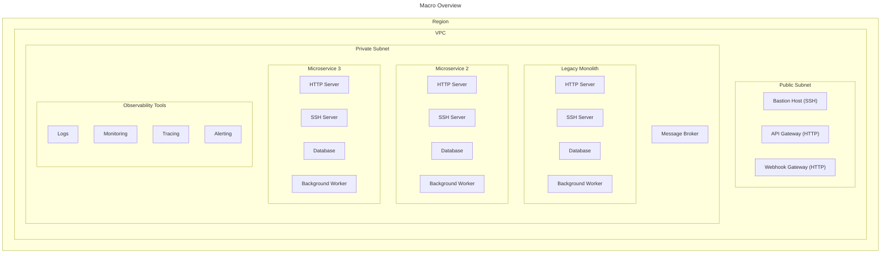
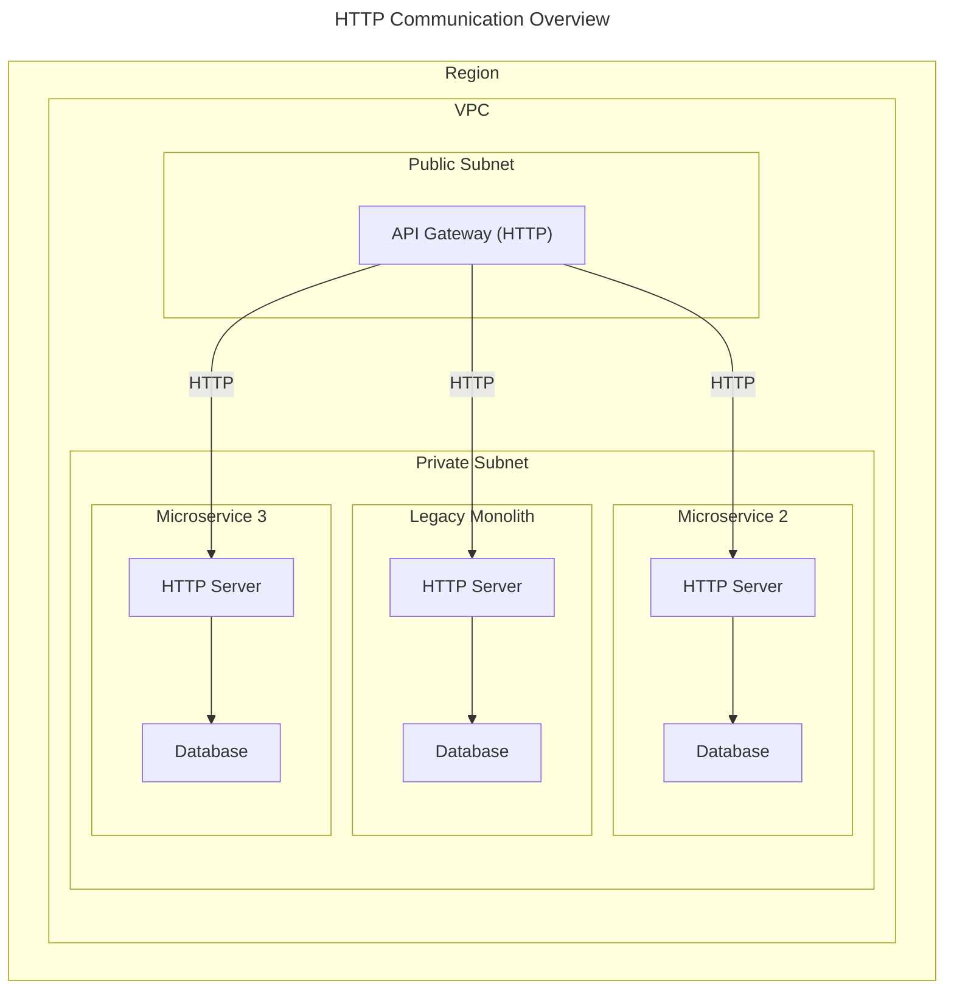
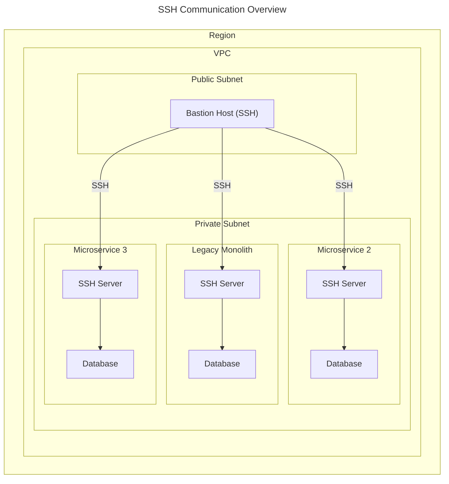
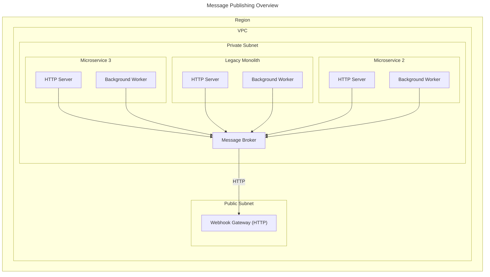
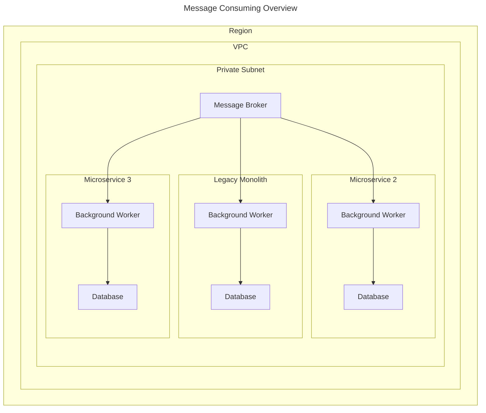

# System Review

## Prelude

This is a review of a conceptual system with the following characteristics:

- It is a web application;
- It is a mix of microservices architecture and legacy monolithic architecture;
- It uses HTTP for synchronous communication between the services;
- It uses a message broker for asynchronous communication between the services;
- It has public and private interfaces (aka. routes and webhooks);
- It requires a high level of security;
    - It must be able to authenticate and authorize all the requests;
    - It must provide access only to allowed sources;
        - Private routes are accessible only by sources at same Virtual Private Cloud (VPC);
        - Public routes are accessible only by enrolled sources (aka. sources with API key);
    - It must use tokens to authenticate and authorize the requests;
- It is a high-availability system;
    - It must be able to auto-scale based on the demand;
- It is a high-performance system;
    - It must be able to handle a high number of requests per second (RPS) with low latency;
- It is a system that requires a high level of observability;
    - It must be able to log and monitor all the requests and responses;
    - It must be able to trace the requests/events through all the services;
    - It must be able to alert the team in case of any issue (e.g. high latency, high error rate, etc.);
- It is a system that requires a high level of maintainability;
    - It must be easy to add new features;
    - It must be easy to fix bugs;
    - It must be easy to deploy new versions;
    - It must be easy to rollback to a previous version;
    - It has a private tunnel for the developers to access the services;
- It is a system that requires a high level of testability;
    - It must be easy to write tests for all the services;
    - It must be easy to run tests for all the services;
    - It must be easy to mock the dependencies of all the services;

## Overview

## Containerization

- > [Containerization](https://en.wikipedia.org/wiki/Operating-system-level_virtualization) is an operating system-level virtualization method for deploying and running distributed applications without launching an entire virtual machine (VM) for each app.
- > [Containerization](https://www.docker.com/resources/what-container) is a lightweight alternative to full machine virtualization that involves encapsulating an application in a container with its own operating environment.
- > [Containerization](https://www.ibm.com/cloud/learn/containerization) is a form of operating system virtualization, through which applications are run in isolated user spaces called containers, all using the same shared operating system (OS).

## Container

- > [Container](https://en.wikipedia.org/wiki/Operating-system-level_virtualization#Containers) is a standard unit of software that packages up code and all its dependencies so the application runs quickly and reliably from one computing environment to another.
- > [Container](https://www.docker.com/resources/what-container) is a standard unit of software that packages up code and all its dependencies so the application runs quickly and reliably from one computing environment to another.
- A container is a running instance of an image (or images) that has been instantiated with a task to accomplish. This task can be a single process or a group of processes that work together to accomplish a goal.
- A group of containers that work together to accomplish a goal is called a service.

### Docker

- > [Docker](https://www.docker.com/) is a tool designed to make it easier to create, deploy, and run applications by using containers.
- [Docker Documentation](https://docs.docker.com/).
- [Docker User Guide](https://docs.docker.com/engine/userguide/).
- [Docker Reference](https://docs.docker.com/engine/reference/).

## Container Orchestration

- > [Container Orchestration](https://en.wikipedia.org/wiki/Container_orchestration) is the automated configuration, coordination, and management of computer systems and software.
- Each environment has a container orchestration system to manage the containers.

### Kubernetes

- > [Kubernetes](https://kubernetes.io/) is an open-source system for automating deployment, scaling, and management of containerized applications.
- [Kubernetes Documentation](https://kubernetes.io/docs/home/).
- [Kubernetes Concepts](https://kubernetes.io/docs/concepts/).
- [Kubernetes Reference](https://kubernetes.io/docs/reference/).
- [Kubernetes Cheat Sheet](https://kubernetes.io/docs/reference/kubectl/cheatsheet/).
- [Kubernetes in Action](https://www.manning.com/books/kubernetes-in-action).
- [Kubernetes: Up and Running](http://shop.oreilly.com/product/0636920043874.do).
- [Kubernetes: The Complete Guide](https://www.udemy.com/kubernetes-the-complete-guide/).

### Elastic Container Service (ECS)

- > [Elastic Container Service](https://aws.amazon.com/ecs/) is a highly scalable, high performance container management service that supports Docker containers and allows you to easily run applications on a managed cluster of Amazon EC2 instances.
- [ECS User Guide](https://docs.aws.amazon.com/AmazonECS/latest/developerguide/Welcome.html).
- [ECS Developer Guide](https://docs.aws.amazon.com/AmazonECS/latest/developerguide/ecs-dg.pdf).

## Load Balancing

- > [Load Balancing](https://www.nginx.com/resources/glossary/load-balancing/) is the process of distributing network traffic across multiple servers.
- > [Load Balancer](https://www.nginx.com/resources/glossary/load-balancing/) is a device that acts as a reverse proxy and distributes network or application traffic across a number of servers.
- The load balancer sits between the user and two (or more) backend web servers that hold the same content. The load balancer receives requests from users and distributes them to the backend servers. When a backend server responds to a request, the load balancer passes the response to the appropriate user.
- The load balancer also monitors the status of each backend server and ensures that it isn’t directing traffic to a server that’s offline or malfunctioning.

## Services

### Authentication + Authorization

- Authentication tasks:
  - Generating JWT tokens.
  - Validating JWT tokens.
  - Managing (create | update | disable) users.
- Authorization tasks:
  - Managing (create | update | delete) roles.
  - Managing (create | update | delete) permissions.
  - Managing (assign | unassign) permissions to roles.
  - Managing (assign | unassign) users to users' groups.
  - Managing (assign | unassign) users' groups to roles.
  - Managing (assign | unassign) users' groups to users' groups.
- The service(s) should be accessible only from the internal network and should be called by the **Gateway Service** to be exposed to the external network.
- The authentication and authorization tasks can be done by a single service or two separate services, depending on the requirements of the project.
  - As a single service, it will be called the **Authentication and Authorization Service** and it will be responsible for all the above tasks.
    - If required, the **Authentication and Authorization Service** can add all the authorization information to the JWT token. This way, the other services will not need to call the **Authorization Service** to get the authorization information.
  - As two separate services, they will be called **Authentication Service** and **Authorization Service**.
    - If required, the **Authentication Service** can call the **Authorization Service** to get the authorization information and add it to the JWT token. This way, the other services will not need to call the **Authorization Service** to get the authorization information.
- Other services can call the service(s) to get the authorization information, if this information is volatile and can change frequently.

### Gateway

- The **Gateway Service** is the only service that is exposed to the external network.
- The **Gateway Service** is responsible for:
  - Authentication and authorization.
  - Routing requests to the appropriate service.
  - Load balancing.
  - Caching.
  - Rate limiting.
  - Logging.
  - Monitoring.
  - Alerting.
  - ...
- The **Gateway Service** can be implemented using [NGINX](#nginx) or [Kong](#kong).
- For all incoming requests, the service should:
  - Check if the request is authenticated and authorized.
  - If the request is authenticated and authorized, it should inject the authorization information into the request headers and forward the request to the appropriate service.
  - If the request is not authenticated or authorized, it should return an error response.

#### NGINX

- [NGINX](https://www.nginx.com/) is a web server which can also be used as a reverse proxy, load balancer, mail proxy and HTTP cache.
- [NGINX Documentation](https://www.nginx.com/resources/wiki/).
- [NGINX Cookbook](https://www.nginx.com/resources/library/complete-nginx-cookbook/).

#### Kong

- [Kong](https://konghq.com/) is a cloud-native, fast, scalable, and distributed Microservice Abstraction Layer (also known as an API Gateway, API Middleware or in some cases Service Mesh).
- [Kong Documentation](https://docs.konghq.com/).

### Message Broker

- > [Message Broker](https://en.wikipedia.org/wiki/Message_broker) is an intermediary computer program module that translates a message from the formal messaging protocol of the sender to the formal messaging protocol of the receiver.

#### RabbitMQ

- [RabbitMQ](https://www.rabbitmq.com/) is the most widely deployed open source message broker.
- [RabbitMQ Documentation](https://www.rabbitmq.com/documentation.html).
- [RabbitMQ Tutorials](https://www.rabbitmq.com/getstarted.html).
- [RabbitMQ in Action](https://www.manning.com/books/rabbitmq-in-action).
- [Part 4: RabbitMQ Exchanges, routing keys and bindings](https://www.cloudamqp.com/blog/part4-rabbitmq-for-beginners-exchanges-routing-keys-bindings.html).
- [Welcome to aio-pika’s documentation!](https://aio-pika.readthedocs.io/en/latest/).
- [Pika: Quick start](https://aio-pika.readthedocs.io/en/latest/quick-start.html#simple-publisher).
- [Publish/Subscribe (using the Pika Python client)](https://www.rabbitmq.com/tutorials/tutorial-three-python.html).

#### Kafka

- [Kafka](https://kafka.apache.org/) is a distributed streaming platform.
- [Kafka Documentation](https://kafka.apache.org/documentation/).
- [Kafka Tutorials](https://kafka.apache.org/quickstart).
- [Kafka: The Definitive Guide](https://www.confluent.io/resources/kafka-the-definitive-guide/).

## Databases

### Relational Databases

#### PostgreSQL

- [PostgreSQL](https://www.postgresql.org/) is a powerful, open source object-relational database system.
- [PostgreSQL Documentation](https://www.postgresql.org/docs/).
- [PostgreSQL Tutorial](https://www.postgresqltutorial.com/).
- [PostgreSQL: Up and Running](https://www.oreilly.com/library/view/postgresql-up-and/9781449326326/).
- The database should be named after environment (e.g. `myapp_dev`, `myapp_test`, `myapp_production`).
- It is a good option for data application that requires complex queries and relationship between objects. For example:
  - A API application that exposes structured data resulted from ingestion flow can use PostgreSQL as a read database of a [CQRS](https://martinfowler.com/bliki/CQRS.html) architecture.
  - A API application that manages structured data, needs to ensure data consistency, and has a small/medium workload can use PostgreSQL as primary database.

### NoSQL Databases

#### MongoDB

- [MongoDB](https://www.mongodb.com/) is a general purpose, document-based, distributed database built for modern application developers and for the cloud era.
- [MongoDB Documentation](https://docs.mongodb.com/).
- [MongoDB Tutorials](https://docs.mongodb.com/manual/tutorial/).
- [MongoDB: The Definitive Guide](https://www.oreilly.com/library/view/mongodb-the-definitive/9781491954454/).
- The database should be named after environment (e.g. `myapp_dev`, `myapp_test`, `myapp_production`).
- It is a good option for data application that requires a flexible data model, high performance, high availability, and automatic scaling. For example:
  - A data application that needs to ingest and store a large amount of data and wants to minimize the risk of losing data can use MongoDB as a write database of a [CQRS](https://martinfowler.com/bliki/CQRS.html) architecture.

## Search Engines

### ElasticSearch

- [ElasticSearch](https://www.elastic.co/elasticsearch/) is a distributed, RESTful search and analytics engine capable of solving a growing number of use cases.
- [ElasticSearch Documentation](https://www.elastic.co/guide/index.html).
- [ElasticSearch Tutorials](https://www.elastic.co/guide/en/elasticsearch/reference/current/getting-started.html).
- [Elasticsearch: The Definitive Guide](https://www.elastic.co/guide/en/elasticsearch/guide/current/index.html).
- Uses ElasticSearch to provide a search API for the data indexed from the database.

## Caching

### Redis

- [Redis](https://redis.io/) is an open source (BSD licensed), in-memory data structure store, used as a database, cache and message broker.
- [Redis Documentation](https://redis.io/documentation).
- [Redis Tutorials](https://redis.io/topics/quickstart).
- [Redis in Action](https://redislabs.com/ebook/).
- Use Redis as a cache for the data from the database or as a message broker queue.
- It is a good option for:
  - A data applications that needs to share transitory (and short lived) data between services. The idea is to use Redis as a temporary easy-access-storage for data that is not critical and can be lost (e.g. tracking data).
  - A API application that needs to cache data to improve performance.

## Monitoring

### Prometheus

- [Prometheus](https://prometheus.io/) is an open-source systems monitoring and alerting toolkit.
- [Prometheus Documentation](https://prometheus.io/docs/introduction/overview/).
- [Prometheus Tutorials](https://prometheus.io/docs/prometheus/latest/getting_started/).
- [Prometheus: Up & Running](https://www.oreilly.com/library/view/prometheus-up/9781492034131/).

### Grafana

- [Grafana](https://grafana.com/) is the open source analytics & monitoring solution for every database.
- [Grafana Documentation](https://grafana.com/docs/).
- [Grafana Tutorials](https://grafana.com/docs/grafana/latest/guides/getting_started/).

## Security

### Bastion

- Straddles public and private Subnet and Security Groups.
- Bastion Host is a server that is used to access the other servers in the private subnet from the Internet.
  - It is used to SSH into the other servers in the private subnet.

### Secrets and Parameters Management

#### Chamber and AWS Parameter Store

- [Chamber](<https://github.com/segmentio/chamber>) is a tool for managing secrets. It works by storing secrets in S3 and exposing them via the EC2 Parameter Store to only those instances that need access to them.
- [The Right Way to Store Secrets using Parameter Store](<https://aws.amazon.com/pt/blogs/mt/the-right-way-to-store-secrets-using-parameter-store/>).

##### Vault

- [Vault](<https://www.vaultproject.io/>) is a tool for managing secrets. It works by storing secrets in S3 and exposing them via the EC2 Parameter Store to only those instances that need access to them.
- [Vault Documentation](<https://www.vaultproject.io/docs/>).
- [Vault Guides](<https://www.vaultproject.io/guides/>).
- [Vault API](<https://www.vaultproject.io/api/>).

##### AWS Secrets Manager

- [AWS Secrets Manager](<https://aws.amazon.com/secrets-manager/>) is a tool for managing secrets. It works by storing secrets in S3 and exposing them via the EC2 Parameter Store to only those instances that need access to them.
- [AWS Secrets Manager Documentation](<https://docs.aws.amazon.com/secretsmanager/latest/userguide/intro.html>).
- [AWS Secrets Manager API](<https://docs.aws.amazon.com/secretsmanager/latest/apireference/Welcome.html>).

## Build Systems and Supporting Components

### Jenkins

- [Jenkins](https://jenkins.io/) is a self-contained, open source automation server which can be used to automate all sorts of tasks related to building, testing, and delivering or deploying software.
- [Jenkins User Documentation](https://jenkins.io/doc/).
- [Jenkins User Handbook](https://jenkins.io/user-handbook.pdf).

#### Description

- Every project has a `Jenkinsfile` in the root of the project to specify the build process.
- Builds are triggered by a webhook from code repository.
- Builds are run in a Docker container.

##### Builds procedure

  1. Checkout the project from GitHub.
  2. Build the Docker image.
    - Pull the base image from private Docker registry.
    - Build the Docker image.
  3. Build the project.
    - Download dependencies from private registry.
    - Run tests.
    - Build the project.
  4. Push the Docker image to private registry.
