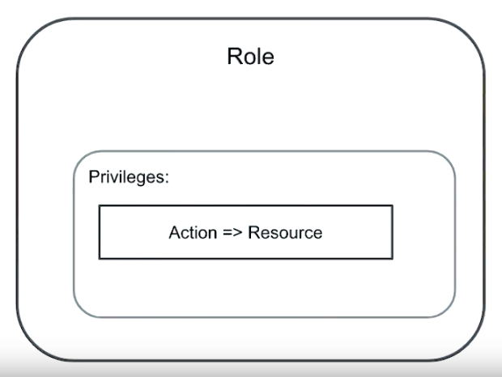

# Basic Security

## Table of contents

- [Basic Security](#basic-security)
  - [Table of contents](#table-of-contents)
  - [Introduction](#introduction)
  - [Authentication](#authentication)
    - [Client Authentication](#client-authentication)
      - [SCRAM](#scram)
      - [X.509](#x509)
      - [LDAO](#ldao)
      - [Kerberos](#kerberos)
      - [Intra-Cluster Authentication](#intra-cluster-authentication)
  - [Authorization](#authorization)
    - [User](#user)
    - [Localhost Exception](#localhost-exception)
  - [First Login Process](#first-login-process)
  - [Role](#role)
    - [Privilege](#privilege)
    - [Resources](#resources)
    - [Examples](#examples)

## Introduction

- MongoDB uses an authentication + authorization security.

## Authentication

- Verifies the Identity of a user.
- Validate credentials.
- MongoDB supports multiple authentication mechanisms.

### Client Authentication

#### SCRAM

- Salted Challenge Response Authentication Mechanism.
- Default MongoDB authentication.
- Provided by all MongoDB version.
- The most basic client authentication (basically password security).
- MongoDB server presents a question (challenge) to the client who must provide a valid answer.

#### X.509

- Provided by Community version.

#### LDAO

- Lightweight Directory Access Protocol.
- Provided by Enterprise version only.

#### Kerberos

- Powerful authentication process.
- Is the main Authentication method (will be studied later).

#### Intra-Cluster Authentication

- Mechanism by which nodes in a cluster authenticate to each other.
- Secret handshake.

## Authorization

- Verifies the Privileges of a user.
- `Role` based access control for authorizing an authenticated user.
- High level of responsibility isolation among individual users.
- Enabled by `authorization` config flag.
- It also enable the authentication process (one cannot exist without the other).

### User

- MongoDB does not provides default users.
  - It is necessary to use the `localhost exception` to connect to MongoDB and create a first administrative root user.
- Users exists per database and should be created by function in database.
- Each MongoDB **User** has one or more associated **Roles**.
- At the very minimum, it should always configure SCRAM-SHA-1 with a single administrative user protected by a strong password.

### Localhost Exception

- Allows a `unauthenticated user` to access a MongoDB server that enforces authentication.
  - Does not have configured user for a common authentication.
  - Must run the Mongo Shell from the same host of MongoDB server.
  - It closes after the first user configuration.
- A kind of `temporary user` that has the permissions to only create one user.
- The `localhost exception` should be always used to create a user with administrative privileges in `admin` database.
  - This new user should be used to create others specific users.

## First Login Process

- Connect to the `localhost exception`:

```shell
mongo --host 127.0.0.1:27000
```

- In Mongo Shell, create the admin user:

```js
db.createUser(
  {
    "user": "root",
    "pwd": "root",
    "roles": [
      {
        "role": "root",
        "db": "admin"
      }
    ]
  }
);
```

- Connect with the new user:

```shell
mongo admin --host 127.0.0.1:27000 -u root -p root --authenticationDatabase admin
```

## Role

- A **Role** assigned to a **User** will give it all the **Privileges** to realize **Action** over the related **Resources**.
- **Role** is composed of set of **Privileges**.



- Instead of have a list of **Privileges**, a **Role** can inherit the privileges from other **Roles**.


- A **Role** can be composed of set of **Network Authentication Restrictions**.
  - It defines that the given **Role** is allowed to connect from a **Client Source**, or to a **Server Address**, by specifying it as parameter.

### Privilege

- **Privileges** defines the **Actions** that can be performed over a **Resources**.

- Example: A role that permits the shutdown of any member of a specified cluster.

```json
{
  "resource": {
    "cluster": true
  },
  "actions": ["shutdown"]
}
```

### Resources

- Database.
- Collection.
- Set of Collections.
- Cluster.
  - Replica Set.
  - Shard Cluster.

### Examples

- Specific database and collection:

```json
{
  "db": "products",
  "collection": "inventory"
}
```

- All databases and all collections:

```json
{
  "db": "",
  "collection": ""
}
```

- Any databases and specific collections:

```json
{
  "db": "",
  "collection": "accounts"
}
```

- Specific databases and any collections:

```json
{
  "db": "products",
  "collection": ""
}
```

- Cluster resource:

```json
{
  "cluster": true
}
```
