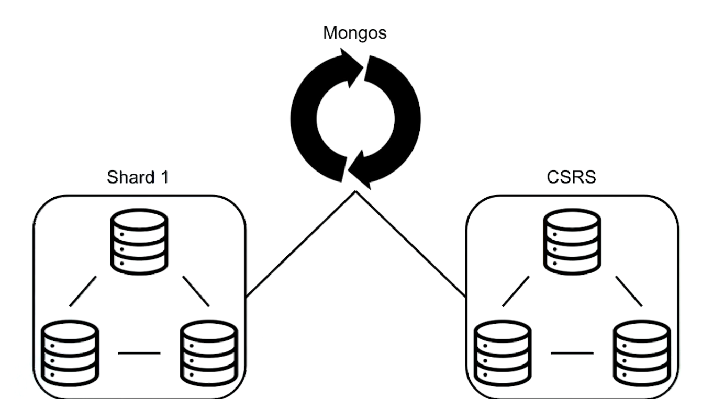

# Setting Up a Sharded Cluster

## Table of contents

- [Setting Up a Sharded Cluster](#setting-up-a-sharded-cluster)
  - [Table of contents](#table-of-contents)
  - [Goal](#goal)
  - [Config Server Replica Set (CSRS)](#config-server-replica-set-csrs)
  - [MongoS](#mongos)
  - [Data Replica Set](#data-replica-set)

## Goal

- Minimum required to start a sharded cluster.
  - Essentially just the Mongos, a config server replica set, and at least one shard.



## Config Server Replica Set (CSRS)

- Configuration servers are MongoD regular nodes.
- Role: `configsvr`
  - Specifies in the configuration that this is in fact a config server.

- Configuration file for first config server `csrs_1.conf`:
  - So we enabled this replica set to use authentication, and the key file authentication is fine, because we already created our key file. We're going to share the same key file in this setup, since all the MongoD instances are running on the same virtual machine. But in a real production environment, X509 certificates would be the way to go.

```YAML
sharding:
  clusterRole: configsvr
replication:
  replSetName: m103-csrs
security:
  keyFile: /var/mongodb/pki/m103-keyfile
net:
  bindIp: localhost,192.168.103.100
  port: 26001
systemLog:
  destination: file
  path: /var/mongodb/db/csrs1.log
  logAppend: true
processManagement:
  fork: true
storage:
  dbPath: /var/mongodb/db/csrs1
```

- Configuration file for first config server `csrs_2.conf`:

```YAML
sharding:
  clusterRole: configsvr
replication:
  replSetName: m103-csrs
security:
  keyFile: /var/mongodb/pki/m103-keyfile
net:
  bindIp: localhost,192.168.103.100
  port: 26002
systemLog:
  destination: file
  path: /var/mongodb/db/csrs2.log
  logAppend: true
processManagement:
  fork: true
storage:
  dbPath: /var/mongodb/db/csrs2
```

- Configuration file for first config server `csrs_3.conf`:

```YAML
sharding:
  clusterRole: configsvr
replication:
  replSetName: m103-csrs
security:
  keyFile: /var/mongodb/pki/m103-keyfile
net:
  bindIp: localhost,192.168.103.100
  port: 26003
systemLog:
  destination: file
  path: /var/mongodb/db/csrs3.log
  logAppend: true
processManagement:
  fork: true
storage:
  dbPath: /var/mongodb/db/csrs3
```

- Setting up:
  - Creating **dbPath** folders.
  - Starting the three config servers.
  - Connect to one of the config servers connection (using the local host exception to create our super user.).
  - Initiating the CSRS.
  - Creating super user on CSRS.
  - Authenticating as the super user.
  - Add the second and third node to the CSRS.
  - Check if it is ok.

```shell
mkdir /var/mongodb/db/csrs{1,2,3}
mongod -f csrs_1.conf
mongod -f csrs_2.conf
mongod -f csrs_3.conf
mongo --port 26001
```

```js
rs.initiate()
use admin
db.createUser({
  user: "m103-admin",
  pwd: "m103-pass",
  roles: [
    {role: "root", db: "admin"}
  ]
})
db.auth("m103-admin", "m103-pass")
```

```js
rs.add("192.168.103.100:26002")
rs.add("192.168.103.100:26003")
rs.isMaster()
```

## MongoS

- So now that we have our CSRS up and running, we can start up MongoS and then point MongoS in the direction of our config server replica set.

- Mongos config (mongos.conf):
  - There is no **dbPath**. That's because Mongos doesn't need to store any data. All of the data used by Mongos is stored on the config servers.
  - Note that we've specified the entire replica set, instead of the individual members.
  - We also enabled key file authentication, so we're going to need to authenticate to Mongos, but it will inherit the same uses as our config servers, and we'll see that in a minute.

```YAML
sharding:
  configDB: m103-csrs/192.168.103.100:26001,192.168.103.100:26002,192.168.103.100:26003
security:
  keyFile: /var/mongodb/pki/m103-keyfile
net:
  bindIp: localhost,192.168.103.100
  port: 26000
systemLog:
  destination: file
  path: /var/mongodb/db/mongos.log
  logAppend: true
processManagement:
  fork: true
```

- Starting MongoS:

```shell
mongos -f mongos.conf
```

- Connect to MongoS:
  - So as we saw before, MongoS has auth enabled, and it's also going to inherit any users that we created on the config servers.

```shell
mongo --port 26000 --username m103-admin --password m103-pass --authenticationDatabase admin
```

- Check sharding status:
  - If we take a look at the output, we can see that we have the number of MongoS currently connected, and we also have the number of shards.
  - Right now, this is empty, because we don't have any shards.

```js
sh.status()
```

## Data Replica Set

- This the line we need to add in data replica set:
  - The **clusterRole**: `shardsvr` section tells MongoD that the node can be used in a sharded cluster.
  - The **cacheSizeGB**: `.1` section restricts the memory usage of each running MongoD. Note that this is not good practice. However, in order to run a sharded cluster inside a virtual machine with only 2GB of memory, certain adjustments must be made.
  - If done on-the-fly, rolling upgrade in order to do this.

```YAML
sharding:
clusterRole: shardsvr
storage:
  wiredTiger:
    engineConfig:
        cacheSizeGB: .1
```

- Updated configuration for `node1.conf`:

```YAML
sharding:
  clusterRole: shardsvr
storage:
  dbPath: /var/mongodb/db/node1
  wiredTiger:
    engineConfig:
      cacheSizeGB: .1
net:
  bindIp: 192.168.103.100,localhost
  port: 27011
security:
  keyFile: /var/mongodb/pki/m103-keyfile
systemLog:
  destination: file
  path: /var/mongodb/db/node1/mongod.log
  logAppend: true
processManagement:
  fork: true
replication:
  replSetName: m103-repl
```

- Updated configuration for `node2.conf`:

```YAML
sharding:
  clusterRole: shardsvr
storage:
  dbPath: /var/mongodb/db/node2
  wiredTiger:
    engineConfig:
      cacheSizeGB: .1
net:
  bindIp: 192.168.103.100,localhost
  port: 27012
security:
  keyFile: /var/mongodb/pki/m103-keyfile
systemLog:
  destination: file
  path: /var/mongodb/db/node2/mongod.log
  logAppend: true
processManagement:
  fork: true
replication:
  replSetName: m103-repl
```

- Updated configuration for `node3.conf`:

  ```YAML
  sharding:
    clusterRole: shardsvr
  storage:
    dbPath: /var/mongodb/db/node3
    wiredTiger:
      engineConfig:
        cacheSizeGB: .1
  net:
    bindIp: 192.168.103.100,localhost
    port: 27013
  security:
    keyFile: /var/mongodb/pki/m103-keyfile
  systemLog:
    destination: file
    path: /var/mongodb/db/node3/mongod.log
    logAppend: true
  processManagement:
    fork: true
  replication:
    replSetName: m103-repl
  ```

- Connecting in replica set:

```shell
mongo --host "m103-example/192.168.103.100:27011" -u "m103-admin" -p "m103-pass" --authenticationDatabase "admin"
```

- Adding new shard to cluster from MongoS:
  - It's necessary to point to the correct replica set and primary node.
  - It's necessary to refer the node by its replica set and address alias.
  - For the given example, use this:

```js
sh.addShard("m103-repl/m103:27001")
```

- For the example from before, use this:

```js
sh.addShard("m103-example/192.168.103.100:27011")
```

- Checking status:

```js
sh.status()
```

- [Note] Removing a shard from cluster:

```js
db.adminCommand( { removeShard: "mongodb0" } ) 
```

- [Note] Importing data in shard cluster:

```shell
mongoimport --drop /dataset/products.json --port 26000 -u "m103-admin" -p "m103-pass" --authenticationDatabase "admin" --db m103 --collection products
```
