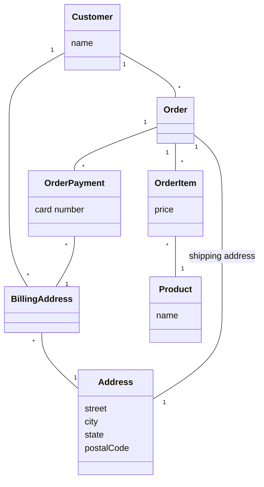
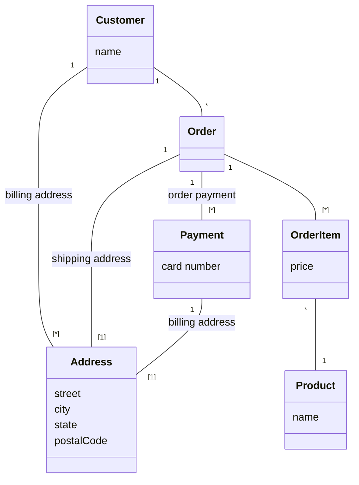

# NoSQL - Distilled

---

### Book Details

- **Title**: NoSQL - Distilled
- **Author**: Pramod J. Sadalage, Martin Fowler
- **Publisher**: Addison-Wesley
- **Published**: 2012-08-01
- **ISBN-10**: 0321826620
- **Amazon Link**: 
  - [**English Edition**](https://www.amazon.com/NoSQL-Distilled-Emerging-Polyglot-Persistence/dp/0321826620)
  - [**Portuguese Edition**](https://www.amazon.com.br/NoSQL-Essencial-Emergente-Persist%C3%AAncia-Poliglota-ebook/dp/B07V5635ZQ)

---

## Chapter 1. Why NoSQL?

### 1.1. The Value of Relational Databases

- **Persistent data**: when compared to file systems, relational databases provide a much more flexible and powerful way to store and query data.
- **Concurrency**: relational databases provide manage concurrency and provide transactional guarantees.
- **Inter-application Integration**: data can be shared between applications using a common database or syncing data between databases.
- **A Mostly Standard Model**: the relational model is a standard model that is implemented by many vendors.

### 1.2. Impedance Mismatch

- **Object-Relational Impedance Mismatch**: the difference between the relational model and the in-memory data structures of the programming language.
- The relational model is organized around relations (tables) and tuples (rows).
  - A tuple is a set of name-value pairs.
    - Values in tuples have to be simple (e.g. no nested objects, no arrays, etc.)
  - A relation is a set of tuples with the same set of attributes.
  - All operations are performed on relations (which leads to a mathematically relational algebra).
- On the other hand, the in-memory data structures of the programming language are organized around objects identified by its memory address.
- This foundational difference leads to a mismatch between the relational model and the in-memory data structures of the programming language.
- This mismatch leads to a lot of boilerplate code to map between the relational model and the in-memory data structures of the programming language. Furthermore, the abstractions can become a problem of their own when people try too hard to ignore the database and query performance suffers.

### 1.3. Application and Integration Databases

- **Integration Database**: a database that is used by multiple applications.
  - A big  reason for the success of relational databases during the 80s and 90s was the need for integration databases. The relational model was a good fit for this use case because it provided a standard model that could be used by multiple applications in a consistent way.
  - But, this approach has its own problems:
    - **Data/Schema Integration**: the data/schema of the database has to be designed to support all the applications that use it. This leads to a lot of compromises and a lot of unused data.
    - **Performance**: the database has to be tuned to support all the applications that use it. This leads to a lot of compromises and performance problems.
- **Application Database**: a database that is used by a single application.
  - This approach is much more common today because it avoids the problems of integration databases, bringing the focus back to the application and giving more flexibility to the database choice.
  - It's only possible because of the rise of the web protocols and the fact that most applications are now accessed through APIs. This makes it possible to have multiple applications with their own databases that share data through their APIs.
    - This approach is called **Service-Oriented Architecture** (SOA) and deals with different integration problems than the integration databases (like consistency along distributed data, availability, etc.).
    - In a first moment, this approach was executed by separating the application into two parts **Presentation Tier** and **Business Data Tier** which communicate each other using the HTTP protocol to exchange data in a format like XML or JSON.
      - This provided more flexibility for the structure of the data that was being exchanged between the two tiers.

### 1.4. Attack of the Clusters

- **Cluster**: a group of computers that work together to provide a single service.
1. **Dot-com boom**: the early 2000s saw the burst of the 1990s dot-com bubble, leading to questions about the economic future of the Internet.
2. **Increase in Web Scale**: Despite the dot-com bubble burst, the 2000s saw a dramatic increase in the scale of web properties. Websites began tracking activity and structure in detail, leading to large sets of data.
3. **Growth in Data and Users**: The growth in data was accompanied by a growth in users, requiring more computing resources.
4. **Scaling Up vs Scaling Out**: To handle the increase in data and traffic, two options were available: scaling up (bigger machines, more processors, disk storage, and memory) or scaling out (using lots of small machines in a cluster).
5. **Clusters and Relational Databases**: As large properties moved towards clusters, it revealed that relational databases are not designed to be run on clusters. This led to technical issues and increased licensing costs.
6. **Google and Amazon's Influence**: Google and Amazon, both capturing huge amounts of data and running large clusters, considered alternative routes to data storage. They produced influential papers about their efforts: BigTable from Google and Dynamo from Amazon.
   - **BigTable**: a distributed storage system for managing structured data that is designed to scale to a very large size: petabytes of data across thousands of commodity servers.
   - **Dynamo**: a highly available key-value storage system that some of Amazon's core services use to provide an "always-on" experience.
7. **New Databases for Clusters**: As more information about what Google and Amazon had done became available, people began to explore creating databases designed to live in a world of clusters, posing a serious threat to the dominance of relational databases.

### 1.5. The Emergence of NoSQL

- **Origin of the term NoSQL**: The term "NoSQL" first appeared in the late 90s as the name of an open-source relational database. The current usage of "NoSQL" that we recognize today traces back to a meetup on June 11, 2009 in San Francisco.
- **Definition of NoSQL**: NoSQL has never had a strong definition. Common characteristics of databases that tend to be called "NoSQL" include the absence of SQL, most are open-source projects, are oriented to operate on clusters, operate without a schema, and are based on the needs of the early 21st century web properties.
- **Interpretation of the term NoSQL**: Most people who talk about NoSQL say that it really means "Not Only SQL". However, this interpretation has some problems.
- **Contribution of NoSQL**: The most important contribution of NoSQL is opening up the range of options for data storage. This is often referred to as polyglot persistence - using different data stores in different circumstances.
- **Use of NoSQL**: Organizations need to shift from integration databases to application databases. NoSQL is seen as a good choice for application databases.
- **Reasons to consider NoSQL**: The two main reasons for considering NoSQL are to handle data access with sizes and performance that demand a cluster and to improve the productivity of application development by using a more convenient data interaction style.

### 1.6. Key Points

- Relational databases have been a successful technology for twenty years, providing persistence, concurrency control, and an integration mechanism.
- Application developers have been frustrated with the impedance mismatch between the relational model and the in-memory data structures.
- There is a movement away from using databases as integration points towards encapsulating databases within applications and integrating through services.
- The vital factor for a change in data storage was the need to support large volumes of data by running on clusters. Relational databases are not designed to run efficiently on clusters.
- NoSQL is an accidental neologism. There is no prescriptive definition— all you can make is an observation of common characteristics.
- The common characteristics of NoSQL databases are - Not using the relational model
  - Running well on clusters
  - Open-source
  - Built for the 21st century web estates
  - Schemaless
  - The most important result of the rise of NoSQL is Polyglot Persistence.

## Chapter 2. Aggregate Data Models

- **Definition of Data Model**: The data model is the method through which we perceive and manipulate our data. It is different from the storage model, which is about how the database stores and manipulates the data internally.
- **Use of Data Model**: In conversation, the term "data model" often refers to the model of the specific data in an application. However, in the context of this book, "data model" refers to the model by which the database organizes data.
- **Relational Data Model**: The dominant data model of the last couple of decades is the relational data model, visualized as a set of tables with rows and columns.
- **Shift to NoSQL**: NoSQL represents a shift away from the relational model. Each NoSQL solution uses a different model, categorized into four types: key-value, document, column-family, and graph.
- **Aggregate Orientation**: The first three NoSQL models (key-value, document, column-family) share a common characteristic called aggregate orientation.

### 2.1. Aggregates

- **Relational Model**: This model divides information into tuples or rows. It's a simple structure that doesn't allow for nesting of tuples or lists within tuples.
- **Aggregate Orientation**: This approach allows for more complex data structures. It's useful for operating on data units that have a more complex structure than a set of tuples.
- **Key-Value, Document, and Column-Family Databases**: These databases use the aggregate orientation approach. They handle operations on a cluster more easily due to the aggregate structure.
- **Domain-Driven Design**: The term "aggregate" comes from this design approach. An aggregate is a collection of related objects treated as a unit for data manipulation and consistency management.
- **Aggregates and Database Operations**: Aggregates make it easier for databases to handle operations like replication and sharding. They are also easier for programmers to work with as they often manipulate data through aggregate structures.

#### 2.1.1. Example of Relations and Aggregates

Let’s assume we have to build an e-commerce website; we are going to be selling items directly to customers over the web, and we will have to store information about users, our product catalog, orders, shipping addresses, billing addresses, and payment data. We can use this scenario to model the data using a relation data store as well as NoSQL data stores and talk about their pros and cons.

##### Relational Model



##### 2-Aggregation Model



```json
// in customers
{
    "id": 1,
    "name": "Martin",
    "billingAddress": [
        {
            "city": "Chicago"
        }
    ]
}
```

```json
// in orders
{
    "id": 99,
    "customerId": 1,
    "orderItems": [
        {
            "productId": 27,
            "price": 32.45,
            "productName": "NoSQL Distilled"
        }
    ],
    "shippingAddress": {
        "city": "Chicago"
    },
    "orderPayment": [
        {
            "ccinfo": "1000-1000-1000-1000",
            "txnId": "abelif879rft",
            "billingAddress": {
                "city": "Chicago"
            }
        }
    ]
}
```

The two main aggregates are 'customer' and 'order'.
- The 'customer' aggregate contains a list of billing addresses.
- The 'order' aggregate contains a list of order items, a shipping address, and payments. Each payment also contains a billing address.

An address record appears three times in the data, but it's treated as a value and copied each time to prevent changes to the shipping or billing address. This approach differs from a relational database where a new row would be created instead of updating existing address rows.

The relationship between 'customer' and 'order' is not within either aggregate, but between them. Similarly, the link from an 'order item' would cross into a separate 'product' aggregate, which is not detailed in the example.

The product name is shown as part of the 'order item', demonstrating denormalization, a common practice with aggregates to minimize the number of aggregates accessed during a data interaction.

##### 1-Aggregation Model


```json
// in customers
{
    "customer": {
        "id": 1,
        "name": "Martin",
        "billingAddress": [
            {
                "city": "Chicago"
            }
        ],
        "orders": [
            {
                "id": 99,
                "customerId": 1,
                "orderItems": [
                    {
                        "productId": 27,
                        "price": 32.45,
                        "productName": "NoSQL Distilled"
                    }
                ],
                "shippingAddress": {
                    "city": "Chicago"
                },
                "orderPayment": [
                    {
                        "ccinfo": "1000-1000-1000-1000",
                        "txnId": "abelif879rft",
                        "billingAddress": {
                            "city": "Chicago"
                        }
                    }
                ],
            }
        ]
    }
}
```

This emphasizes the importance of considering data access patterns when defining aggregate boundaries in your application data model. The way you group your data into aggregates can vary based on how you typically manipulate your data.

For instance, if you often access a customer along with all their orders, it might be beneficial to put all orders into the customer aggregate. Conversely, if you usually work with one order at a time, it might be better to have separate aggregates for each order.

The choice of how to draw your aggregate boundaries is context-specific and can vary even within a single system. This flexibility is one reason why some developers prefer to work with systems that don't enforce a specific aggregate structure (aggregate ignorance).

#### 2.1.2. Consequences of Aggregate Orientation

- **Aggregate Entities**: The relational model lacks the concept of aggregate entities, which are groups of related data items that are treated as a single unit for data manipulation and consistency purposes.

- **Aggregate-Oriented Databases**: These databases provide clearer semantics for aggregates by focusing on the unit of interaction with the data storage. The definition of an aggregate is not a logical data property, but rather depends on how the data is used by applications.

- **Aggregate-Ignorant Databases**: Relational and graph databases are considered aggregate-ignorant because they don't have a concept of aggregate within their data model. This can be beneficial when the same data is used in many different contexts, as it allows for more flexibility in viewing and manipulating data.

- **Benefits of Aggregate Orientation**: Aggregate orientation can improve performance when running on a cluster by minimizing the number of nodes that need to be queried. It also provides important information to the database about which data items should be stored together.

- **Transactions and Aggregates**: While relational databases support ACID transactions that can manipulate any combination of rows from any tables, aggregate-oriented databases typically only support atomic manipulation of a single aggregate at a time. This can limit the scope of atomicity, but it's often sufficient for most use cases.

- **Consistency**: The topic of consistency in databases is more complex than whether a database supports ACID transactions or not. Other factors, such as how data is divided into aggregates, also play a role.

### 2.2. Key-Value and Document Data Models

- **Aggregate Orientation**: Key-value and document databases are strongly aggregate-oriented, meaning they are primarily constructed through aggregates. Each aggregate has a key or ID used to access the data.

- **Key-Value vs Document Databases**: Key-value databases treat aggregates as opaque blobs, while document databases see a structure in the aggregate. Key-value databases offer more freedom in what can be stored, while document databases provide more flexibility in access.

- **Accessing Aggregates**: In key-value stores, aggregates can only be accessed by their key. In contrast, document databases allow queries based on the fields in the aggregate, partial retrieval of the aggregate, and indexing based on the contents of the aggregate.

- **Blurring Lines**: The distinction between key-value and document databases can blur in practice. For example, key-value databases may allow structures for data beyond just an opaque aggregate, and document databases may use an ID field for key-value style lookups.

- **Expectations**: Generally, with key-value databases, we expect to look up aggregates using a key. With document databases, we mostly expect to submit queries based on the internal structure of the document.

### 2.3. Column-Family Stores

- **BigTable and Influences**: Google's BigTable, a NoSQL database, has influenced later databases like HBase and Cassandra. It's often referred to as a column store due to its data model.

- **Column Stores**: Column stores, like C-Store, store data by groups of columns for all rows as the basic storage unit. This is beneficial when writes are rare, but there's a need to read a few columns of many rows at once.

- **Column-Family Databases**: BigTable and its successors are referred to as column-family databases. They store groups of columns (column families) together but abandon the relational model and SQL.

- **Column-Family Model**: This model is a two-level aggregate structure. The first key is often a row identifier, and the row aggregate is formed of a map of more detailed values, referred to as columns.

- **Column Families**: Column-family databases organize their columns into column families. Each column is part of a single column family, and the column acts as a unit for access.

- **Data Structure**: The data can be structured in two ways: row-oriented, where each row is an aggregate with column families representing chunks of data within that aggregate; or column-oriented, where each column family defines a record type with rows for each of the records.

- **Cassandra's Approach**: Cassandra views things slightly differently. A row in Cassandra only occurs in one column family, but that column family may contain supercolumns—columns that contain nested columns.

- **Wide and Skinny Rows**: Column-family databases can have wide rows with many columns (modeling a list) and skinny rows with few columns (defining a record type).

- **Sort Order**: Column families can define a sort order for their columns, allowing access to orders by their order key and access ranges of orders by their keys.

### 2.4. Summarizing Aggregate-OrientedDatabases

- **Aggregate-Oriented Data Models**: These models are common in NoSQL databases and are characterized by the use of aggregates indexed by a key for lookup. They are crucial for running on a cluster, as they ensure all data for an aggregate is stored together on one node.
  - **Atomic Unit for Updates**: The aggregate acts as the atomic unit for updates, providing a degree of transactional control.

- **Key-Value Data Model**: This model treats the aggregate as an opaque whole, allowing only key lookup for the entire aggregate. It does not support running a query or retrieving a part of the aggregate.

- **Document Model**: This model makes the aggregate transparent to the database, enabling queries and partial retrievals. However, due to the lack of a schema, the database cannot optimize the storage and retrieval of parts of the aggregate based on its structure.

- **Column-Family Models**: These models divide the aggregate into column families, which the database can treat as units of data within the row aggregate. This imposes some structure on the aggregate, allowing the database to improve its accessibility.

### 2.5. Further Reading

- **Domain-Driven Design**: This book by Eric Evans is the definitive work on domain-driven design. It introduced the concept of aggregates and aggregate roots, which are the basis for the aggregate-oriented data model.

### 2.6. Key Points

- An aggregate is a collection of data that we interact with as a unit. Aggregates form the boundaries for ACID operations with the database.

- Key-value, document, and column-family databases can all be seen as forms of aggregate-oriented database.

- Aggregates make it easier for the database to manage data storage over clusters.

- Aggregate-oriented databases work best when most data interaction is done with the same aggregate; aggregate-ignorant databases are better when interactions use data organized in many different formations.
