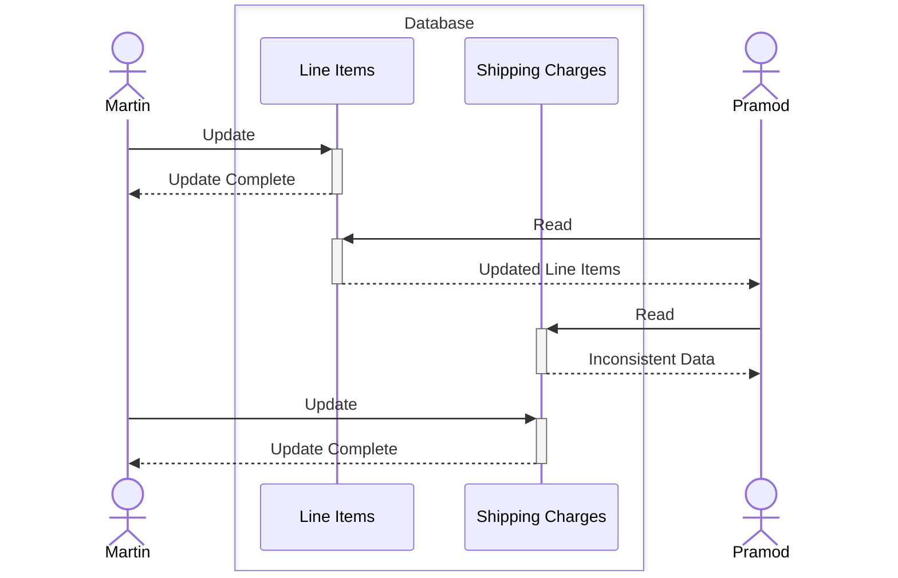
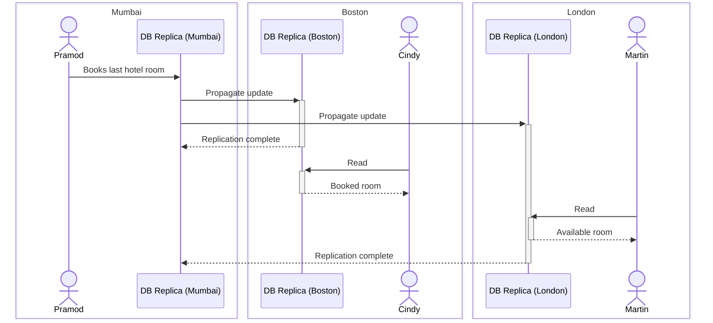
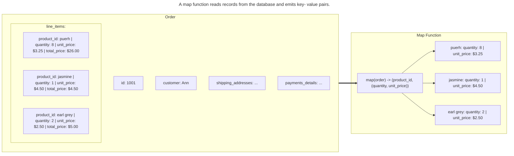
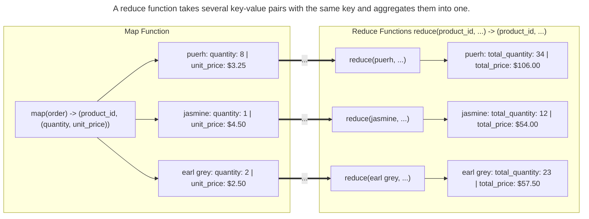

# NoSQL - Distilled

---

### Book Details

- **Title**: NoSQL - Distilled
- **Author**: Pramod J. Sadalage, Martin Fowler
- **Publisher**: Addison-Wesley
- **Published**: 2012-08-01
- **ISBN-10**: 0321826620
- **Amazon Link**: 
  - [**English Edition**](https://www.amazon.com/NoSQL-Distilled-Emerging-Polyglot-Persistence/dp/0321826620)
  - [**Portuguese Edition**](https://www.amazon.com.br/NoSQL-Essencial-Emergente-Persist%C3%AAncia-Poliglota-ebook/dp/B07V5635ZQ)

---

## Chapter 1. Why NoSQL?

### 1.1. The Value of Relational Databases

- **Persistent data**: when compared to file systems, relational databases provide a much more flexible and powerful way to store and query data.
- **Concurrency**: relational databases provide manage concurrency and provide transactional guarantees.
- **Inter-application Integration**: data can be shared between applications using a common database or syncing data between databases.
- **A Mostly Standard Model**: the relational model is a standard model that is implemented by many vendors.

### 1.2. Impedance Mismatch

- **Object-Relational Impedance Mismatch**: the difference between the relational model and the in-memory data structures of the programming language.
- The relational model is organized around relations (tables) and tuples (rows).
  - A tuple is a set of name-value pairs.
    - Values in tuples have to be simple (e.g. no nested objects, no arrays, etc.)
  - A relation is a set of tuples with the same set of attributes.
  - All operations are performed on relations (which leads to a mathematically relational algebra).
- On the other hand, the in-memory data structures of the programming language are organized around objects identified by its memory address.
- This foundational difference leads to a mismatch between the relational model and the in-memory data structures of the programming language.
- This mismatch leads to a lot of boilerplate code to map between the relational model and the in-memory data structures of the programming language. Furthermore, the abstractions can become a problem of their own when people try too hard to ignore the database and query performance suffers.

### 1.3. Application and Integration Databases

- **Integration Database**: a database that is used by multiple applications.
  - A big  reason for the success of relational databases during the 80s and 90s was the need for integration databases. The relational model was a good fit for this use case because it provided a standard model that could be used by multiple applications in a consistent way.
  - But, this approach has its own problems:
    - **Data/Schema Integration**: the data/schema of the database has to be designed to support all the applications that use it. This leads to a lot of compromises and a lot of unused data.
    - **Performance**: the database has to be tuned to support all the applications that use it. This leads to a lot of compromises and performance problems.
- **Application Database**: a database that is used by a single application.
  - This approach is much more common today because it avoids the problems of integration databases, bringing the focus back to the application and giving more flexibility to the database choice.
  - It's only possible because of the rise of the web protocols and the fact that most applications are now accessed through APIs. This makes it possible to have multiple applications with their own databases that share data through their APIs.
    - This approach is called **Service-Oriented Architecture** (SOA) and deals with different integration problems than the integration databases (like consistency along distributed data, availability, etc.).
    - In a first moment, this approach was executed by separating the application into two parts **Presentation Tier** and **Business Data Tier** which communicate each other using the HTTP protocol to exchange data in a format like XML or JSON.
      - This provided more flexibility for the structure of the data that was being exchanged between the two tiers.

### 1.4. Attack of the Clusters

- **Cluster**: a group of computers that work together to provide a single service.
1. **Dot-com boom**: the early 2000s saw the burst of the 1990s dot-com bubble, leading to questions about the economic future of the Internet.
2. **Increase in Web Scale**: Despite the dot-com bubble burst, the 2000s saw a dramatic increase in the scale of web properties. Websites began tracking activity and structure in detail, leading to large sets of data.
3. **Growth in Data and Users**: The growth in data was accompanied by a growth in users, requiring more computing resources.
4. **Scaling Up vs Scaling Out**: To handle the increase in data and traffic, two options were available: scaling up (bigger machines, more processors, disk storage, and memory) or scaling out (using lots of small machines in a cluster).
5. **Clusters and Relational Databases**: As large properties moved towards clusters, it revealed that relational databases are not designed to be run on clusters. This led to technical issues and increased licensing costs.
6. **Google and Amazon's Influence**: Google and Amazon, both capturing huge amounts of data and running large clusters, considered alternative routes to data storage. They produced influential papers about their efforts: BigTable from Google and Dynamo from Amazon.
   - **BigTable**: a distributed storage system for managing structured data that is designed to scale to a very large size: petabytes of data across thousands of commodity servers.
   - **Dynamo**: a highly available key-value storage system that some of Amazon's core services use to provide an "always-on" experience.
7. **New Databases for Clusters**: As more information about what Google and Amazon had done became available, people began to explore creating databases designed to live in a world of clusters, posing a serious threat to the dominance of relational databases.

### 1.5. The Emergence of NoSQL

- **Origin of the term NoSQL**: The term "NoSQL" first appeared in the late 90s as the name of an open-source relational database. The current usage of "NoSQL" that we recognize today traces back to a meetup on June 11, 2009 in San Francisco.
- **Definition of NoSQL**: NoSQL has never had a strong definition. Common characteristics of databases that tend to be called "NoSQL" include the absence of SQL, most are open-source projects, are oriented to operate on clusters, operate without a schema, and are based on the needs of the early 21st century web properties.
- **Interpretation of the term NoSQL**: Most people who talk about NoSQL say that it really means "Not Only SQL". However, this interpretation has some problems.
- **Contribution of NoSQL**: The most important contribution of NoSQL is opening up the range of options for data storage. This is often referred to as polyglot persistence - using different data stores in different circumstances.
- **Use of NoSQL**: Organizations need to shift from integration databases to application databases. NoSQL is seen as a good choice for application databases.
- **Reasons to consider NoSQL**: The two main reasons for considering NoSQL are to handle data access with sizes and performance that demand a cluster and to improve the productivity of application development by using a more convenient data interaction style.

### 1.6. Key Points

- Relational databases have been a successful technology for twenty years, providing persistence, concurrency control, and an integration mechanism.
- Application developers have been frustrated with the impedance mismatch between the relational model and the in-memory data structures.
- There is a movement away from using databases as integration points towards encapsulating databases within applications and integrating through services.
- The vital factor for a change in data storage was the need to support large volumes of data by running on clusters. Relational databases are not designed to run efficiently on clusters.
- NoSQL is an accidental neologism. There is no prescriptive definition— all you can make is an observation of common characteristics.
- The common characteristics of NoSQL databases are - Not using the relational model
  - Running well on clusters
  - Open-source
  - Built for the 21st century web estates
  - Schemaless
  - The most important result of the rise of NoSQL is Polyglot Persistence.

## Chapter 2. Aggregate Data Models

- **Definition of Data Model**: The data model is the method through which we perceive and manipulate our data. It is different from the storage model, which is about how the database stores and manipulates the data internally.
- **Use of Data Model**: In conversation, the term "data model" often refers to the model of the specific data in an application. However, in the context of this book, "data model" refers to the model by which the database organizes data.
- **Relational Data Model**: The dominant data model of the last couple of decades is the relational data model, visualized as a set of tables with rows and columns.
- **Shift to NoSQL**: NoSQL represents a shift away from the relational model. Each NoSQL solution uses a different model, categorized into four types: key-value, document, column-family, and graph.
- **Aggregate Orientation**: The first three NoSQL models (key-value, document, column-family) share a common characteristic called aggregate orientation.

### 2.1. Aggregates

- **Relational Model**: This model divides information into tuples or rows. It's a simple structure that doesn't allow for nesting of tuples or lists within tuples.
- **Aggregate Orientation**: This approach allows for more complex data structures. It's useful for operating on data units that have a more complex structure than a set of tuples.
- **Key-Value, Document, and Column-Family Databases**: These databases use the aggregate orientation approach. They handle operations on a cluster more easily due to the aggregate structure.
- **Domain-Driven Design**: The term "aggregate" comes from this design approach. An aggregate is a collection of related objects treated as a unit for data manipulation and consistency management.
- **Aggregates and Database Operations**: Aggregates make it easier for databases to handle operations like replication and sharding. They are also easier for programmers to work with as they often manipulate data through aggregate structures.

#### 2.1.1. Example of Relations and Aggregates

Let’s assume we have to build an e-commerce website; we are going to be selling items directly to customers over the web, and we will have to store information about users, our product catalog, orders, shipping addresses, billing addresses, and payment data. We can use this scenario to model the data using a relation data store as well as NoSQL data stores and talk about their pros and cons.

##### Relational Model


##### 2-Aggregation Model


```json
// in customers
{
    "id": 1,
    "name": "Martin",
    "billingAddress": [
        {
            "city": "Chicago"
        }
    ]
}
```

```json
// in orders
{
    "id": 99,
    "customerId": 1,
    "orderItems": [
        {
            "productId": 27,
            "price": 32.45,
            "productName": "NoSQL Distilled"
        }
    ],
    "shippingAddress": {
        "city": "Chicago"
    },
    "orderPayment": [
        {
            "ccinfo": "1000-1000-1000-1000",
            "txnId": "abelif879rft",
            "billingAddress": {
                "city": "Chicago"
            }
        }
    ]
}
```

The two main aggregates are 'customer' and 'order'.
- The 'customer' aggregate contains a list of billing addresses.
- The 'order' aggregate contains a list of order items, a shipping address, and payments. Each payment also contains a billing address.

An address record appears three times in the data, but it's treated as a value and copied each time to prevent changes to the shipping or billing address. This approach differs from a relational database where a new row would be created instead of updating existing address rows.

The relationship between 'customer' and 'order' is not within either aggregate, but between them. Similarly, the link from an 'order item' would cross into a separate 'product' aggregate, which is not detailed in the example.

The product name is shown as part of the 'order item', demonstrating denormalization, a common practice with aggregates to minimize the number of aggregates accessed during a data interaction.

##### 1-Aggregation Model


```json
// in customers
{
    "customer": {
        "id": 1,
        "name": "Martin",
        "billingAddress": [
            {
                "city": "Chicago"
            }
        ],
        "orders": [
            {
                "id": 99,
                "customerId": 1,
                "orderItems": [
                    {
                        "productId": 27,
                        "price": 32.45,
                        "productName": "NoSQL Distilled"
                    }
                ],
                "shippingAddress": {
                    "city": "Chicago"
                },
                "orderPayment": [
                    {
                        "ccinfo": "1000-1000-1000-1000",
                        "txnId": "abelif879rft",
                        "billingAddress": {
                            "city": "Chicago"
                        }
                    }
                ],
            }
        ]
    }
}
```

This emphasizes the importance of considering data access patterns when defining aggregate boundaries in your application data model. The way you group your data into aggregates can vary based on how you typically manipulate your data.

For instance, if you often access a customer along with all their orders, it might be beneficial to put all orders into the customer aggregate. Conversely, if you usually work with one order at a time, it might be better to have separate aggregates for each order.

The choice of how to draw your aggregate boundaries is context-specific and can vary even within a single system. This flexibility is one reason why some developers prefer to work with systems that don't enforce a specific aggregate structure (aggregate ignorance).

#### 2.1.2. Consequences of Aggregate Orientation

- **Aggregate Entities**: The relational model lacks the concept of aggregate entities, which are groups of related data items that are treated as a single unit for data manipulation and consistency purposes.

- **Aggregate-Oriented Databases**: These databases provide clearer semantics for aggregates by focusing on the unit of interaction with the data storage. The definition of an aggregate is not a logical data property, but rather depends on how the data is used by applications.

- **Aggregate-Ignorant Databases**: Relational and graph databases are considered aggregate-ignorant because they don't have a concept of aggregate within their data model. This can be beneficial when the same data is used in many different contexts, as it allows for more flexibility in viewing and manipulating data.

- **Benefits of Aggregate Orientation**: Aggregate orientation can improve performance when running on a cluster by minimizing the number of nodes that need to be queried. It also provides important information to the database about which data items should be stored together.

- **Transactions and Aggregates**: While relational databases support ACID transactions that can manipulate any combination of rows from any tables, aggregate-oriented databases typically only support atomic manipulation of a single aggregate at a time. This can limit the scope of atomicity, but it's often sufficient for most use cases.

- **Consistency**: The topic of consistency in databases is more complex than whether a database supports ACID transactions or not. Other factors, such as how data is divided into aggregates, also play a role.

### 2.2. Key-Value and Document Data Models

- **Aggregate Orientation**: Key-value and document databases are strongly aggregate-oriented, meaning they are primarily constructed through aggregates. Each aggregate has a key or ID used to access the data.

- **Key-Value vs Document Databases**: Key-value databases treat aggregates as opaque blobs, while document databases see a structure in the aggregate. Key-value databases offer more freedom in what can be stored, while document databases provide more flexibility in access.

- **Accessing Aggregates**: In key-value stores, aggregates can only be accessed by their key. In contrast, document databases allow queries based on the fields in the aggregate, partial retrieval of the aggregate, and indexing based on the contents of the aggregate.

- **Blurring Lines**: The distinction between key-value and document databases can blur in practice. For example, key-value databases may allow structures for data beyond just an opaque aggregate, and document databases may use an ID field for key-value style lookups.

- **Expectations**: Generally, with key-value databases, we expect to look up aggregates using a key. With document databases, we mostly expect to submit queries based on the internal structure of the document.

### 2.3. Column-Family Stores

- **BigTable and Influences**: Google's BigTable, a NoSQL database, has influenced later databases like HBase and Cassandra. It's often referred to as a column store due to its data model.

- **Column Stores**: Column stores, like C-Store, store data by groups of columns for all rows as the basic storage unit. This is beneficial when writes are rare, but there's a need to read a few columns of many rows at once.

- **Column-Family Databases**: BigTable and its successors are referred to as column-family databases. They store groups of columns (column families) together but abandon the relational model and SQL.

- **Column-Family Model**: This model is a two-level aggregate structure. The first key is often a row identifier, and the row aggregate is formed of a map of more detailed values, referred to as columns.

- **Column Families**: Column-family databases organize their columns into column families. Each column is part of a single column family, and the column acts as a unit for access.

- **Data Structure**: The data can be structured in two ways: row-oriented, where each row is an aggregate with column families representing chunks of data within that aggregate; or column-oriented, where each column family defines a record type with rows for each of the records.

- **Cassandra's Approach**: Cassandra views things slightly differently. A row in Cassandra only occurs in one column family, but that column family may contain supercolumns—columns that contain nested columns.

- **Wide and Skinny Rows**: Column-family databases can have wide rows with many columns (modeling a list) and skinny rows with few columns (defining a record type).

- **Sort Order**: Column families can define a sort order for their columns, allowing access to orders by their order key and access ranges of orders by their keys.

### 2.4. Summarizing Aggregate-OrientedDatabases

- **Aggregate-Oriented Data Models**: These models are common in NoSQL databases and are characterized by the use of aggregates indexed by a key for lookup. They are crucial for running on a cluster, as they ensure all data for an aggregate is stored together on one node.
  - **Atomic Unit for Updates**: The aggregate acts as the atomic unit for updates, providing a degree of transactional control.

- **Key-Value Data Model**: This model treats the aggregate as an opaque whole, allowing only key lookup for the entire aggregate. It does not support running a query or retrieving a part of the aggregate.

- **Document Model**: This model makes the aggregate transparent to the database, enabling queries and partial retrievals. However, due to the lack of a schema, the database cannot optimize the storage and retrieval of parts of the aggregate based on its structure.

- **Column-Family Models**: These models divide the aggregate into column families, which the database can treat as units of data within the row aggregate. This imposes some structure on the aggregate, allowing the database to improve its accessibility.

### 2.5. Further Reading

- **Domain-Driven Design**: This book by Eric Evans is the definitive work on domain-driven design. It introduced the concept of aggregates and aggregate roots, which are the basis for the aggregate-oriented data model.

### 2.6. Key Points

- An aggregate is a collection of data that we interact with as a unit. Aggregates form the boundaries for ACID operations with the database.

- Key-value, document, and column-family databases can all be seen as forms of aggregate-oriented database.

- Aggregates make it easier for the database to manage data storage over clusters.

- Aggregate-oriented databases work best when most data interaction is done with the same aggregate; aggregate-ignorant databases are better when interactions use data organized in many different formations.

## Chapter 3. More Details on Data Models

### 3.1. Relationships

- **Aggregates and Data Access:** Aggregates group together commonly accessed data. However, the way data is accessed can vary, affecting how aggregates should be structured. For example, some applications may need to access a customer's entire order history, while others may need to process orders individually.

- **Relationships Between Aggregates**: There can be relationships between different aggregates, such as a customer and their orders. These relationships can be represented by embedding the ID of one aggregate within another. However, this approach makes the database ignorant of the relationship.

- **Database Awareness of Relationships**: Many databases, including key-value stores and document stores, provide ways to make these relationships visible to the database. This can be useful for forming indexes and queries, and for supporting partial retrieval and link-walking capabilities.

- **Updates and Atomicity**: Aggregate-oriented databases treat the aggregate as the unit of data retrieval, and only support atomicity within a single aggregate. If multiple aggregates are updated at once, handling a failure partway through becomes the developer's responsibility.

- **Operating Across Multiple Aggregates**: Working with multiple aggregates can be challenging with aggregate-oriented databases. While there are ways to manage this, the fundamental complexity remains.

- **Relational Databases and Complex Relationships**: While relational databases can handle complex relationships, they also have their limitations. As the number of joins in a query increases, writing SQL and managing performance can become difficult.

### 3.2. Graph Databases

- **Graph Databases**: Unlike most NoSQL databases, graph databases are not primarily designed for cluster operation. They are designed to handle small records with complex interconnections, making them ideal for data with complex relationships like social networks, product preferences, or eligibility rules.

- **Data Model**: The fundamental data model of a graph database is nodes connected by edges. There is a lot of variation in how data can be stored in nodes and edges, with some databases allowing additional attributes or storing Java objects.

- **Query Operations**: Graph databases provide query operations designed for their graph structure. This allows for efficient traversal of relationships, shifting most of the work from query time to insert time. This is beneficial when query performance is more important than insert speed.

- **Finding Data**: Data in a graph database is typically found by navigating through the network of edges. Some nodes can be indexed by an attribute for a starting point, but most query work is expected to be navigating relationships.

- **Comparison with Aggregate-Oriented Databases**: Graph databases differ significantly from aggregate-oriented databases due to their emphasis on relationships. They are more likely to run on a single server and require ACID transactions to cover multiple nodes and edges for consistency. The main similarity is their rejection of the relational model.

- **Example of a graph structure**:
    - Nodes: Alice, Bob, Charlie, David
    - Edges: Knows, Friend, Likes, Loves
    - Relationships:
        - Alice Knows Bob
        - Bob is a Friend of Charlie
        - Charlie Likes David
        - David Loves Alice
    - Possible queries:
        - Find all of Alice's friends
        - Find all of Alice's friends who like David
        - Find all of Alice's friends who like David and are loved by David


### 3.3. Schemaless Databases

- **Schemaless Databases**: NoSQL databases are often schemaless, meaning they do not require a predefined structure for the data they store. This contrasts with relational databases, which require a defined schema before data can be stored.

- **Flexibility of Schemaless Databases**: Schemaless databases allow for more flexibility in data storage. They can store any data under any key, document, column, or node. This flexibility is beneficial when the data to be stored is not fully known in advance or when the data structure may change over time.

- **Handling Nonuniform Data**: Schemaless databases handle nonuniform data more efficiently than relational databases. They allow each record to contain just what it needs, avoiding the need for null values or meaningless columns.

- **Implicit Schema in Programs**: Despite the schemaless nature of NoSQL databases, programs that access the data often rely on an implicit schema. They assume certain field names and data types, which can lead to problems if the assumptions do not match the actual data.

- **Problems with Implicit Schema**: Having an implicit schema in the application code can make it difficult to understand the data structure without examining the code. It also prevents the database from using the schema to optimize data storage and retrieval, and from validating the data.

- **Shifting the Schema to Application Code**: In a schemaless database, the schema is essentially shifted into the application code. This can cause problems if multiple applications access the same database, but these problems can be mitigated with certain approaches, such as encapsulating all database interaction within a single application.

- **Changing Relational Schemas**: Contrary to common criticism, relational schemas can be changed at any time with standard SQL commands. However, schemaless databases may still be preferred for nonuniform data.

- **Impact of Schemalessness on Database Structure Changes**: Schemalessness affects how a database's structure can be changed over time. Changes must be controlled to ensure old and new data can be accessed easily. The flexibility of schemalessness applies only within an aggregate; changing aggregate boundaries is as complex as in the relational case.

### 3.4. Materialized Views

- **Aggregate-Oriented Data Models**: These models have advantages in storing and accessing data as a unit, but can be disadvantageous when needing to access individual elements within the aggregate.

- **Relational Databases and Views**: Relational databases can support different data access methods due to their lack of aggregate structure. They use views, which are computations over base tables, to present data differently from how it's stored.

- **Materialized Views**: These are views that are computed in advance and cached on disk. They are useful for data that is read frequently but can tolerate being slightly outdated. 

- **Materialized Views in NoSQL Databases**: NoSQL databases may not have views, but they can have precomputed and cached queries, often referred to as materialized views. These are particularly important for aggregate-oriented databases when dealing with queries that don't align well with the aggregate structure.

- **Strategies for Building Materialized Views**: There are two main strategies - the eager approach, where the materialized view is updated simultaneously with the base data, and the batch approach, where materialized views are updated at regular intervals.

- **Building Materialized Views Outside the Database**: Materialized views can be built outside the database by reading the data, computing the view, and saving it back to the database. Alternatively, some databases support building materialized views internally.

- **Materialized Views within the Same Aggregate**: Materialized views can be used within the same aggregate to provide summary information, reducing the need to transfer the entire document for a query. This is a common feature in column-family databases and allows for atomic operations on the materialized view.

### 3.5. Modeling for Data Access

1. **Embedding All Data for a Customer**: The text begins by discussing a model where all data related to a customer, including details, billing addresses, payments, and orders, is embedded within a single object in a key-value store. This allows for easy retrieval of all customer-related data, but requires parsing on the client side to access specific information.

```json
// Customer Object
{
    "id": "Customer ID",
    "details": {
        "name": "Martin"
    },
    "billingAddresses": [
        {
            "city": "Chicago"
        }
    ],
    "payments": [
        {
            "type": "debit",
            "ccinfo": "1000-1000-1000-1000"
        }
    ],
    "orders": [
        {
            "orderDate": "Nov-20-2011",
            "shippingAddress": {
                "city": "Chicago"
            },
            "payments": [
                {
                    "ccinfo": "1000-1000-1000-1000",
                    "txnId": "abelif879rft"
                }
            ],
            "items": [
                {
                    "productId": 27,
                    "price": 32.45
                }
            ]
        }
    ]
}
```


2. **Separating Customer and Order Data**: The text then discusses a model where customer and order data are stored separately, with references (like order IDs) used to link related data. This allows for more efficient querying but requires maintaining references between objects.

```json
// Customer Object
{
    "id": "Customer ID",
    "details": {
        "name": "Martin"
    },
    "billingAddresses": [
        {
            "city": "Chicago"
        }
    ],
    "payments": [
        {
            "type": "debit",
            "ccinfo": "1000-1000-1000-1000"
        }
    ],
    "orders": [
        {
            "orderId": 99
        }
    ]
}
```

```json
// Order Object
{
    "id": "Order Id",
    "customerId": "Customer ID",
    "orderDate": "Nov-20-2011",
    "shippingAddress": {
        "city": "Chicago"
    },
    "payments": [
        {
            "ccinfo": "1000-1000-1000-1000",
            "txnId": "abelif879rft"
        }
    ],
    "items": [
        {
            "productId": 27,
            "price": 32.45
        }
    ]
}
```


3. **Using Aggregates for Analytics**: The text discusses how aggregates can be used to facilitate analytics, such as identifying which orders contain a particular product. This involves denormalizing the data to allow for faster access to relevant information.

```json
[
    {
        "productId": 27,
        "orders": {
            99,545,897,678
        }
    },
    {
        "productId": 29,
        "orders": {
            199,545,704,819
        }
    }
]
```

4. **Removing Order References from the Customer Object**: The text discusses a model where references to orders are removed from the customer object, allowing for updates to orders without needing to update the customer object. This is possible in document stores, which allow querying within documents.

```json
// Customer Object
{
    "id": "Customer ID",
    "details": {
        "name": "Martin"
    },
    "billingAddresses": [
        {
            "city": "Chicago"
        }
    ],
    "payments": [
        {
            "type": "debit",
            "ccinfo": "1000-1000-1000-1000"
        }
    ]
}
```

```json
// Order Object
{
    "id": "Order Id",
    "customerId": "Customer ID",
    "orderDate": "Nov-20-2011",
    "shippingAddress": {
        "city": "Chicago"
    },
    "payments": [
        {
            "ccinfo": "1000-1000-1000-1000",
            "txnId": "abelif879rft"
        }
    ],
    "items": [
        {
            "productId": 27,
            "price": 32.45
        }
    ]
}
```

5. **Modeling for Column-Family Stores**: The text discusses how to model data for column-family stores, emphasizing the importance of designing the model based on query requirements rather than write requirements. The text suggests denormalizing data during write operations to make querying easier.


6. **Using Graph Databases**: Finally, the text discusses how to model data using graph databases, where objects are modeled as nodes and relationships between them are modeled as edges. This allows for easy traversal of relationships, which can be useful for tasks like product recommendation or pattern detection.


### 3.6. Key Points

- Aggregate-oriented databases make inter-aggregate relationships more difficult to handle than intra-aggregate relationships.

- Graph databases organize data into node and edge graphs; they work best for data that has complex relationship structures.

- Schemaless databases allow you to freely add fields to records, but there is usually an implicit schema expected by users of the data.

- Aggregate-oriented databases often compute materialized views to provide data organized differently from their primary aggregates. This is often done with map-reduce computations.

## Chapter 4. Distribution Models

- **NoSQL and Scalability**: The initial focus is on the key advantage of NoSQL databases: their ability to scale out across a large cluster of servers, which is particularly beneficial as data volumes increase.

- **Benefits and Costs of Scaling Out**: Scaling out can provide the ability to handle larger quantities of data, process greater read or write traffic, and maintain availability in the face of network issues. However, it also introduces complexity, making it a strategy to consider only when the benefits outweigh the costs.

- **Data Distribution Strategies**: The text introduces two main strategies for data distribution: replication and sharding. Replication involves copying the same data across multiple nodes, while sharding involves distributing different data across different nodes.

- **Replication Techniques**: The text further breaks down replication into two forms: master-slave and peer-to-peer. It outlines a plan to discuss these techniques in increasing order of complexity: single-server, master-slave replication, sharding, and finally peer-to-peer replication.

### 4.1. Single Server

- **Single-Server Distribution**: The simplest form of data distribution, recommended for its ease of management and simplicity for application developers.

- **NoSQL on Single-Server**: Despite many NoSQL databases being designed for cluster operation, using them in a single-server model can be beneficial if the data model suits the application, such as with graph databases or aggregate processing.

- **Complex Distribution Schemes**: While the rest of the chapter will discuss more complex distribution schemes, the single-server approach is preferred when possible, despite the greater volume of discussion dedicated to the more complex options.

### 4.2. Sharding


- **Sharding**: A technique used to distribute different parts of a dataset across different servers for improved horizontal scalability.

- **Ideal Case of Sharding**: The ideal scenario is when different users interact with different server nodes, each user only communicates with one server, leading to faster responses and balanced load across servers.

- **Data Clumping and Aggregate Orientation**: The text talks about the importance of grouping data that is accessed together on the same node (data clumping) and how aggregate orientation can help achieve this.

- **Data Arrangement on Nodes**: Several factors can improve performance when arranging data on nodes, such as placing data close to where it's accessed and evenly distributing aggregates across nodes.

- **Sharding in Application Logic**: Historically, sharding has been done as part of application logic, which can complicate the programming model. However, many NoSQL databases now offer auto-sharding, which simplifies this process.

- **Performance and Resilience**: Sharding can improve both read and write performance, but it doesn't necessarily improve resilience. While it can limit the impact of a node failure to only the users of the data on that shard, it can also decrease resilience if used alone.

- **Sharding Implementation**: The text warns that implementing sharding is not a step to be taken lightly. It advises starting with a single-server configuration and only moving to sharding when load projections indicate it's necessary. It also emphasizes the importance of implementing sharding well before it's needed to avoid potential issues.

### 4.3. Primary-Secondary Replication


- **Primary-Secondary Replication**: Data is replicated across multiple nodes. The primary node is the authoritative source for the data and handles updates, while secondary nodes are synchronized with the primary.

- **Scaling and Read-Intensive Datasets**: Primary-secondary replication is beneficial for scaling read-intensive datasets. By adding more secondary nodes and routing read requests to them, the system can handle more read requests. However, the system's ability to process updates and propagate them is still limited by the primary node's capacity.

- **Read Resilience and Failure Handling**: Another advantage of primary-secondary replication is read resilience. If the primary node fails, secondary nodes can still handle read requests. The system can quickly appoint a new primary from the secondary nodes, speeding up recovery after a failure.

- **Hot Backup and Resilience**: All read and write traffic can go to the primary while the secondary acts as a hot backup. This setup provides the convenience of a single-server configuration with greater resilience, especially useful for handling server failures gracefully.

- **Primary Node Appointment**: Primary nodes can be appointed manually or automatically. Automatic appointment allows the cluster to automatically appoint a new primary when the current one fails, reducing downtime.

- **Read and Write Paths**: To achieve read resilience, the application should have separate read and write paths. This setup allows the system to handle a failure in the write path while still being able to read.

- **Replication and Inconsistency**: Replication offers many benefits, but it also introduces the risk of inconsistency. Different clients reading from different secondary nodes might see different values if changes haven't propagated to all secondary nodes yet. This issue is discussed further in the section on "Consistency".

### 4.4. Peer-to-Peer Replication


- **Primary-Secondary Replication Limitations**: The primary node is a potential bottleneck and a single point of failure.

- **Peer-to-Peer Replication**: All nodes are equal, can accept writes, and the loss of any node doesn't prevent data access.

- **Benefits and Complications**: Peer-to-peer replication offers benefits like resilience to node failures and improved performance with added nodes. However, it also introduces complications, primarily related to data consistency.

- **Write-Write Conflict**: The risk of write-write conflict arises when two different places can be written to simultaneously, leading to potential inconsistencies.

- **Handling Write Inconsistencies**: There are two broad options for handling write inconsistencies. One is to coordinate replicas during a write to avoid conflict, and the other is to cope with an inconsistent write and merge them based on a policy.

- **Consistency vs Availability Trade-off**: These points are at the ends of a spectrum where we trade off consistency for availability.

### 4.5. Combining Sharding and Replication

#### 4.5.1. Primary-Secondary Replication X Sharding

- **Multiple Primary Nodes with Unique Data Items**: The system has multiple primary nodes, but each data item is primarily controlled by a single node.

- **Node Configuration**: Nodes can be configured to serve as a primary for some data and secondary for others, or nodes can be dedicated solely to primary or secondary roles.


#### 4.5.2. Peer-to-Peer Replication X Sharding

- **Cluster Configuration**: Considering a column-family databases setup, there could be tens or hundreds of nodes in a cluster with data sharded across them. 

- **Replication Factor**: A replication factor of 3 is suggested as a good starting point, meaning each shard is present on three nodes. 

- **Node Failure Handling**: If a node fails, the shards on that node will be rebuilt on the other nodes.


### 4.6. Key Points

- There are two styles of distributing data (a system may use either or both techniques):
  - Sharding distributes different data across multiple servers, so each server acts as the single source for a subset of data.
  - Replication copies data across multiple servers, so each bit of data can be found in multiple places.

- Replication comes in two forms:
  - Primary-secondary replication makes one node the authoritative copy that handles writes while secondaries synchronize with the primary and may handle reads.
  - Peer-to-peer replication allows writes to any node; the nodes coordinate to synchronize their copies of the data.

- Primary-secondary replication reduces the chance of update conflicts but peer-to-peer replication avoids loading all writes onto a single point of failure.

## Chapter 5. Consistency

- **Transition to NoSQL Databases**: The text discusses the shift from centralized relational databases to cluster-oriented NoSQL databases, emphasizing the change in how consistency is considered. It mentions that relational databases aim to exhibit strong consistency by avoiding various inconsistencies, while NoSQL databases aim to exhibit eventual consistency by allowing inconsistencies to occur and then resolving them.

### 5.1. Update Consistency

- **Write-Write Conflict**: Two users attempt to update the same data item simultaneously.
    - **Example**: Two users attempt to update the same customer's address at the same time. The server receives both updates and applies them in an arbitrary order, resulting in one update being lost. This called a **lost update**.

- **Consistency Maintenance Approaches**: There are two main approaches to maintaining consistency: pessimistic and optimistic.
    - **Pessimistic**: The pessimistic approach prevents conflicts from occurring.
        - **Strategies**:
            - **Write Lock**: The server applies a write lock to the data item, preventing other users from updating it until the first update is complete.
        - **Issues**:
            - **Degraded Responsiveness**: The server must wait for the first update to complete before allowing the second update to proceed, which can lead to degraded responsiveness.
            - **Deadlocks**: If two users attempt to update the same data item simultaneously, each will acquire a write lock and wait for the other to release it, resulting in a deadlock.
    - **Optimistic**: The optimistic approach allows conflicts to occur but detects and resolves them.
        - **Strategies**:
            - **Conditional Update**: The server applies the update if the data item has not been updated since the user read it. If the data item has been updated, the server rejects the update and the user must read the data again and try the update again.
            - **Handling Write-Write Conflicts**: The server applies both updates and records that they are in conflict. The user must read the data again and resolve the conflict (usually used in version control systems).
        - **Issues**:
            - **Read-Modify-Write**: The user must read the data, modify it, and write it back. If the data is updated between the read and write, the user must read the data again and try the update again.
            - **Extra Work**: Conditional updates and conflict resolution require extra work from the user, which can be difficult to implement correctly.

- **Consistent Serialization**: Updates are applied in the same order on all nodes.

- **Sequential Consistency**: All nodes see the same order of updates.

- **Safety vs Liveness**: Each approach has its own tradeoff between safety and liveness.
    - **Safety**: Avoiding errors such as update conflicts.
    - **Liveness**: Responding quickly to clients.

- **Replication and Update Consistency**: Replication introduces the risk of update conflicts, noting that using a single node for all writes makes it easier to maintain update consistency.

### 5.2.Read Consistency

- **Logical Consistency and Read-Write Conflicts**: The text discusses the concept of logical consistency, where different data items need to make sense together. It explains the scenario of a read-write conflict, where a read operation occurs in the middle of a write operation, leading to inconsistent data.



- **Transactions and Consistency**: By wrapping multiple writes in a transaction, the system can ensure that all data items are read either before or after the update, avoiding inconsistencies.

- **NoSQL Databases and Consistency**: The text refutes the claim that NoSQL databases can't support transactions and thus can't be consistent. It clarifies that some NoSQL databases, particularly aggregate-oriented ones, do support atomic updates within a single aggregate, ensuring logical consistency within the aggregate.

- **Inconsistency Window**: The time during which an inconsistent read could occur. The inconsistency window for some NoSQL systems can be quite short.

- **Replication Consistency**: Ensures that the same data item has the same value when read from different replicas.
    - **Eventual Consistency**: Nodes may have replication inconsistencies at any time, but if there are no further updates, all nodes will eventually be updated to the same value.



- **Consistency Guarantees and Levels**: Consistency guarantees can be specified at the level of individual requests, allowing for weak consistency most of the time and strong consistency when necessary.

- **Read-Your-Writes Consistency and Session Consistency**: The text discusses the need for read-your-writes consistency, where once an update is made, the user is guaranteed to continue seeing that update.
    - **Session Consistency**: Techniques for maintaining read-your-writes consistency within a user's session. This can be done by routing all requests from a user to the same node (**sticky sessions**), or by using version stamps to ensure that the user sees the latest version of the data (**etag**).

- **Replication Consistency in Application Design**: The text concludes by discussing the importance of replication consistency in overall application design, and the challenges of maintaining consistency during user interaction.

### 5.3. Relaxing Consistency

- **Consistency Trade-offs**: Discusses the necessity of sometimes sacrificing consistency in system design due to other constraints. Different domains have varying tolerances for inconsistency, which should be considered in system design decisions. The trade-off between consistency and other system characteristics is seen as an inevitable part of system design.

- **Relational Database Systems and Consistency**: Explains how transactions in single-server relational database systems enforce consistency. However, transaction systems usually come with the ability to relax isolation levels, allowing queries to read data that hasn’t been committed yet. Most applications choose to operate at the read-committed transaction level, which eliminates some read-write conflicts but allows others.

- **Performance Impact of Transactions**: Highlights scenarios where systems avoid transactions due to their high performance impact. Examples include the early popularity of MySQL, which didn't support transactions, and large websites like eBay that needed to forego transactions for performance reasons.

- **Transactions and Sharding**: Mentions that the need for sharding can also lead to the avoidance of transactions.

- **Non-Transactional Updates**: Concludes by noting that many applications need to interact with remote systems that can't be included within a transaction boundary, making non-transactional updates a common occurrence in enterprise applications.

####  5.3.1. The CAP Theorem

- **CAP Theorem**: States that a distributed data store cannot simultaneously provide more than two out of the following three guarantees: **Consistency**, **Availability**, and **Partition tolerance**. The theorem is often used to explain why some NoSQL databases may relax consistency.
    - **Consistency**: All nodes see the same data at the same time.
    - **Availability (particular meaning in the context of CAP)**: If you can talk to a node in the cluster, it can read and write data.
    - **Partition tolerance**: The cluster can survive communication breakages in the cluster that separate the cluster into multiple partitions unable to communicate with each other (situation known as a **split brain**).

- **Single-Server Systems and CA**: Single-server systems are examples of systems that provide Consistency and Availability but not Partition tolerance. Most relational database systems operate in this world.

- **Trade-off between Consistency and Availability**: In a system that may suffer partitions, there is a trade-off between consistency and availability. This isn't a binary decision; often, a little consistency can be traded off to gain some availability.

- **Examples**:
    - **Booking System**: Two users are trying to book the last hotel room. The system must decide between ensuring consistency (and potentially sacrificing availability) or improving availability (and potentially allowing inconsistent data).
    - **Inconsistent Writes and Shopping Cart (Amazon Dynamo)**: Discusses the concept of allowing inconsistent writes, using the example of a shopping cart. Even if network failures result in multiple shopping carts, the checkout process can merge the carts, allowing the user to review before completing the order.

- **Read Consistency and Tolerance of Stale Reads**: Different data items may have different tolerances for staleness, and this tolerance needs to be considered when configuring replication.

- **ACID and BASE Properties**: Mentions the ACID (Atomicity, Consistency, Isolation, Durability) properties of relational transactions and the BASE (Basically Available, Soft state, Eventual consistency) properties often associated with NoSQL systems. The tradeoff between ACID and BASE is seen as a spectrum, not a binary choice.

- **Consistency vs Latency**: It’s usually better to think not about the tradeoff between *consistency* and *availability* but rather between *consistency* and *latency*. We could add more nodes to a system to improve availability, but that would increase the latency of the system. So, we can think about availability as the limit of latency that we’re prepared to tolerate; once latency gets too high, we give up and treat the data as unavailable.
    - **Latency and CAP**: The CAP theorem is often misinterpreted as a trade-off between consistency and availability, but it’s actually a trade-off between consistency and latency.

### 5.4. Relaxing Durability

- **Durability Trade-offs**: Discusses the concept of trading off some durability for higher performance. This can be achieved by running a database mostly in memory, applying updates to its in-memory representation, and periodically flushing changes to disk. The risk is that any updates since the last flush will be lost if the server crashes.

- **Examples**:
    - **User-Session State**: A large website may have many users and keep temporary information about each user's activity in a session state. Losing the session data isn't too much of a tragedy and may be less annoying than a slower website, making it a good candidate for nondurable writes.
    - **Telemetric Data**: Capturing telemetric data from physical devices at a faster rate may be more important than the risk of missing the last updates if the server crashes.

- **Replicated Data and Durability Trade-offs**: A failure of replication durability occurs when a primary node processes an update but fails before that update is replicated to the secondary nodes. If a primary does fail, any writes not passed onto the replicas will effectively become lost.

- **Primary-Secondary Distribution Model**: In a primary-secondary distribution model, if the primary fails, the secondary nodes may appoint a new primary automatically. If the primary comes back online, those updates will conflict with updates that have happened since.

- **Improving Replication Durability**: Replication durability can be improved by ensuring that the primary waits for some replicas to acknowledge the update before the primary acknowledges it to the client. However, this will slow down updates and make the cluster unavailable if secondary nodes fail, leading to another tradeoff depending on how vital durability is.

### 5.5. Quorums

- **Consistency and Durability Trade-offs**: Discusses the concept of trading off consistency or durability for performance. The more nodes involved in a request, the higher the chance of avoiding inconsistency. However, the number of nodes required for strong consistency depends on the system's configuration.

- **Write Quorum**: The minimum number of nodes that must acknowledge a write to ensure strong consistency. For example, in a system with three nodes, only two need to acknowledge a write for strong consistency. This is because if there are conflicting writes, only one can get a majority.
    - **Inequality**: `W > N / 2`
        - `W`: Write Quorum
        - `N`: Number of Nodes

- **Read Quorum**: The minimum number of nodes that must be contacted to ensure the most up-to-date data is read. The read quorum depends on the write quorum. For instance, if all writes need two nodes to confirm, then at least two nodes need to be contacted for a read. However, if writes are only confirmed by a single node, all three nodes need to be contacted for a read.
    - **Inequality**: `R + W > N`
        - `R`: Read Quorum
        - `W`: Write Quorum
        - `N`: Number of Nodes

- **Strongly Consistent Reads**: Even if there isn't strong consistency on writes, strongly consistent reads can still be achieved by contacting enough readers to detect any update conflicts.

- **Replication Factor**: The number of replicas of the data. The replication factor is often different from the number of nodes in the cluster. For example, a cluster may have 100 nodes but only a replication factor of 3. A replication factor of 3 is often suggested for good resilience, allowing a single node to fail while still maintaining quorums for reads and writes.

- **Operation-Specific Quorums**: The number of nodes participating in an operation can vary with the operation. Some types of updates might require a quorum, while others might not, depending on the value placed on consistency and availability. Similarly, a read that needs speed but can tolerate staleness should contact fewer nodes.

- **Balancing Consistency, Availability, and Performance**: There is a range of options to work with when balancing consistency, availability, and performance. The choice depends on the specific circumstances and the trade-offs that are acceptable.

### 5.6. Further Reading

- *Tanenbaum and Van Steen*, **Distributed Systems: Principles and Paradigms (2nd Edition)**, is a good introduction to distributed systems, including consistency and replication.
    - Link: https://www.amazon.com/Distributed-Systems-Principles-Paradigms-2nd/dp/0132392275

- IEEE Computer Feb 2012, **There is More Consensus in Egalitarian Parliaments**, discusses the CAP theorem and the tradeoffs between consistency and availability.
    - Link: https://ieeexplore.ieee.org/document/6142648

### 5.7. Key Points

- Write-write conflicts occur when two clients try to write the same data at the same time. Read-write conflicts occur when one client reads inconsistent data in the middle of another client’s write.

- Pessimistic approaches lock data records to prevent conflicts. Optimistic approaches detect conflicts and fix them.

- Distributed systems see read-write conflicts due to some nodes having received updates while other nodes have not. Eventual consistency means that at some point the system will become consistent once all the writes have propagated to all the nodes.

- Clients usually want read-your-writes consistency, which means a client can write and then immediately read the new value. This can be difficult if the read and the write happen on different nodes.

- To get good consistency, you need to involve many nodes in data operations, but this increases latency. So you often have to trade off consistency versus latency.

- The CAP theorem states that if you get a network partition, you have to trade off availability of data versus consistency.

- Durability can also be traded off against latency, particularly if you want to survive failures with replicated data.

- You do not need to contact all replicants to preserve strong consistency with replication; you just need a large enough quorum.

## Chapter 6. Version Stamps

- **Transactions and NoSQL Databases**: Discusses the criticism of NoSQL databases for their lack of support for transactions. Transactions are a mechanism that helps maintain consistency in databases. However, aggregate-oriented NoSQL databases do support atomic updates within an aggregate, which is a natural unit of update.

- **Consideration of Transactional Needs**: Emphasizes that transactional needs should be considered when choosing a database. The choice of database should align with the specific requirements of the application or system.

- **Limitations of Transactions**: Highlights the limitations of transactions. Even in a transactional system, there are updates that require human intervention and cannot be run within transactions because they would involve holding a transaction open for too long.

- **Use of Version Stamps**: Introduces the concept of version stamps, which can be used to handle updates that cannot be run within transactions. Version stamps are also useful in other situations, especially when moving away from a single-server distribution model.

### 6.1.Business and SystemTransactions

- **Business Transactions**: A business transaction is a sequence of steps that need to be executed atomically.
    - **Examples**: A customer placing an order involves multiple steps, including checking the customer's credit, reserving the items, and charging the customer's credit card. All these steps need to be executed atomically to ensure that the customer is not charged if the items are not available.

- **System Transactions**: A system transaction is a database operation that needs to be executed atomically. It's usually initiated at the end of a business transaction to minimize lock time.
    - **Data Changes During Transactions**: As the system transaction is initiated at the end of the business transaction, there is a risk that data may have changed during the business transaction. This can lead to incorrect decisions being made based on stale data.

- **Offline Concurrency Techniques**: Offline concurrency techniques to handle data changes during transactions.
    - **Optimistic Offline Lock**: Involves re-reading data before an update and checking if it has changed since it was first read.

- **Version Stamps**: Fields in a database record that change every time the underlying data changes. Version stamps can be used to check if data has changed before an update.

- **HTTP Etags**: An example of version stamps in HTTP, where Etags are used to indicate the version of a resource. Etags can be used for conditional updates to ensure that updates are not based on stale data.

- **Conditional Updates in Databases**: Discusses how some databases provide mechanisms for conditional updates similar to HTTP etags. These mechanisms can be used to prevent updates based on stale data.

- **Different Types of Version Stamps**: Describes different ways to construct version stamps, including counters, GUIDs, content hashes, and timestamps. Each method has its own advantages and disadvantages.
    - **Counters**: Counters are simple to implement but can be difficult to scale out due to the need to coordinate updates between nodes.
    - **GUIDs**: GUIDs are easy to generate but can be difficult to compare.
    - **Content Hashes**: Content hashes are easy to compare but can be difficult to generate and store.
    - **Timestamps**: Timestamps are simple to implement but has the risk of duplicate timestamps if the clock is not synchronized or has low resolution.

- **Composite Version Stamps**: Combine different methods. This can provide the advantages of multiple methods and help avoid update conflicts.

- **Session Consistency**: Version stamps can also be used to provide session consistency, ensuring that a user sees a consistent view of data throughout a session.

### 6.2. Version Stamps on Multiple Nodes

- **Version Stamps in Primary-Secondary Systems**: In these systems, the primary node controls the version stamps, and secondary nodes follow the primary's stamps. 

- **Version Stamps in Peer-to-Peer Systems**: As there's no single authority, if two nodes provide different data, it's necessary to determine which data is more recent or if there's an inconsistency.

- **Counter-Based Version Stamps**: Each time a node updates data, it increments the counter. For example, if one node has a version stamp of 4 and another has 6, the data from the second node is more recent.

- **Version Stamp Histories**: These histories can show if one version of data is an ancestor of another, helping to resolve conflicts.

- **Timestamp-Based Version Stamps**: Highlighting the challenges of ensuring all nodes have a consistent notion of time and the inability of timestamps to detect write-write conflicts.

- **Vector Stamps**: Sets of counters, one for each node. For example, a vector stamp for three nodes might look like `[node1: 43, node2: 54, node3: 12]`. Each time a node updates data, it increments its own counter in the vector stamp.
    - **Handling Missing Values in Vector Stamps**: Missing values in vector stamps are treated as zero, allowing new nodes to be easily added without invalidating existing vector stamps.
    - **Conflict Resolution with Vector Stamps**: Notes that while vector stamps can detect inconsistencies, they do not resolve them. The method of conflict resolution depends on the specific domain and is part of the trade-off between consistency and latency.

### 6.3. Key Points

- Version stamps help you detect concurrency conflicts. When you read data, then update it, you can check the version stamp to ensure nobody updated the data between your read and write.

- Version stamps can be implemented using counters, GUIDs, content hashes, timestamps, or a combination of these.

- With distributed systems, a vector of version stamps allows you to detect when different nodes have conflicting updates.

## Chapter 7. Map-Reduce

- **Data Storage and Computation in Clusters**: The rise of clusters has changed the way data is stored and processed. In a cluster, data storage and computation need to be distributed across multiple machines, which requires different strategies compared to a single machine setup.

- **Processing Logic in Centralized Databases**: There are two main ways to run processing logic in a centralized database: on the database server itself or on a client machine.
    - **Processing on the Server**: Processing on the server can be more efficient if a lot of data is involved, but it can increase the load on the server and limit programming convenience.
    - **Processing on the Client**: Processing on a client machine offers more flexibility in choosing a programming environment, but it requires transferring data from the server, which can be costly.

- **Processing in Clusters**: Allow computation to be spread across multiple machines. However, it's still important to minimize data transfer across the network by processing data on the same node where it's stored.

- **Map-Reduce Pattern**: Designed to take advantage of multiple machines in a cluster while keeping processing and data together on the same machine. This pattern was popularized by Google's MapReduce framework and is implemented in various ways in different systems.
    - **Citation: Scatter-Gather [Hohpe and Woolf]**: This is a reference to the Scatter-Gather pattern, which involves dividing a task into subtasks that can be processed in parallel and then combining the results. The map-reduce pattern is a form of Scatter-Gather.
        - **Link**: https://www.enterpriseintegrationpatterns.com/patterns/messaging/BroadcastAggregate.html
    - **Citation: Google’s MapReduce framework [Dean and Ghemawat]**: This is a reference to the original paper on Google's MapReduce framework, which introduced the map-reduce pattern to a wide audience.
        - **Link**: https://static.googleusercontent.com/media/research.google.com/en//archive/mapreduce-osdi04.pdf
    - **Citation: Hadoop project**: This is a reference to the Hadoop project, which includes a widely used open-source implementation of the map-reduce pattern.
        - **Link**: https://hadoop.apache.org/

### 7.1. Basic Map-Reduce

- **Data Aggregation in Distributed Systems**:
    - **Example Context**: An e-commerce system, orders could be an aggregate, with each order containing line items. Each line item has a product ID, quantity, and price. This aggregate structure allows for efficient access to complete orders.
    - **Challenges**: However, this aggregate structure makes it difficult to calculate the total revenue for a product over a certain period. To do this, you would need to access all orders containing that product, which could be distributed across many machines.

- **Map-Reduce as a Solution**: Introduces the map-reduce pattern as a solution to the above problem. The map function takes an aggregate as input and produces key-value pairs as output. In the e-commerce example, the input would be an order, and the output would be key-value pairs for each line item, with the product ID as the key and a map containing the quantity and price as the value.



- **Parallelization in Map-Reduce**: Each map function operates independently, allowing them to run in parallel across multiple nodes. This leads to efficient data access and high levels of parallelism.

- **Complexity of Map Functions**: Map functions can perform complex operations, as long as they only depend on a single aggregate's worth of data. For example, a map function could calculate the total price for each line item in an order.

- **Role of the Reduce Function**: The reduce function takes the output of multiple map functions and combines them. For instance, if the map function outputs line items for a specific product, the reduce function could sum the quantities and revenues to provide total sales data for that product.

- **Data Movement in Map-Reduce**: The map-reduce framework ensures that map tasks are run on the correct nodes and that data is moved to the reduce function. All values for a single key are collected and passed to the reduce function at once.

- **Writing Map-Reduce Jobs**: Notes that to run a map-reduce job, you only need to write the map and reduce functions. The framework handles the rest, including data distribution and collection.



### 7.2. Partitioning and Combining

- **Map-Reduce Job Structure**: The basic structure of a map-reduce job typically involves a single reduce function. All outputs from the map tasks are combined and passed to this reduce function.

```mermaid
---
title: Partitioning allows reduce functions to run in parallel on different keys.
---
graph LR
    subgraph node_1 ["Node 1"]
        subgraph node_1_map_results ["Map Results"]
            node_1_map_results_item_1["(puerh, 26)"]
            node_1_map_results_item_2["(genmaicha, 12)"]
            node_1_map_results_item_3["(dragonwell, 16)"]
            node_1_map_results_item_4["(dragonwell, 13)"]
            node_1_map_results_item_5["(puerh, 36)"]
        end
        subgraph node_1_map_segregated_results_1 ["Map Segregated Results"]
            node_1_map_segregated_results_1_item_1["(puerh, 26)"]
            node_1_map_segregated_results_1_item_2["(genmaicha, 12)"]
            node_1_map_segregated_results_1_item_3["(puerh, 36)"]
        end
        subgraph node_1_map_segregated_results_2 ["Map Segregated Results"]
            node_1_map_segregated_results_2_item_1["(dragonwell, 16)"]
            node_1_map_segregated_results_2_item_2["(dragonwell, 13)"]
        end

        node_1_map(("Map")) --> node_1_map_results
        node_1_map_results --> node_1_map_segregated_results_1
        node_1_map_results --> node_1_map_segregated_results_2
    end

    subgraph node_2 ["Node 2"]
        subgraph node_2_map_results ["Map Results"]
            node_2_map_results_item_1["(genmaicha, 18)"]
            node_2_map_results_item_2["(genmaicha, 10)"]
            node_2_map_results_item_3["(dragonwell, 38)"]
            node_2_map_results_item_4["(hojicha, 9)"]
            node_2_map_results_item_5["(puerh, 44)"]
        end
        subgraph node_2_map_segregated_results_1 ["Map Segregated Results"]
            node_2_map_segregated_results_1_item_1["(genmaicha, 18)"]
            node_2_map_segregated_results_1_item_2["(genmaicha, 10)"]
            node_2_map_segregated_results_1_item_3["(puerh, 44)"]
        end
        subgraph node_2_map_segregated_results_2 ["Map Segregated Results"]
            node_2_map_segregated_results_2_item_1["(dragonwell, 38)"]
            node_2_map_segregated_results_2_item_2["(hojicha, 9)"]
        end

        node_2_map(("Map")) --> node_2_map_results
        node_2_map_results --> node_2_map_segregated_results_1
        node_2_map_results --> node_2_map_segregated_results_2
    end

    subgraph node_3 ["Node 3"]
        subgraph node_3_grouped_results ["Reduce Preparation"]
            node_3_map_results_item_1["(dragonwell, 18)"]
            node_3_map_results_item_2["(dragonwell, 13)"]
            node_3_map_results_item_3["(dragonwell, 38)"]
            node_3_map_results_item_4["(hojicha, 9)"]
        end

        node_3_grouped_results --> node_3_map(("Reduce"))
    end

    subgraph node_4 ["Node 3"]
        subgraph node_4_grouped_results ["Reduce Preparation"]
            node_4_map_results_item_1["(puerh, 26)"]
            node_4_map_results_item_2["(genmaicha, 12)"]
            node_4_map_results_item_3["(puerh, 36)"]
            node_4_map_results_item_4["(genmaicha, 18)"]
            node_4_map_results_item_5["(genmaicha, 10)"]
            node_4_map_results_item_6["(puerh, 44)"]
        end

        node_4_grouped_results --> node_4_map(("Reduce"))
    end

    node_1_map_segregated_results_1 --> node_4_grouped_results
    node_1_map_segregated_results_2 --> node_3_grouped_results
    node_2_map_segregated_results_1 --> node_4_grouped_results
    node_2_map_segregated_results_2 --> node_3_grouped_results
```



- **Increasing Parallelism**: This can be achieved by partitioning the output of the map tasks, allowing multiple reduce functions to operate in parallel. Each reduce function operates on the results of a single key.

- **Reducing Data Transfer**: This can be achieved by using a combiner function, which combines all the data for the same key into a single value, reducing the amount of data that needs to be moved between nodes.

- **Combinable Reducers**: Reduce functions whose output matches their input. Not all reduce functions are combinable, but when they are, the map-reduce framework can run in both parallel and series, providing extra flexibility.

```mermaid
---
title: Combining reduces data before sending it across the network.
---
graph LR
    subgraph node_1 ["Node 1"]
        subgraph node_1_map_results ["Map Results"]
            node_1_map_results_item_1["(puerh, 26)"]
            node_1_map_results_item_2["(genmaicha, 12)"]
            node_1_map_results_item_3["(puerh, 36)"]
            node_1_map_results_item_4["(genmaicha, 8)"]
            node_1_map_results_item_5["(puerh, 20)"]
            node_1_map_results_item_6["(genmaicha, 16)"]
            node_1_map_results_item_7["(puerh, 40)"]
            node_1_map_results_item_8["(puerh, 6)"]
        end
        subgraph node_1_map_combined_results_1 ["Map Combined Results"]
            node_1_map_combined_results_1_item_1["(puerh, 128)"]
            node_1_map_combined_results_1_item_2["(genmaicha, 36)"]
        end

        node_1_map(("Map")) --> node_1_map_results
        node_1_map_results --> node_1_combine(("Combine"))
        node_1_combine --> node_1_map_combined_results_1
    end

    subgraph node_2 ["Node 2"]
        node_2_reduce(("Reduce"))
    end

    node_1_map_combined_results_1 --> node_2_reduce
```



- **Non-Combinable Reducers**: If a reduce function's output doesn't match its input, it can't be used as a combiner. In such cases, the processing may need to be separated into pipelined map-reduce steps.

```mermaid
---
title: This reduce function, which counts how many unique customers order a particular tea, is not combinable.
---
graph LR
    subgraph map_results ["Map Results"]
        map_results_item_1["(dragonwell, ann)"]
        map_results_item_2["(puerh, ann)"]
        map_results_item_3["(puerh, brian)"]
        map_results_item_4["(genmaicha, claire)"]
        map_results_item_5["(puerh, david)"]
        map_results_item_6["(dragonwell, ann)"]
        map_results_item_7["(hojicha, ann)"]
        map_results_item_8["(puerh, claire)"]
        map_results_item_9["(genmaicha, claire)"]
    end
    subgraph reduce_results ["Map Combined Results"]
        reduce_results_item_1["(dragonwell, 1)"]
        reduce_results_item_2["(puerh, 3)"]
        reduce_results_item_3["(genmaicha, 1)"]
        reduce_results_item_4["(hojicha, 1)"]
    end

    map_results --> reduce(("Reduce"))
    reduce --> reduce_results
```



### 7.3. Composing Map-Reduce Calculations

- **Map-Reduce Constraints**: Requires computations to be structured in a specific way. For instance, a map task can only operate on a single aggregate, and a reduce task can only operate on a single key.

- **Examples**:
    - **Averages**: Explains the process of calculating averages in a map-reduce job. This involves taking the total amount and count of orders from each group, combining those, and then calculating the average from the combined sum and count.

    ```mermaid
    graph LR
        A[Group 1] --> B[Total Amount and Count]
        C[Group 2] --> D[Total Amount and Count]
        B --> E[Combined Sum and Count]
        D --> E
        E --> F[Average]
    ```
    - **Counting**: Describes how counts are performed in a map-reduce job. The mapping function emits count fields with a value of 1, which can be summed to get a total count.

    ```mermaid
    graph LR
        A[Map Task 1] --> B[Count: 1]
        C[Map Task 2] --> D[Count: 1]
        B --> E[Total Count]
        D --> E
    ```

- **Composable Operations in Map-Reduce**: Highlights the importance of structuring calculations around operations that fit well with the reduce operation. Not all operations are composable, meaning they can't be broken down into smaller operations that can be performed independently and then combined.


#### 7.3.1. A Two Stage Map-Reduce Example

- **Staged Map-Reduce Calculations**: Concept of breaking down complex map-reduce calculations into stages. Each stage's output serves as the next stage's input, similar to a pipes-and-filters approach. For example, to compare product sales for each month of a year to the prior year, you could first create records showing the aggregate figures for a single product in a single month. Then, in the next stage, you could use these records to compare one month's results with the same month in the prior year.

    ```mermaid
    graph LR
        A[Original Order Records] --> B[Stage 1: Monthly Sales Records]
        B --> C[Stage 2: Year-on-Year Comparison]
    ```

- **Composite Keys in Map-Reduce**: Allows to reduce records based on the values of multiple fields. For instance, in the first stage of the above example, you could use a composite key consisting of the product and month to create the monthly sales records.

- **Year-Based Mapping**: For instance, in the second stage of the above example, a record from 2011 could populate the current year quantity, while a record from 2010 could populate the prior year quantity.

- **Merging Records in Reduce**: This involves combining values by summing them, allowing outputs from different years to be reduced to a single value.

    ```mermaid
    graph LR
        A[2011 Record] --> B[Current Year Quantity]
        C[2010 Record] --> D[Prior Year Quantity]
        B --> E[Merged Record]
        D --> E
    ```

- **Benefits of Staged Map-Reduce**: This makes the job easier to write and allows for potential reuse of intermediate outputs. These outputs can be saved in the data store, forming a materialized view, which can save time in both programming and execution.

- **Map-Reduce in Different Languages**: Notes that while map-reduce can be implemented in any programming language, some languages are specifically designed for map-reduce computations. These languages, such as Apache Pig and Hive, can make it easier to write map-reduce programs.

- **Importance of Map-Reduce**: Emphasizes the importance of the map-reduce pattern, particularly for processing high volumes of data in a cluster-oriented approach. The pattern is well-suited to running on a cluster and fits well with aggregate-oriented databases.

### 7.4. Further Reading

- **Database-Specific Map-Reduce**: Emphasizes the importance of understanding the specific map-reduce implementation of the database you're using. Each database has its own unique approach and vocabulary, which you'll need to familiarize yourself with.

- **Maximizing Maintainability and Performance**: Discusses the need to structure map-reduce jobs in a way that maximizes both maintainability and performance. This involves understanding the general principles of map-reduce, beyond the specifics of any one database.

- **Learning from Hadoop**: Suggests that resources on Hadoop, a tool that heavily uses map-reduce, can be a valuable source of information. Even though Hadoop is not a database, the principles of writing effective map-reduce tasks in Hadoop can be applied in other contexts.

- **Adapting to Different Systems**: Notes that while learning from Hadoop can be useful, it's important to adapt this knowledge to the specifics of the system you're using. The details of map-reduce implementation can vary between Hadoop and other systems.

### 7.5. Key Points

- Map-reduce is a pattern to allow computations to be parallelized over a cluster.

- The map task reads data from an aggregate and boils it down to relevant key-value pairs. Maps only read a single record at a time and can thus be parallelized and run on the node that stores the record.

- Reduce tasks take many values for a single key output from map tasks and summarize them into a single output. Each reducer operates on the result of a single key, so it can be parallelized by key.

- Reducers that have the same form for input and output can be combined into pipelines. This improves parallelism and reduces the amount of data to be transferred.

- Map-reduce operations can be composed into pipelines where the output of one reduce is the input to another operation’s map.

- If the result of a map-reduce computation is widely used, it can be stored as a materialized view.

- Materialized views can be updated through incremental map-reduce operations that only compute changes to the view instead of recomputing everything from scratch.

## Chapter 8. Key-Value Databases

1. **Understanding**: The basic structure of a key-value store is essentially a hash table. The primary method of accessing data in a key-value store is through the key. For example, consider a simple table with two columns: ID and Name. The ID is the key, and the Name is the value.

2. **Data Types**: The data types in key-value stores are highly flexible. Unlike in a traditional RDBMS where the value column might be restricted to a specific data type, in a key-value store, the value can be of any type.

3. **Data Persistence**: When a key-value pair is provided, if the key already exists in the store, the current value is overwritten. If the key does not exist, a new entry is created.

    ```mermaid
    graph LR
        A[Key-Value Pair] -->|If Key Exists| B[Overwrite Value]
        A -->|If Key Doesn't Exist| C[Create New Entry]
    ```

4. **Comparing Terminology Across Databases**: Notes that the terminology used in different databases can vary. For instance, what is referred to as a 'table' in Oracle might be called a 'bucket' in Riak. Understanding these differences is crucial when working with different databases.

Oracle | Riak
--- | ---
database instance | Riak cluster
table | bucket
row | key-value
row ID | key

### 8.1. What Is a Key-Value Store?

1. **Simplicity**: Key-value stores are extremely simple from an API perspective, with only three operations: get, put, and delete. The value is a blob that the store doesn't interpret; it's up to the application to understand the stored data.

2. **Performance and Scalability**: Once key-value stores always use primary-key access, they generally perform well and can be easily scaled.

3. **Variety of Databases**:
    - **[Riak](https://riak.com/)**
    - **[Redis](https://redis.io/)**
    - **[Memcached DB](https://memcached.org)**
    - **[Berkeley DB](https://www.oracle.com/database/technologies/related/berkeleydb.html)**
    - **[HamsterDB](https://hamsterdb.com/)**
    - **[Amazon DynamoDB](https://aws.amazon.com/dynamodb/)**
    - **[Project Voldemort](https://www.project-voldemort.com/voldemort/)**

4. **Data Structures Flexibility**: Notes that in some key-value stores, like Redis, the stored aggregate doesn't have to be a domain object — it could be any data structure. Redis supports storing lists, sets, hashes and can perform range, diff, union, and intersection operations.

5. **Bucketing in Key-Value Stores**: Explains the concept of bucketing in key-value stores, using Riak as an example. Buckets are a way to segment keys, acting as flat namespaces for the keys.

6. **Storing Different Objects in a Single Bucket**:
    - **Pros**: simple and easy to implement.
    - **Cons**: increases the chance of key conflicts.

    ```mermaid
    ---
    title: Storing all the data in a single bucket
    ---
    flowchart TB
        subgraph "UserData (bucket)"
            subgraph "SessionId (key)"
                user_1_profile["UseProfile"]
                user_1_session_data["UserSessionData"]
                subgraph "ShoppingCart"
                    user_1_cart_item_1["CartItem"]
                    user_1_cart_item_2["CartItem"]
                    user_1_cart_item_3["CartItem"]
                end
            end
        end
    ```

7. **Segmenting Data with Key Design and Multiple Buckets**: There are two ways to segment data in key-value stores, both allow reading only the object you need without having to change key design.
    - changing the key design;

        ```mermaid
        ---
        title: Append the name of the object to the key
        ---
        flowchart TB
            subgraph "UserData (bucket)"
                subgraph "SessionId_UserProfile (key)"
                    user_1_profile["UseProfile"]
                    user_1_session_data["UserSessionData"]
                end
                subgraph "SessionId_ShoppingCart (key)"
                    subgraph "ShoppingCart"
                        user_1_cart_item_1["CartItem"]
                        user_1_cart_item_2["CartItem"]
                        user_1_cart_item_3["CartItem"]
                    end
                end
            end
        ```

    - using multiple buckets.

        ```java
        Bucket bucket = client.fetchBucket(bucketName).execute();
        DomainBucket<UserProfile> profileBucket = DomainBucket.builder(bucket, UserProfile.class).build();
        ```

        ```mermaid
        ---
        title: Use multiple buckets
        ---
        flowchart TB
            subgraph "UserData (bucket)"
                subgraph "SessionId (key)"
                    user_1_profile["UseProfile"]
                    user_1_session_data["UserSessionData"]
                end
            end
            subgraph "ShoppingCart (bucket)"
                subgraph "SessionId (key)"
                    subgraph "ShoppingCart"
                        user_1_cart_item_1["CartItem"]
                        user_1_cart_item_2["CartItem"]
                        user_1_cart_item_3["CartItem"]
                    end
                end
            end
        ```

8. **Storing Random Data Structures**: Notes that key-value stores like Redis also support storing random data structures. This feature can be used to store lists of things, like states or address types, or an array of user’s visits.

### 8.2. Key-Value Store Features

When considering a key-value store, it's important to understand the features it provides. These features can vary widely between different key-value stores, so it's important to understand the specific features of the store you're using. Here, we'll discuss some of the common features of key-value stores and compare them to the features of relational databases.

#### 8.2.1. Consistency

1. **Single Key Operations and Consistency**: Consistency in key-value stores applies only to operations on a single key. These operations are typically get, put, or delete. Optimistic writes can be implemented but are costly due to the data store's inability to determine a change in value.

2. **Eventual Consistency in Distributed Key-Value Stores**: Due to replication of values across nodes, conflicts can arise during updates. Riak resolves these conflicts in two ways:
    - either the latest write wins;
    - all conflicting values are returned for the client to resolve.

3. **Bucket Creation and Consistency Settings in Riak**: Buckets, which are used to namespace keys and reduce collisions, can be set up with default values for consistency. For instance, a write might only be considered successful when the data is consistent across all nodes where it's stored.

    ```java
    Bucket bucket = connection
        .createBucket(bucketName)
        .withRetrier(attempts(3))
        .allowSiblings(siblingsAllowed)
        .nVal(numberOfReplicasOfTheData)
        .w(numberOfNodesToRespondToWrite)
        .r(numberOfNodesToRespondToRead)
        .execute();
    ```

4. **Balancing Consistency and Performance**: Increased consistency can lead to decreased performance, as more nodes need to be contacted to ensure consistency. This trade-off needs to be considered when choosing consistency settings.
    - On Riak, set the `numberOfNodesToRespondToWrite` to be the same as `nVal` is a way to ensure consistency. To deal with conflicts, set the `allowSiblings` flag to false and let the last write win.

#### 8.2.2. Transactions

1. **Transaction Handling**: While there are no universal guarantees on write operations, many data stores implement their own versions of transactions.

2. **Quorum Concept in Distributed Systems**: A method to ensure consistency and availability. A quorum is the minimum number of votes that a distributed transaction has to obtain in order to be allowed to perform an operation in a distributed system.

3. **Write Operations and Replication Factor**: For instance, if a cluster has a replication factor (`N`) of 5 and a quorum value (`W`) value of 3, a write operation is considered successful only when it is written and acknowledged as successful on at least 3 nodes.

    ```mermaid
    graph LR
        A[Cluster] --> B[N: 5]
        A --> C[W: 3]
        B --> D[Write Success: At least 3 nodes]
        C --> D
    ```

4. **Write Tolerance in Distributed Systems**: In the previous example, with a replication factor (`N`) of 5 and a quorum value (`W`) value of 3, the cluster can tolerate `N - W = 2` nodes being down for write operations. However, some data on those nodes would be lost for read operations.

    ```mermaid
    graph LR
        A[Cluster] --> B[N: 5]
        A --> C[W: 3]
        B --> D[Write Tolerance: N - W = 2 nodes]
        C --> D
    ```

#### 8.2.3. Query Features

1. **Query Limitations**: Key-value stores are limited to querying by key. If there's a need to query by an attribute of the value, the application must read the value to determine if it meets the conditions.

2. **Key Design Considerations**: Key design is important in key-value stores, as it determines how the data is stored and accessed. The key can be generated using an algorithm provided by the user - like an UUID generator, a combination of important fields (from inside or outside the database), or some time-marked value.
    - If a field is needed to be used in a query, it's a good idea to include it in the key.
    - The `expiry_secs` property can be used to expire keys after a certain time interval.

3. **Example**: Consider a key-value store that stores user profiles.
    - Storing a value:

        ```java
        Bucket bucket = getBucket(bucketName);
        IRiakObject riakObject = bucket.store(key, value).execute();
        ```

    - Retrieving a value:

        ```java
        Bucket bucket = getBucket(bucketName);
        IRiakObject riakObject = bucket.fetch(key).execute(); 
        byte[] bytes = riakObject.getValue();
        String value = new String(bytes);
        ```
    
    - Deleting a value:

        ```java
        Bucket bucket = getBucket(bucketName);
        bucket.delete(key).execute();
        ```
    
    - Riak HTTP-based interface:

        ```bash
        curl -v -X POST -d 'value' http://localhost:8098/buckets/session/keys/<key>
        ```

        ```bash
        curl -v -X PUT -d 'value' http://localhost:8098/buckets/bucketName/keys/<key>
        ```

        ```bash
        curl -v http://localhost:8098/buckets/bucketName/keys/<key>
        ```

        ```bash
        curl -v -X DELETE http://localhost:8098/buckets/bucketName/keys/<key>
        ```

#### 8.2.4. Structure of Data

1. **Value Flexibility**: The value can be of any type, such as a blob, text, JSON, XML, etc.

2. **Data Type Specification**: This is typically done using a specific attribute in the request made to the store.
    - For example, in a key-value store like Riak, the `Content-Type` in the `POST` request can be used to specify the data type of the value.

        ```http
        POST /bucket/key HTTP/1.1
        Host: localhost:8098
        Content-Type: application/json
        Content-Length: 30

        {
            "key": "example",
            "value": "Hello, World!"
        }
        ```

    - In this example, the `Content-Type` header is set to `application/json`, indicating that the value is a JSON object.

#### 8.2.5. Scaling

1. **Sharding**: A method of distributing data across multiple nodes based on the key's value. For instance, keys starting with `a` might be stored on one node, while keys starting with `b` might be stored on another.

    ```mermaid
    graph LR
        A[Key: a123] --> B[Node 1]
        C[Key: b456] --> D[Node 2]
    ```

2. **Potential Issues with Sharding**: If a node goes down, all data stored on that node becomes unavailable, and new data with keys that would be stored on that node cannot be written.

3. **Controlling CAP Theorem Aspects in Riak**: Riak allows you to control aspects of the CAP Theorem with `N`, `R`, and `W` values.
    - `N` is the number of nodes to store the key-value replicas;
    - `R` is the number of nodes that must have the data being fetched before the read is considered successful;
    - `W` is the number of nodes the write must be written to before it is considered successful.

    ```mermaid
    graph LR
        A[Riak Cluster] --> B[N: 3]
        A --> C[R: 2]
        A --> D[W: 2]
    ```

4. **Fine-Tuning Node Failures**: Discusses how these settings allow us to fine-tune node failures for read or write operations. We can change these values for better read availability or write availability based on our needs.

### 8.3. Suitable Use Cases

1. **Fast Data Access and High Scalability**: Key-value stores are well-suited to applications that require fast data access. This is because they can be easily scaled and provide fast access to data through a single request.
    - **Examples**: user profiles, shopping carts, and session data.
2. **Unstructured Data**: Key-value stores are well-suited to storing unstructured data, as they don't require a schema. This allows for flexibility in the data being stored.
    **Examples**: recommendation engines, document storage, and streaming data.

### 8.4.When Not to Use

1. **Data Relationships**: Discusses the limitations of key-value stores when it comes to handling relationships between different sets of data. While some key-value stores offer features like link-walking, they are generally not the best solution for managing data relationships.

2. **Transaction Management**: Highlights the challenges of managing multi operation transactions in key-value stores. If a failure occurs during the saving of multiple keys, there's no built-in mechanism to revert or roll back the rest of the operations.

3. **Data Querying**: Explains the difficulties of querying data based on the value part of the key-value pairs in key-value stores. While some products like Riak Search or indexing engines like Lucene or Solr offer some capabilities, key-value stores are generally not optimized for this kind of operation.

4. **Set Operations**: Describes the limitations of key-value stores when it comes to performing operations on multiple keys at the same time. Since operations are typically limited to one key at a time, any need to operate on multiple keys must be handled from the client side.

## Chapter 9. Document Databases

1. **Understanding**: In document databases, data is stored and retrieved in the form of documents. These documents can be in various formats like `XML`, `JSON`, `BSON`, etc.

2. **Document Structure**: Documents are stored in a hierarchical tree structure. The root of the tree is the document itself, and the branches are the fields and values. The values can be of any type, including other documents (allowing for nesting). Documents in a same collection are similar but not necessarily identical.

3. **Key-Value Store Comparison**: In essence, document databases can be thought of as key-value stores where the value is examinable.

4. **Terminology Comparison**:

Oracle | MongoDB
--- | ---
database instance | MongoDB cluster
schema | database
table | collection
row | document
row ID | _id
join | DBRef or embedded document

5. **Unique Identifier**: Each document in a collection has a unique identifier, `_id`, which is used to retrieve the document. This identifier is automatically generated by the database, but can be overridden by the user.

### 9.1. What Is a Document Database?

1. **Flexible Schema**: Unlike relational databases, where every row in a table must follow the same schema, document databases allow documents within the same collection to have different schemas (attributes mapping).
    - Attributes can be of different types in different documents, including complex types like arrays and nested documents.
    - Attributes can be added or removed from documents without affecting other documents in the collection.
    - Attributes may be missing from some documents, as long as they are not required. This is different from relational databases, where every column must be defined and empty values are marked as null.

    ```json
    {
        "firstname": "Martin",
        "likes": ["Biking", "Photography"],
        "lastcity": "Boston",
        "lastVisited": "2018-10-04T12:00:00Z"
    }
    ```

    ```json
    {
        "firstname": "Pramod",
        "citiesvisited": ["Chicago", "London", "Pune", "Bangalore"],
        "addresses": [
            {"state": "AK", "city": "DILLINGHAM", "type": "R"},
            {"state": "MH", "city": "PUNE", "type": "R"}
        ],
        "lastcity": "Chicago"
    }
    ```

4. **Popular Document Databases**:
    - **[MongoDB](https://www.mongodb.com/)**
    - **[CouchDB](https://couchdb.apache.org/)**
    - **[Terrastore](https://code.google.com/archive/p/terrastore/)**
    - **[OrientDB](https://orientdb.org/)**
    - **[RavenDB](https://ravendb.net/)**
    - **[Lotus Notes](https://www.ibm.com/products/lotus-notes)**

### 9.2. Features

- PS.: The features of document databases can vary widely between different databases, so it's important to understand the specific features of the database you're using.

#### 9.2.1. Consistency

1. **Consistency**: Consistency in MongoDB is managed using replica sets and write propagation. The level of consistency can be configured by specifying the number of secondary servers a write operation needs to be propagated to before it is considered successful.

    ```javascript
    db.runCommand({ getlasterror : 1 , w : "majority" })
    ```

2. **Read Performance Optimization**: Read performance can be improved by allowing reads from secondary servers. This can be configured at the connection, database, collection, or operation level. 

    ```javascript
    Mongo mongo = new Mongo("localhost:27017");
    mongo.slaveOk();
    ```

3. **Write Consistency**: Write consistency can be configured by specifying the number of secondary servers a write operation needs to be propagated to before it is considered successful. This is called `WriteConcern` and can be configured at the connection, database, collection, or operation level.

    ```javascript
    DBCollection shopping = database.getCollection("shopping"); 
    shopping.setWriteConcern(REPLICAS_SAFE);
    ```

4. **Trade-offs in Consistency Configuration**: Discusses the trade-offs that need to be considered when configuring consistency settings in MongoDB. The optimal settings depend on the specific needs and requirements of your application.

#### 9.2.2. Transactions

1. **Understanding**: Unlike traditional RDBMS, NoSQL databases do not support multi-operation transactions. A write operation either succeeds or fails.

2. **Atomic Transactions**: Transactions at a single-document level. These are the only type of transactions supported in most NoSQL databases.

3. **Write Concerns**: By default, all writes are reported as successful. However, you can configure the Write Concern to ensure that a write operation is propagated to more than one node before it is reported as successful.

    ```javascript
    const mongo = new Mongo(mongoURI);
    mongo.setWriteConcern(REPLICAS_SAFE);
    const shopping = mongo.getDB(orderDatabase).getCollection(shoppingCollection);

    try {
        const result = shopping.insert(order, REPLICAS_SAFE);
        // Writes made it to primary and at least one secondary
    } catch (writeException) {
        // Writes did not make it to minimum of two nodes including primary
        dealWithWriteFailure(order, writeException);
    }
    ```

4. **Handling Write Failures**: If a write operation does not make it to the minimum number of nodes (including the primary), an exception is thrown, which should be handled appropriately.

5. **New Features in MongoDB 4.0**: MongoDB 4.0 introduces [multi-document transactions](https://docs.mongodb.com/manual/core/transactions/), which allow multiple operations to be grouped into a single transaction. This feature is currently in beta and is not recommended for production use.
    - **How this works**: A session is created, and all operations are performed within that session. If any operation fails, the session is aborted, and all operations are rolled back.
    - **Example**: Consider a shopping cart application that needs to update the user's profile and the shopping cart in a single transaction. In MongoDB 4.0, this can be done using a multi-document transaction.

        ```javascript
        const session = mongo.startSession();
        session.startTransaction();
        try {
            const user = session.getDB(userDatabase).getCollection(userCollection);
            const shopping = session.getDB(orderDatabase).getCollection(shoppingCollection);

            user.updateOne({ _id: userId }, { $set: { name: newName } });
            shopping.updateOne({ _id: cartId }, { $set: { items: newItems } });

            session.commitTransaction();
        } catch (error) {
            session.abortTransaction();
        } finally {
            session.endSession();
        }
        ```

#### 9.2.3. Availability    

1. **CAP Theorem**: Document databases try to balance the three aspects of the CAP Theorem: Consistency, Availability, and Partition Tolerance. Document databases improve availability by replicating data across multiple nodes, ensuring data access even if the primary node is down.

2. **Replica Sets**: A form of asynchronous primary-secondary replication. Nodes in a replica set elect a primary among themselves, and all requests go to the primary node. If the primary node fails, a new primary is elected, and all future requests are routed to the new primary.

    ```mermaid
    ---
    title: Replica set configuration with higher priority assigned to nodes in the same data center
    ---
    flowchart TB
        subgraph replica_set ["Replica Set"]
            subgraph node_1 ["Node 1 - Primary"]
                node_1_priority["Priority: 10"]
            end
            subgraph node_2 ["Node 2 - Secondary"]
                node_2_priority["Priority: 10"]
            end
            subgraph node_3 ["Node 3 - Secondary"]
                node_3_priority["Priority: 1"]
            end
        end
        app["Application"] --> replica_set
    ```

3. **Node Prioritization in Replica Sets**: Discusses how nodes in a replica set can be assigned a priority to influence the election of the primary node. Nodes with higher priority are more likely to be elected as the primary.

4. **High Availability with Replica Sets**: The application does not need to manage communication failures or node selection criteria, as these are handled by the replica set. Replica sets are used for data redundancy, automated failover, read scaling, server maintenance without downtime, and disaster recovery.

5. **Replica Sets in Other Databases**: Mentions that similar availability setups can be achieved with other databases like CouchDB, RavenDB, and Terrastore.

#### 9.2.4. Query Features

1. **Querying**: Unlike key-value stores, document databases allow querying the data inside the document without having to retrieve the whole document by its key.

2. **Views in CouchDB**: Explains how CouchDB allows querying via views, which are complex queries on documents. These views can be either materialized or dynamic. Materialized views pre-compute the values and store the results in the database, improving performance for frequent queries.
    - For more information, see [Views in CouchDB](https://docs.couchdb.org/en/stable/ddocs/views/intro.html).

    ```javascript
    function(doc) {
        if(doc.type == 'review') {
            emit(doc.product_id, {count: 1, rating: doc.rating});
        }
    }
    ```

3. **MongoDB Query Language**: MongoDB query language is expressed via JSON. It has constructs for various SQL-like operations, such as filtering (`$query`), sorting (`$orderby`), and explaining the execution plan (`$explain`).

4. **Example Queries in MongoDB**:

    | SQL | MongoDB | Explanation |
    | --- | --- | --- |
    | `SELECT * FROM orders` | `db.orders.find()` | Returns all documents in the orders collection. |
    | `SELECT * FROM orders WHERE order_id = 123` | `db.orders.find({order_id: 123})` | Returns all documents in the orders collection where the order_id is 123. |
    | `SELECT order_id, order_date FROM orders` | `db.orders.find({}, {order_id: 1, order_date: 1})` | Returns all documents in the orders collection, but only the order_id and order_date fields. |
    | `SELECT * FROM orders WHERE order_date > '2010-01-01'` | `db.orders.find({order_date: {$gt: '2010-01-01'}})` | Returns all documents in the orders collection where the order_date is greater than 2010-01-01. |

#### 9.2.5. Scaling

1. **Database Scaling**: Scaling in databases involves adding more nodes or changing data storage to handle more load. This is different from application scaling, which involves making changes to the application to handle more load.

2. **Read Scaling with Replica Sets**: Read scaling can be achieved by adding more secondary nodes to a replica set. The application can direct read requests to these secondary nodes, allowing the database to handle more read load.

    ```mermaid
    ---
    title: Adding a new node, mongo D, to an existing replica-set cluster
    ---
    flowchart TB
        subgraph replica_set ["Replica Set"]
            subgraph primary ["Primary"]
                node_a["Node A [P:10]"]
            end
            subgraph secondaries ["Secondaries"]
                node_b["Node B [P:10]"]
                node_c["Node C [P:1]"]
                node_d["Node D [P:10]"]
            end
        end
        app["Application"] --> replica_set
    ```

    ```javascript
    rs.add("mongod:27017");
    ```

3. **Write Scaling with Sharding**: Write scaling can be achieved by sharding the data. Sharding involves splitting the data by a certain field and moving it to different nodes. This allows the database to handle more write load.

    ```javascript
    db.runCommand( { shardcollection : "ecommerce.customer", key : {firstname : 1} } )
    ```

    ```mermaid
    ---
    title: MongoDB sharded setup where each shard is a replica set
    ---
    flowchart TB
        subgraph sharded_cluster["Sharded Cluster"]
            subgraph replica_set_a ["Replica Set A"]
                shard_1["Shard 1"]
            end
            subgraph replica_set_b ["Replica Set B"]
                shard_2["Shard 2"]
            end
            subgraph replica_set_c ["Replica Set C"]
                shard_3["Shard 3"]
            end
        end
        app["Application"] --> sharded_cluster
    ```

4. **Shard Key Selection**: Highlights the importance of selecting the right shard key. The shard key determines how the data is split and moved to different nodes. For example, if the data is sharded by user location, all user data for a specific location will be in the shards that are served from that location.

### 9.3. Suitable Use Cases

1. **Document Structure**: Document databases are well-suited to storing data that has a hierarchical structure. This is because the data can be stored in a document, which is a hierarchical structure itself.

2. **Unstructured Data and Flexible Schema**: Document databases are well-suited to storing unstructured data, as they don't require a schema. This allows for flexibility in the data being stored.

3. **Fast Application Development**: Document databases are well-suited to applications that require fast development. As they don't require a schema, they can be easily adapted to changing requirements. Also, they have an easy-to-use API, which is similar to the JSON format.

### 9.4.When Not to Use

1. **Data Relationships**: Strong relationships between data are not well-suited to document databases. While some document databases offer features like DBRefs or embedded documents, they are generally not the best solution for managing data relationships.

2. **Data Cohesion**: Once it's schemaless, it's hard to enforce data cohesion. This can lead to data inconsistencies and data quality issues.

## Chapter 10. Column-Family Stores

1. **Understanding**: Column-family stores are a type of NoSQL database that store data in columns rather than rows. This allows for efficient storage and retrieval of data, as well as the ability to store large amounts of data.

2. **Examples**: 
    - **[Cassandra](https://cassandra.apache.org/)**
    - **[HBase](https://hbase.apache.org/)**
    - **[Hypertable](http://hypertable.org/)**
    - **[Google Bigtable](https://cloud.google.com/bigtable/)**

3. **Terminology Comparison**:

RDBMS | Cassandra
--- | ---
database instance | Cassandra cluster
database | keyspace
table | column family
row | row
column (same for all rows) | column (can be different per row)

### 10.1. What Is a Column-Family Data Store?

1. **Column-Family Databases**: Discusses the concept of column-family databases, which store data in rows with many columns associated with a row key. Column families are groups of related data that are often accessed together. For example, for a customer, we would often access their profile information at the same time, but not their orders.

    ```mermaid
    ---
    title: Cassandra’s data model with column families
    ---
    flowchart LR
        subgraph keyspace ["User (Keyspace)"]
            subgraph user_profile ["User Profile (Column Family)"]
                subgraph first_name_column ["First Name (Column)"]
                    user_1_first_name["User 1"]
                    user_2_first_name["User 2"]
                    user_3_first_name["User 3"]
                end
                subgraph last_name_column ["Last Name (Column)"]
                    user_1_last_name["User 1"]
                    user_2_last_name["User 2"]
                    user_3_last_name["User 3"]
                end
                subgraph email_column ["Email (Column)"]
                    user_1_email["User 1"]
                    user_2_email["User 2"]
                    user_3_email["User 3"]
                end

                subgraph first_name_column ["User 1 (Row)"]
                    user_1_first_name --> user_1_last_name
                    user_1_last_name --> user_1_email
                end
                subgraph first_name_column ["User 2 (Row)"]
                    user_2_first_name --> user_2_last_name
                    user_2_last_name --> user_2_email
                end
                subgraph first_name_column ["User 3 (Row)"]
                    user_3_first_name --> user_3_last_name
                    user_3_last_name --> user_3_email
                end
            end
        end
    ```

2. **Cassandra**: Highlights Cassandra as a popular column-family database. Cassandra is known for its speed and scalability, with write operations spread across the cluster. There is no primary node in a Cassandra cluster, so any read and write can be handled by any node in the cluster.

### 10.2. Features

1. **Data Structure in Cassandra**: The basic unit of storage is a column, which consists of a name-value pair and a timestamp. The name also behaves as the key. The timestamp is used for various purposes such as resolving write conflicts and expiring data.

2. **Rows and Column Families**:
    - **Rows**: A collection of columns linked to a key.
    - **Column Families**: A collection of similar rows. In a standard column family, the columns are simple columns.

    ```json
    {
        "name": "martin-fowler",
        "value": {
            "firstName": "Martin",
            "lastName": "Fowler",
            "location": "Boston"
        }
    }
    ```

    ```json
    {
        "pramod-sadalage": {
            "firstName": "Pramod",
            "lastName": "Sadalage",
            "lastVisit": "2012/12/12"
        },
        "martin-fowler": {
            "firstName": "Martin",
            "lastName": "Fowler",
            "location": "Boston"
        }
    }
    ```

3. **Super Columns and Super Column Families**:
    - **Super Columns**: A super column consists of a name and a value which is a map of columns.
    - **Super Column Families**: A super column family is created when we use super columns to create a column family.

    ```json
    {
        "name": "billing:martin-fowler",
        "value": {
            "address": {
                "name": "address:default",
                "value": {
                    "fullName": "Martin Fowler",
                    "street": "100 N. Main Street",
                    "zip": "20145"
                }
            },
            "billing": {
                "name": "billing:default",
                "value": {
                    "creditcard": "8888-8888-8888-8888",
                    "expDate": "12/2016"
                }
            }
        }
    }
    ```

    ```json
    {
        "billing:martin-fowler": {
            "address:default": {
                "fullName": "Martin Fowler",
                "street": "100 N. Main Street",
                "zip": "20145"
            },
            "billing:default": {
                "creditcard": "8888-8888-8888-8888",
                "expDate": "12/2016"
            }
        }
    }
    ```

4. **Keyspaces in Cassandra**: A keyspace is similar to a database in RDBMS where all column families related to the application are stored.

    ```cql
    create keyspace ecommerce
    ```

#### 10.2.1. Consistency

1. **Write Operation in Cassandra**: The data is first recorded in a commit log, then written to an in-memory structure known as memtable. Writes are batched in memory and periodically written out to structures known as SSTable. SSTables are immutable; if there are changes to the data, a new SSTable is written.

2. **Read Operation and Consistency Levels**:
    - **ONE**: The data is read from the first replica that responds. This is the fastest read operation, but the data may be stale.
    - **QUORUM**: The data is read from the majority of the replicas. This is the slowest read operation, but the data is the most up-to-date.
    - **ALL**: The data is read from all replicas. This is the slowest read operation, but the data is the most up-to-date. This is not fault-tolerant, as it requires all replicas to be up.

3. **Write Operation and Consistency Levels**:
    - **ONE**: The data is written to the first replica that responds. This is the fastest write operation, but the data may be lost if the replica fails.
    - **QUORUM**: The data is written to the majority of the replicas. This is the slowest write operation, but the data is the most durable.
    - **ALL**: The data is written to all replicas. This is the slowest write operation, but the data is the most durable. This is not fault-tolerant, as it requires all replicas to be up.

4. **Keyspace Creation and Replication Factor**: During keyspace creation, we can configure how many replicas of the data we need to store. This number determines the replication factor of the data.
    - **Example**: With a replication factor of 3 and a write/read consistency level of QUORUM, the data is written to and read from the majority of the replicas (2 out of 3). This ensures that the data is the most up-to-date and durable (`R + W > N`).

    ```cql

5. **Hinted Handoff**: While a node is down, the data that was supposed to be stored by that node is handed off to other nodes. As the node comes back online, the changes made to the data are handed back to the node. This technique is known as hinted handoff.

6. **Read Repair**: When a read operation is performed, the data is compared across replicas. If the data is inconsistent, the data is repaired across the replicas.

#### 10.2.2. Transactions

1. **Atomicity in Cassandra**: A write operation is atomic at the row level. This means that when inserting or updating columns for a given row key, the operation will be treated as a single write and will either completely succeed or fail. 

2. **Commit Logs and Memtables**: Writes are first recorded in commit logs and memtables, and are only considered successful when both these operations are successful. If a node goes down, the commit log is used to apply changes to the node when it comes back online.

3. **External Transaction Libraries**: Mentions the use of external transaction libraries to synchronize writes and reads in Cassandra. Libraries such as ZooKeeper and Cages can be used to wrap transactions and ensure consistency across multiple operations.

4. **Lack of Traditional Transactions**: Highlights that Cassandra does not support traditional transactions where multiple writes can be started and then decided whether to commit the changes or not. This is a key difference between Cassandra and traditional relational databases like Oracle.

#### 10.2.3. Availability

1. **High Availability in Cassandra**: Every node is a peer, and there is no primary node. This design makes Cassandra highly available as there is no single point of failure.

2. **Consistency Level and Availability**: The availability of a Cassandra cluster can be increased by reducing the consistency level of the requests. The formula `( R + W ) > N` is used to govern availability, where `W` is the minimum number of nodes where the write must be successfully written, `R` is the minimum number of nodes that must respond successfully to a read, and `N` is the number of nodes participating in the replication of data.

3. **Tuning Availability**: Describes how to tune availability in Cassandra by changing the `R` and `W` values for a fixed value of `N`. For example, in a 10-node Cassandra cluster with a replication factor set to 3 (`N = 3`), if we set `R = 2` and `W = 2`, then we have `(2 + 2) > 3`. In this scenario, when one node goes down, availability is not affected much, as the data can be retrieved from the other two nodes.

4. **Setting Up Keyspaces and Read/Write Operations**: Highlights the importance of setting up your keyspaces and read/write operations based on your needs—whether you need higher availability for write or higher availability for read.

#### 10.2.4. Query Features

1. **Data Modeling**: Since Cassandra does not have a rich query language, the design of columns and column families should be tailored to the read patterns of the application.

2. **Column Sorting**: Data in each row is sorted by column names. This feature can be leveraged to improve read performance by carefully choosing the column names.

3. **Row Key Selection**: Highlights the importance of selecting the right row key. If a particular column is retrieved more often than others, it can be beneficial to use that column's value as the row key. This can significantly improve the performance of read operations.

    ```mermaid
    graph LR
        A[Row Key] --> B[Column 1]
        A --> C[Column 2]
        A --> D[Column 3]
    ```

4. **Performance Considerations**: The choice of row keys and the arrangement of columns can have a significant impact on the performance of the database.

##### 10.2.4.1. Basic Queries

1. **Cassandra Query Basics**: Discusses the basic operations in Cassandra, including `GET`, `SET`, and `DEL`. Before performing these operations, the keyspace must be specified using the `use` command.

2. **Column Family Creation**: The `CREATE COLUMN FAMILY` command is used, followed by the column family name and the column definitions.

    ```cql
    CREATE COLUMN FAMILY User
    WITH comparator = UTF8Type
    AND key_validation_class=UTF8Type
    AND column_metadata = [
    {column_name: city, validation_class: UTF8Type},
    {column_name: name, validation_class: UTF8Type},
    {column_name: web, validation_class: UTF8Type}];
    ```

3. **Data Insertion (`SET`)**: The command is followed by the column family name, the row key, and the column name and value.

    ```cql
    SET User['jdoe']['city']='New York';
    SET User['jdoe']['name']='John Doe';
    SET User['jdoe']['web']='www.johndoe.com';
    ```

4. **Data Retrieval (`GET`)**: The command can be used to retrieve all columns for a row key or a specific column for a row key.

    ```cql
    GET User['jdoe'];
    GET User['jdoe']['web'];
    ```

5. **Data Deletion (`DEL`)**: The command can be used to delete a column or an entire row.

    ```cql
    DEL User['jdoe']['city'];
    DEL User['jdoe'];
    ```

##### 10.2.4.2. AdvancedQueries andIndexing

1. **Indexing**: It is possible to index columns other than the keys in Cassandra. This feature allows for more efficient querying of data based on non-key columns.

2. **Index Creation**: The `UPDATE COLUMN FAMILY` command is used, followed by the column family name and the column metadata, which includes the column name, validation class, and index type.

    ```cql
    UPDATE COLUMN FAMILY Customer
    WITH comparator = UTF8Type
    AND column_metadata = [{column_name: city,
    validation_class: UTF8Type, index_type: KEYS}];
    ```

3. **Querying Indexed Columns**: Describes how to query data using the indexed column. The `GET` command is used, followed by the column family name and the condition based on the indexed column.

    ```cql
    GET Customer WHERE city = 'Boston';
    ```

4. **Index Implementation**: Highlights that indexes in Cassandra are implemented as bit-mapped indexes. These indexes perform well for columns with low cardinality values.

##### 10.2.4.3. Cassandra Query Language (CQL)

1. **Cassandra Query Language (CQL)**: CQL is used to interact with Cassandra and perform operations like creating column families, inserting data, and querying data.

2. **Creating Column Families**: The `CREATE COLUMNFAMILY` command is used, followed by the column family name and the column definitions.

    ```cql
    CREATE COLUMNFAMILY Customer (
        KEY varchar PRIMARY KEY,
        name varchar,
        city varchar,
        web varchar
    );
    ```

3. **Inserting Data**: The `INSERT INTO` command is used, followed by the column family name, the column names, and the values.

    ```cql
    INSERT INTO Customer (KEY,name,city,web)
    VALUES (
        'mfowler',
        'Martin Fowler',
        'Boston',
        'www.martinfowler.com'
    );
    ```

4. **Querying Data**: The `SELECT` command is used to retrieve all columns or specific columns from a column family.

    ```cql
    SELECT * FROM Customer;
    SELECT name,web FROM Customer;
    ```

5. **Indexing and Querying Indexed Columns**: The `CREATE INDEX` command is used to create an index, and the `SELECT` command is used to query data based on the indexed column.

    ```cql
    SELECT name,web FROM Customer WHERE city='Boston';
    ```

6. **Limitations of CQL**: Emphasizes that while CQL has many features for querying data, it does not support all SQL features. For example, CQL does not support joins or subqueries, and its `where` clauses are typically simple.

#### 10.2.5. Scaling

1. **Horizontal Scaling**: It's done by adding more nodes to the cluster. This increases the capacity of the cluster to handle more read and write operations.

2. **No Primary Node**: This means that every node in the cluster is a peer, which contributes to the high availability of the system.

3. **Adding Nodes to the Cluster**:  When new nodes are added, the cluster continues to serve client requests, ensuring maximum uptime.

4. **Improved Capacity**: Add more nodes to the cluster improves its capacity to support more reads and writes. This is a key advantage of horizontal scaling in Cassandra.

### 10.3. Suitable Use Cases

1. **Large Amounts of Data**: Column-family stores are well-suited to storing large amounts of data, as they are designed to scale horizontally.

2. **High Write Throughput**: Column-family stores are well-suited to applications that require high write throughput, as they are designed to handle a large number of write operations.

3. **Time Series Data**: Column-family stores are well-suited to storing time series data, as they are designed to handle data that is written and read in a sequential manner.

- Examples: time series data, sensor data, and log data.

### 10.4. When Not to Use

1. **Complex Queries and Data Relationships**: Column-family stores are not well-suited to applications that require complex queries or data relationships, as they are designed to handle data that is stored in a denormalized format and support simple queries.

3. **ACID Transactions**: Column-family stores are not well-suited to applications that require ACID transactions, as they are designed to handle data that is eventually consistent.

4. **Data Aggregation**: Column-family stores are not well-suited to applications that require data aggregation, as they are designed to handle data that is stored in a denormalized format.
