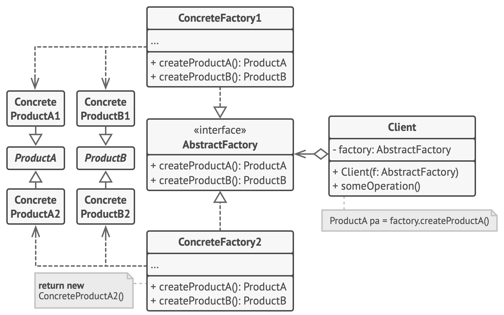

# Abstract Factory

- Produce families of related objects without specifying their concrete classes.

## Intent

### Problem

- Entities with multiple types and variant classifications.

### Solution

- Use the [**Factory Method**](../factory_method/index.md) to combine the type creation with factory of multiple classifications.

  - Explicitly declare a **Product Interface** for each each distinct product type.
  - Create a **Concrete Product** for each classification of a same type (implement the **Product Interface Class**).
  - Explicitly declare the **Abstract Factory**: an interface with a list of creation methods for all product types that are part of the classification.
  - Create a separate **Concrete Factory Class** based on the **AbstractFactory** interface for each variant of a product classification. 

    - These methods must return abstract product types represented by respective interfaces.
    - Each concrete factory corresponds to a specific product classification.
    - A factory is a class that returns products of a particular kind.

- So, the system should work with **Abstract Classes** (**Product Interface** and **Abstract Factory**), which implements the common type and product per type creation methods, respectively.
- The application creates a concrete factory object at the initialization stage. Just before that, the app must select the factory type depending on the configuration or the environment settings.

## Motivation

- Decouple the **Product** creation from its use logic and classification.
- Make easy the implementation of new **Product** types and classifications.

## Structure

1. **Abstract Products**: declare interfaces for a set of distinct but related products which make up a product family.
2. **Concrete Products** are various implementations of abstract products, grouped by variants. Each **Abstract Product** must be implemented in all given variants.
3. The **Abstract Factory** interface declares a set of methods for creating each of the abstract products.
4. **Concrete Factories** implement creation methods of the abstract factory. Each concrete factory corresponds to a specific variant of products and creates only those product variants.
5. Although **Concrete Factories** instantiate **Concrete Products**, signatures of their creation methods must return corresponding abstract products. This way the client code that uses a factory doesn’t get coupled to the specific variant of the product it gets from a factory. The Client can work with any concrete factory/product variant, as long as it communicates with their objects via abstract interfaces.



## Applicability

- Use the Factory Method when:

  - The code needs to work with various families of related products, but doesn’t depend on the concrete classes of those products — they might be unknown beforehand or simply allow for future extensibility.
  - There are a class with a set of **Factory Methods** that blur its primary responsibility.
  - A class deals with multiple product types, it may be worth extracting its **Factory Methods** into a stand-alone factory class or a full-blown **Abstract Factory** implementation.

## Implementation steps

1. Map out a matrix of distinct product types versus variants of these products.
2. Declare **Abstract Product** interfaces for all product types. Then make all **Concrete Product** classes implement these interfaces.
3. Declare the **Abstract Factory** interface with a set of creation methods for all **Abstract Products**.
4. Implement a set of **Concrete Factory** classes, one for each product variant.
5. Create **Factory Initialization** code somewhere in the app. It should instantiate one of the **Concrete Factory** classes, depending on the application configuration or the current environment. Pass this factory object to all classes that construct products.
6. Scan through the code and find all direct calls to product constructors. Replace them with calls to the appropriate creation method on the factory object.

## Pros and Cons

| Pros                                                                                                                              | Cons                                                                                                                                     |
| --------------------------------------------------------------------------------------------------------------------------------- | ---------------------------------------------------------------------------------------------------------------------------------------- |
| You can be sure that the products you’re getting from a factory are compatible with each other.                                   | The code may become more complicated than it should be, since a lot of new interfaces and classes are introduced along with the pattern. |
| You avoid tight coupling between concrete products and client code.                                                               | -                                                                                                                                        |
| **Single Responsibility Principle**. You can extract the product creation code into one place, making the code easier to support. | -                                                                                                                                        |
| Open/Closed Principle. You can introduce new variants of products without breaking existing client code.                          | -                                                                                                                                        |

## Code Examples

- Complexity: **★★☆**
- Popularity: **★★★**
- Usage: Extend and customize libraries' standard components.
- Identification: The pattern is easy to recognize by methods, which return a factory object. Then, the factory is used for creating specific sub-components.
- P.S.: For this example, use the following imports:

```python
from __future__ import annotations
from abc import ABC, abstractmethod
```

### Abstract Factory

- The **Abstract Factory** interface declares a set of methods that return different abstract products. These products are called a family and are related by a high-level theme or concept.
- Products of one family are usually able to collaborate among themselves.
- A family of products may have several variants, but the products of one variant are incompatible with products of another.

```python
class AbstractFactory(ABC):
    """Abstract Factory."""

    @abstractmethod
    def create_product_a(self) -> AbstractProductA:
        """Abstract Product A Creation Method."""

    @abstractmethod
    def create_product_b(self) -> AbstractProductB:
        """Abstract Product B Creation Method."""
```

### ConcreteFactories

- **Concrete Factories** produce a family of products that belong to a single variant.
- The factory guarantees that resulting products are compatible. Note that signatures of the **Concrete Factory**'s methods return an abstract product, while inside the method a concrete product is instantiated.
- Each Concrete Factory has a corresponding product variant.

```python
class ConcreteFactory1(AbstractFactory):
    """Concrete Factory 1."""

    def create_product_a(self) -> ConcreteProductA1:
        """Product A1 Creation Method."""
        return ConcreteProductA1()

    def create_product_b(self) -> ConcreteProductB1:
        """Product B1 Creation Method."""
        return ConcreteProductB1()
```

```python
class ConcreteFactory2(AbstractFactory):
    """Concrete Factory 2."""

    def create_product_a(self) -> ConcreteProductA2:
        """Product A2 Creation Method."""
        return ConcreteProductA2()

    def create_product_b(self) -> ConcreteProductB2:
        """Product B2 Creation Method."""
        return ConcreteProductB2()
```

### Abstract Products

- Each distinct product of a product family should have a base interface. All variants of the product must implement this interface.
- All products can interact with each other, but proper interaction is possible only between products of the same concrete variant.

```python
class AbstractProductA(ABC):
    """Abstract Product A (Product A Interface)."""

    @abstractmethod
    def useful_function_a(self) -> str:
        """Abstract Operation A Method."""
```

```python
class AbstractProductB(ABC):
    """Abstract Product B (Product B Interface)."""

    @abstractmethod
    def useful_function_b(self) -> None:
        """Abstract Operation B Method."""

    @abstractmethod
    def another_useful_function_b(self, collaborator: AbstractProductA) -> None:
        """Another Abstract Operation B Method."""
```

### Concrete Products

- **Concrete Products** are created by corresponding **Concrete Factories**.

```python
class ConcreteProductA1(AbstractProductA):
    """Concrete Product A1."""

    def useful_function_a(self) -> str:
        """Concrete Operation A1 Method."""
        return "The result of the product A1."
```

```python
class ConcreteProductA2(AbstractProductA):
    """Concrete Product A2."""

    def useful_function_a(self) -> str:
        """Concrete Operation A2 Method."""
        return "The result of the product A2."
```

```python
class ConcreteProductB1(AbstractProductB):
    """Concrete Product B1."""

    def useful_function_b(self) -> str:
        """Concrete Operation B1 Method."""
        return "The result of the product B1."

    def another_useful_function_b(self, collaborator: AbstractProductA) -> str:
        """Another Abstract Operation B1 Method."""
        result = collaborator.useful_function_a()
        return f"The result of the B1 collaborating with the ({result})"
```

```python
class ConcreteProductB2(AbstractProductB):
    """Concrete Product B2."""

    def useful_function_b(self) -> str:
        """Concrete Operation B2 Method."""
        return "The result of the product B2."

    def another_useful_function_b(self, collaborator: AbstractProductA):
        """Another Abstract Operation B2 Method."""
        result = collaborator.useful_function_a()
        return f"The result of the B2 collaborating with the ({result})"
```

### Client Code

- The client code works with factories and products only through abstract types: AbstractFactory and AbstractProduct. This lets you pass any factory or product subclass to the client code without breaking it.

```python
def client_code(factory: AbstractFactory) -> None:
    """Do comething as Client."""
    product_a = factory.create_product_a()
    product_b = factory.create_product_b()

    print(f"{product_b.useful_function_b()}")
    print(f"{product_b.another_useful_function_b(product_a)}", end="")
```

### Output

- Execute the following script to run the example:

```shell
➜  design_patterns python3 main.py
```

```plain
Client: Testing client code with the first factory type:
The result of the product B1.
The result of the B1 collaborating with the (The result of the product A1.)

Client: Testing the same client code with the second factory type:
The result of the product B2.
The result of the B2 collaborating with the (The result of the product A2.)
```
