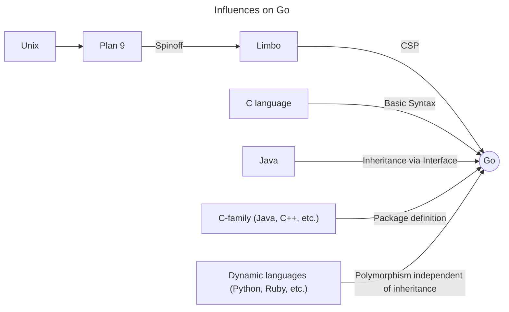
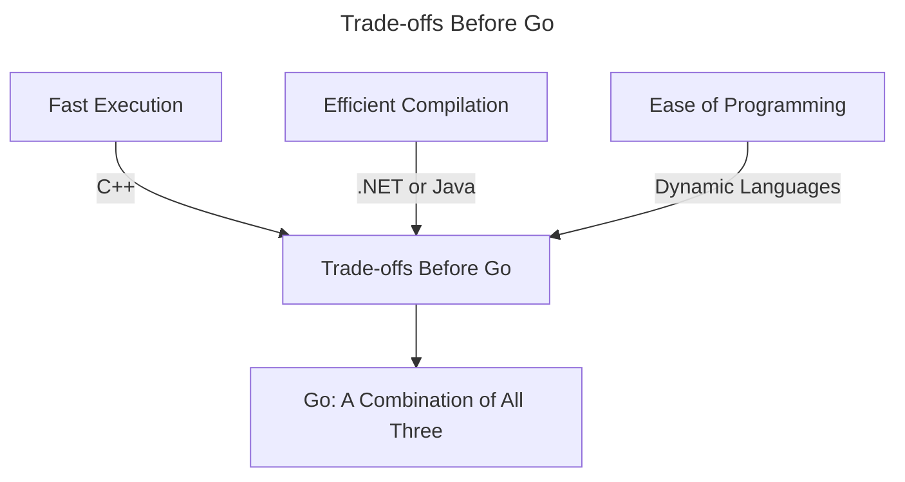
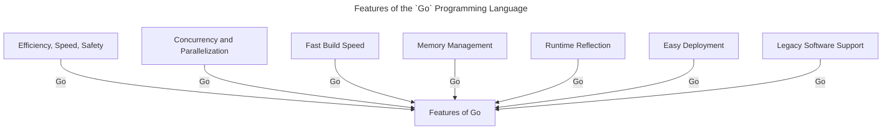
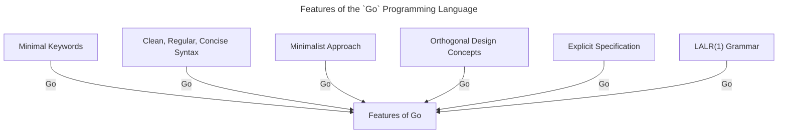
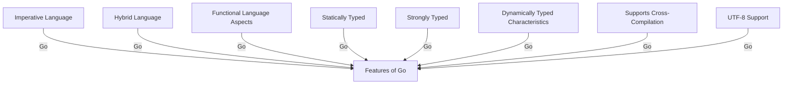
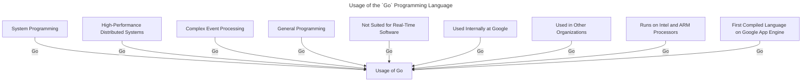
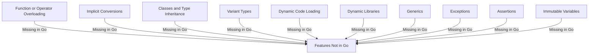
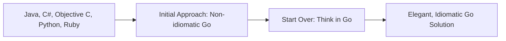

# Chapter 1 — Origins, Context and Popularity of `Go`

## 1.1 Origins and evolution

- `Go` programming language reached its peak popularity in Feb 2010, ranking 13th with a popularity of `1,778 %`.
- Timeline:
    - Initial design: 2007
    - Public release: Sep 21, 2009
    - Language of the year: 2009
    - Used at Google: Jan 8, 2010
    - `Go` in Google App Engine: May 5, 2011
- Since May 2010, `Go` has been used in production at Google for back-end infrastructure, including programs for administering complex environments.
- The principal website for `Go` is [golang.org](http://golang.org/), which runs in Google App Engine with `godoc` serving the content and a Python front-end.
- The `Go` website features a `Go`-playground, a sandbox for compiling and running `Go` code in the browser.
- `Go`'s logo symbolizes its speed: =GO, and it has a gopher as its mascot.
- The Google discussion group [`Go` Nuts](http://groups.google.com/group/golang-nuts/) is very active.
- There's a separate group for [`Go` on Google App Engine](https://groups.google.com/forum/#!forum/google-appengine-go).
- The community has a `Go` language resource site at [go-lang.cat-v.org](http://go-lang.cat-v.org/) and `#go-nuts` on irc.freenode.net is the official `Go` IRC channel.
- The `Go` project’s official Twitter account is [@go_nuts](http://twitter.com/#!/go_nuts), with `#golang` as the most used tag.
- There's a [Linked-in group](http://www.linkedin.com/groups?gid=2524765&trk=myg_ugrp_ovr) for `Go`.
- The Wikipedia page for `Go` is at [`Go` (programming language)](http://en.wikipedia.org/wiki/Go_(programming_language)).
- A search engine page specifically for `Go` language code can be found at [go-lang.cat-v.org/go-search](http://go-lang.cat-v.org/go-search).
- `Go` can be interactively tried out in your browser via the App Engine application [`Go` Tour](http://go-tour.appspot.com/). To install it on your local machine, use: `go install go-tour.googlecode.com/hg/gotour`.

## 1.2 Main characteristics, context and reasons for developing a new language

### 1.2.1 Languages that influenced `Go`

- `Go` is a language designed from scratch, envisioned as a 'C for the 21st century'.
- It belongs to the C-family, which includes languages like `C++`, `Java`, and `C#`.
- `Go` is inspired by many languages used and created by its designers.
- Significant input came from the `Pascal` / `Modula` / `Oberon` family, influencing `Go`'s declarations and packages.
- `Go`'s concurrency mechanism is built on experiences from `Limbo` and `Newsqueak`, which were inspired by Tony Hoare’s CSP theory (Communicating Sequential Processes). This is similar to the mechanism used by the `Erlang` language.
- `Go` is an open-source language, distributed under a BSD license. This means it can be used by everyone, even for commercial purposes, without a fee. It can also be modified by others.
- The resemblance to C-syntax was maintained to be immediately familiar to a majority of developers. However, compared to `C/C++`, `Go`'s syntax is greatly simplified and more concise.
- `Go` also has characteristics of a dynamic language, making `Python` and `Ruby` programmers feel more comfortable with it.
- The following diagram shows some of the influences on `Go`:

### 1.2.2 Why a new language?

- `C/C++` did not evolve with the computing landscape, and no major systems language has emerged in over a decade. This indicates a need for a new systems language that is appropriate for the needs of our current computing era.
- Despite advancements in computing power, software development has not become considerably faster or more successful. Considering the number of failed projects and the continuous growth in application size, there is a need for a new low-level language that is equipped with higher concepts.
- Before `Go`, developers had to make a choice:
  - Fast execution but slow and inefficient building (like `C++`)
  - Efficient compilation but not so fast execution (like `.NET` or `Java`)
  - Ease of programming but slower execution (like dynamic languages)
- `Go` is an attempt to combine all three aspects: efficient and thus fast compilation, fast execution, and ease of programming.

### 1.2.3 Targets of the language

- `Go` aims to combine the efficiency, speed, and safety of a statically compiled language with the ease of programming of a dynamic language.
- `Go` is type-safe and memory-safe. It uses pointers, but pointer arithmetic is not possible.
- `Go` provides excellent support for networked communication, concurrency, and parallelization, making it ideal for distributed and multicore machines.
- `Go` implements concurrency through goroutines (lightweight threads) and channels for communication between them. Goroutines are implemented as growing stacks (segmented stacks) and multiplexing of goroutines onto threads is done automatically.
- `Go` excels in the area of multicore and multiprocessor computing, where many existing programming languages lack support.
- Fast build speed (compilation and linking to machine code) is a key feature of `Go`. This is a response to the slow build times of `C++` projects, which are heavily used in Google's infrastructure.
- `Go` has a strong focus on dependency management. It avoids the overhead of "header files" in `C-like` languages, which can lead to long build times. `Go` provides a clean and efficient package model with explicit dependencies for faster builds.
- The entire `Go` standard library compiles in less than 20 seconds; typical projects compile in half a second. This fast compilation process is even faster than `C` or `Fortran`, making compilation a non-issue.
- The execution speed of the native code in `Go` is comparable to `C/C++`.
- `Go` handles memory management automatically, avoiding the memory leaks that are a common problem in `C++`. `Go` uses a runtime system to handle efficient and fast garbage collection.
- `Go` has built-in runtime reflection capability (the ability of a program to examine its own structure, particularly types).
- `Go` provides an easy deployment system for external packages with `go install`.
- `Go` supports legacy software, notably `C` libraries.

Here's a Mermaid diagram to illustrate the features of `Go`:

### 1.2.4 Guiding design principles

- `Go` aims to reduce typing, clutter, and complexity in coding through a minimal amount of keywords (25). This enhances the compilation speed as the keywords can be parsed without a symbol table.
- The clean, regular, and concise syntax of `Go` reduces the number of necessary code lines, even compared to a language like `Java`.
- `Go` adopts a minimalist approach, providing only one or two ways of accomplishing tasks. This enhances the readability of code, a crucial aspect of software engineering.
- The design concepts of `Go` are orthogonal, meaning they don't interfere with each other or add complexity.
- `Go` is defined by an explicit specification, not by an implementation like `Ruby`. The specification can be found at [Go Specification](http://golang.org/doc/go_spec.html).
- The explicit language specification was a requirement for implementing the two different compilers `gc` and `gccgo`.
- The `Go` grammar is LALR(1), meaning it can be parsed without a symbol table. More about LALR(1) can be found at [LALR Parser](http://en.wikipedia.org/wiki/LALR_parser).

### 1.2.5 Characteristics of the language

- `Go` is an imperative language, designed with concurrency in mind.
- Unlike `Java` and `C++`, `Go` does not have the concept of classes and inheritance, making it not object-oriented in the traditional sense.
- `Go` does have interfaces, which can be used to achieve polymorphism.
- `Go` has a clear and expressive type system that is lightweight and without hierarchy, making it a hybrid language.
- Functions are the basic building block in `Go`, and their use is very versatile.
- `Go` exhibits the fundamental aspects of a functional language.
- `Go` is statically typed, making it a safe language, and compiles to native code for efficient execution.
- `Go` is strongly typed, meaning implicit type conversions (castings or coercions) are not allowed. The principle is to keep things explicit!
- `Go` has characteristics of a dynamically typed language through the `var` keyword.
- `Go` supports cross-compilation, such as developing on a Linux machine for an application that will execute on Windows.
- `Go` is the first programming language in which UTF-8 can be used, not only in strings, but also in program code. `Go` source files are UTF-8, making `Go` truly international.

Here's a Mermaid diagram to illustrate the features of `Go`:

### 1.2.6 Uses of the language

- `Go` was originally conceived as a systems programming language for use in server-centric environments like web servers and storage architectures.
- `Go` has proven to be a productive language for high-performance distributed systems and excels in handling massive concurrency, making it suitable for game server development.
- `Go` is also well-suited for Complex Event Processing (CEP), which requires mass concurrency, high-level abstractions, and performance. More about CEP can be found at [Complex Event Processing](http://en.wikipedia.org/wiki/Complex_event_processing).
- `Go` has also emerged as a general programming language, useful for text-processing problems, frontend development, and scripting-like applications.
- `Go` is not suited for real-time software due to its garbage collection and automatic memory allocation.
- `Go` is used internally at Google for heavy-duty distributed applications, including a part of Google Maps.
- Real-life examples of `Go` usage in other organizations can be found at [Organizations Using Go](http://go-lang.cat-v.org/organizations-using-go).
- A `Go` compiler exists for Native Client (NaCl) in the Chrome browser, potentially for executing native code in web applications in Chrome OS.
- `Go` runs on both Intel and ARM processors, making it compatible with Android OS.
- `Go` was introduced to Google App Engine on May 5, 2011, making it the first true compiled language that runs on App Engine, which previously only hosted Python and Java apps.

### 1.2.7 Missing features?

- `Go` lacks several features commonly found in modern Object-Oriented languages. Some of these might be implemented in the future.
- `Go` does not support function or operator overloading, a decision made to simplify the design.
- `Go` does not allow implicit conversions, a design choice to avoid bugs and confusion that often arise from this in `C/C++`.
- `Go` does not have classes and type inheritance. Instead, it takes a different approach to object-oriented design (discussed in chapters 10-11).
- `Go` does not support variant types. However, similar functionality is realized through interfaces (see chapter 11).
- `Go` does not support dynamic code loading, dynamic libraries, or generics.
- `Go` does not have exceptions, although the recover/panic mechanism (see § 13.2-3) serves a similar purpose.
- `Go` does not support assertions or immutable variables.
- A discussion about these design choices by the `Go` team can be found in the [Go FAQ](http://golang.org/doc/go_faq.html).

Here's a Mermaid diagram to illustrate the missing features in `Go`:

### 1.2.8 Programming in Go

- Developers coming to `Go` from other languages, especially class or inheritance-oriented languages like `Java`, `C#`, `Objective C`, `Python`, `Ruby`, may initially try to program in `Go` as they did in their previous language.
- This approach often results in non-idiomatic `Go` code and generally works poorly. It's usually necessary to start over, thinking in `Go`.
- `Go` is built on a different model from these languages, requiring a different approach.
- By taking a higher-level view and analyzing the problem within the `Go` mindset, often a different, more elegant and idiomatic `Go` solution presents itself.

### 1.2.9 Summary

Here are the killer features of Go:

- Emphasis on simplicity: easy to learn;
- Memory managed and syntactically lightweight: easy to use;
- Fast compilation: enhances productivity (dev cycle of a scripting ;language)
- Fast compiled code: comparable to C;
- Concurrency support: write simpler code;
- Static typing;
- Consistent standard library;
- Easy deployment system (go install);
- Self-documenting (and well-documented);
- Free and Open Source (BSD licensed).
