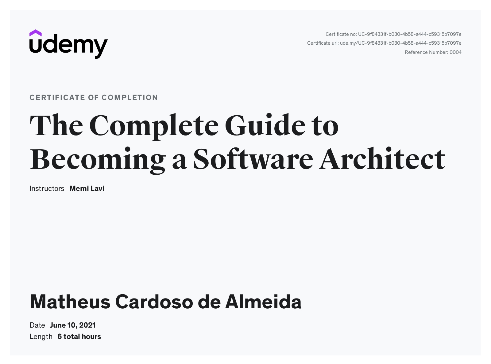

# The Complete Guide to Becoming a Software Architect

## [Content](https://www.udemy.com/course/the-complete-guide-to-becoming-a-software-architect/)

- Practical, proven techniques to becoming a great Software Architect.
- The exact role of the Software Architect
- Adopting Software Architect's mindset
- Architectural Patterns used in almost any software system
- Design Patterns to make the code more readable and easy to maintain
- Crucial Soft Skills that will make your work much easier
- Role and structure of the Architecture Document
- Advanced architectural patterns for extreme cases

## Table of contents

- [Section 1: Welcome](section_01/index.md)
- [Section 2: What Is a Software Architect](section_02/index.md)
- [Section 3: The Architect's Mindset](section_03/index.md)
- [Section 4: The Architecture Process](section_04/index.md)
- [Section 5: Working with System Requirements](section_05/index.md)
- [Section 6: Types of Applications](section_06/index.md)
- [Section 7: Selecting Technology Stack](section_07/index.md)
- [Section 8: Meet the *-ilities](section_08/index.md)
- [Section 9: Components' Architecture](section_09/index.md)
- [Section 10: Design Patterns 101](section_10/index.md)
- [Section 11: System Architecture](section_11/index.md)
- [Section 12: External Considerations](section_12/index.md)
- [Section 13: Architecture Document](section_13/index.md)
- [Section 14: Case Study](section_14/index.md)
- [Section 15: Advanced Architecture Topics](section_15/index.md)
- [Section 16: Soft Skills](section_16/index.md)
- [Section 17: Conclusion](section_17/index.md)

## Proof of Completion

