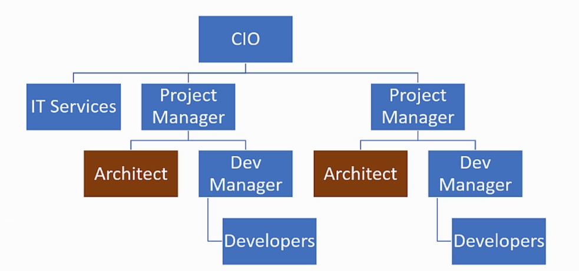
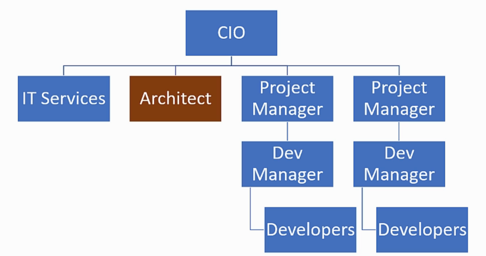
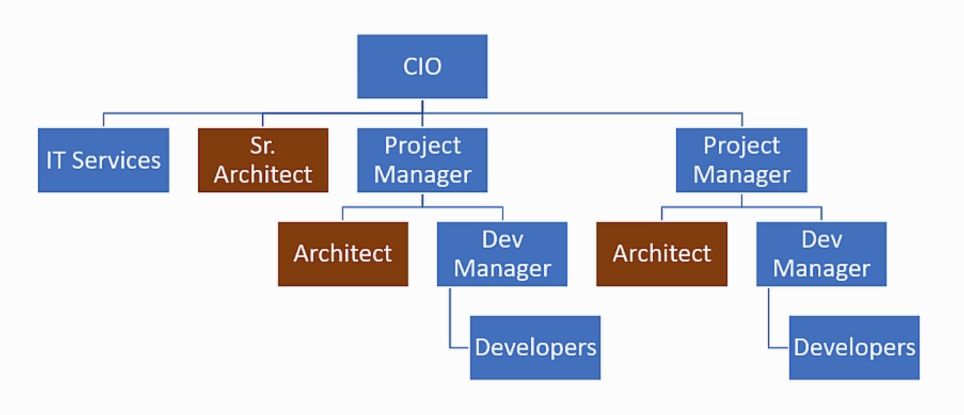

# 2. What Is a Software Architect

## 2.1. Table of contents

- [2. What Is a Software Architect](#2-what-is-a-software-architect)
  - [2.1. Table of contents](#21-table-of-contents)
  - [2.2. Types of Architects](#22-types-of-architects)
  - [2.3. Responsibility of the Architect](#23-responsibility-of-the-architect)
  - [2.4. The Architect in the Organizational Chart](#24-the-architect-in-the-organizational-chart)
  - [2.5. Architects & Code](#25-architects--code)
  - [2.6. Architects and the Academic Degrees](#26-architects-and-the-academic-degrees)
  - [2.7. Career Path to Architect](#27-career-path-to-architect)

## 2.2. Types of Architects

- **Infrastructure Architect**:
  - Design the Infrastructure.
    - Servers, VMs, Network, Storage, ...
  - Familiar with system requirements.
  - Career path: Infrastructure Expert.

- **Software Architecture**:
  - The focus of the course.
  - System or Solution Architect.

- **Enterprise Architect**:
  - Works with Top-Level-Management.
    - CEO, CIO, ...
  - Streamlines the IT to Support Business.
  - No development-oriented tasks.
  - Career Path: Senior Software Architect / Project Manager.

## 2.3. Responsibility of the Architect

- Small companies have no Architect function, but Team Leader function.
- So, why do we need a Software Architect?
  > Developer knows what **CAN** be done.
  > Architect knows what **SHOULD** be done.

- The Architect looks at the Macro-Level Software implementation, dealing with requirements and technology definitions.

- Architect baseline requirements:
  - Fast.
  - Secure.
  - Reliable.
  - Easy to maintain.

- The Architect's main function is to guarantee that the baseline requirements will be executed well - with the appropriate technologies, patterns and designs.

## 2.4. The Architect in the Organizational Chart

- Architect isn't a management position.

- Organizational Chart #1:
  - Junior Architect.
  - Deal with Macro-vision of the project.
  - Reports to Project Manager.
  - Minor contributions.

- Organizational Chart #2:
  - Senior Architect.
  - Deal with organization level architecture points, not only project points.
  - Reports to CIO.
  - Multi-project and organization wide decisions (global architecture patterns, platforms to be used by the company, etc ...).

- Organizational Chart #1 and #2:
  - The Senior Architect works with the CIO.
  - There are one Architect per project, that works with the Project Manager and the Senior Architect.

## 2.5. Architects & Code

- **Architecture Trustworthiness**: implement parts of the total architecture in order to test and validate them before the definitive implementation (something like a POC or MVP).
  - Example: If you are recommending a sustained Dependency Injection package, test it in a small application and make sure it actually do what you expect it to do.
  - Example: If you are contemplating whether to use a SQL or No-SQL database, install both on your machine and test them out.

- **Support the Developers**: help developers when they get stuck well while implementing the architecture and detect deviations from the intend implementation.

- **Respect**: Gain developers respect and maintain a continuos relation with them, giving the necessary help and discussing architecture concepts.

## 2.6. Architects and the Academic Degrees

- There isn't a dedicated degree for Architecture.
- Computer Science can help, but it isn't focused on this theme.
- There are some courses and certifications (TOGAF, etc), but usually for Enterprise Architect.

## 2.7. Career Path to Architect

- As there isn't a formal degree for Architecture, experience became the most important difference (further more if it is experience on technology).
- There are some possible paths:
  1. Developer -> Jr. Architect.
      - \>3 years of experience.
      - On small companies.
  2. Developer -> Team Leader -> Jr. Architect.
      - As a Team Leader, you should have a mix of technical and management knowledge.
      - As progress, you can focus on the technical (Architect) or management (Project Manager) knowledge.
  3. Developer -> Team Leader -> Dev Manager/CTO -> Sr. Architect.
      - Depends on the company organizational chart.
      - Sometimes, the Enterprise Architect.
      - Too long path.
  4. System Analyst -> Jr. Architect.
      - Has a greet system knowledge.
      - Leaks technique experience.
      - Requires mentoring.
