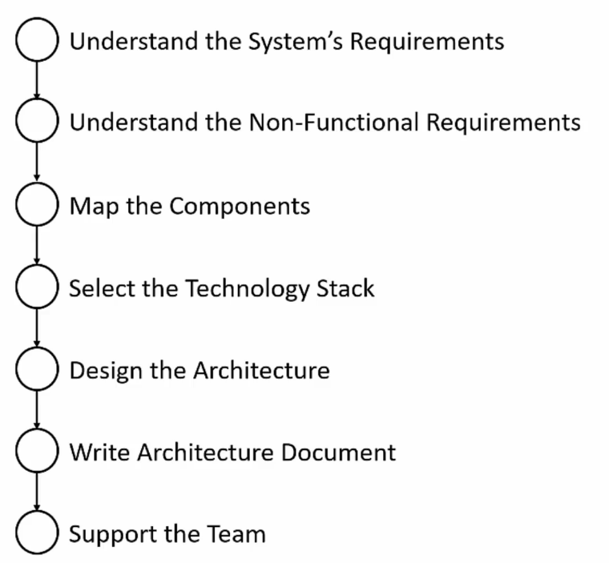

# 4. The Architecture Process

## 4.1. Table of contents
- [4. The Architecture Process](#4-the-architecture-process)
  - [4.1. Table of contents](#41-table-of-contents)
  - [4.2. Introduction](#42-introduction)
  - [4.3. Understand the System Requirements](#43-understand-the-system-requirements)
  - [4.4. Understand the Non-Functional Requirements](#44-understand-the-non-functional-requirements)
  - [4.5. Map the Components](#45-map-the-components)
  - [4.6. Select Technology Stack](#46-select-technology-stack)
  - [4.7. Design the Architecture](#47-design-the-architecture)
  - [4.8. Write the Architecture Document](#48-write-the-architecture-document)
  - [4.9. Support the Team](#49-support-the-team)
  - [4.10. Conclusion](#410-conclusion)

## 4.2. Introduction

- Brief overview of each process step and its importance.

## 4.3. Understand the System Requirements

- The first thing to understand is the system's goals.
- Requirements = **What** the System should do.
- Usually begin with high level tasks.
- Usually defined by System Analysts and the Client (considering the End User necessities).

## 4.4. Understand the Non-Functional Requirements

- Define Technical & Service Level Attributes.
  - i.e. Number of users, loads, volumes, performance, etc...
- Not always known ny the Client or Analyst.
  - Usually they are implicit characteristics related to the application type, scope and context.
- Much more important than the regular Requirements.
- As an Architect, you must:
  - Help the Client and the Analyst to identify and understand the Non-Functional Requirements.
  - Be aware os all Non-Functional Requirements before start to deal with the regular Requirements - because many Architecture elements can be affected by the first one.

## 4.5. Map the Components

- Represent the tasks of the System.
- Two goals:
  - Understand the System Functionality.
  - Communicate your understanding to the Client/Analyst.
- Completely non-technical.

## 4.6. Select Technology Stack

- One of the most important steps of this process.
- Multiple technologies used in the same solution (for Back-end, Front-end, Data Store, etc).
- Delicate step that requires care, study and planning.

## 4.7. Design the Architecture

- The "heart" of the Architect's work.
- Combine the Regular Requirements, the Non-Functional Requirements, the Components and the Technology to create a "fast, secure, reliable and easy to maintain" software. 

## 4.8. Write the Architecture Document

- Describes the whole process and gives a full picture of the system to developers and managements.
- Must be relevant for all participants.

## 4.9. Support the Team

- The Architecture will change a lot.
- Make sure it will stay relevant and is developing according to the plan. 

## 4.10. Conclusion

- The process can be adapted.
  - For example, the participants of each step can changing according the situation: understanding the Non-functional Requirements with the Client or the Analyst; designing the Architecture by yourself or with the Development Team.
