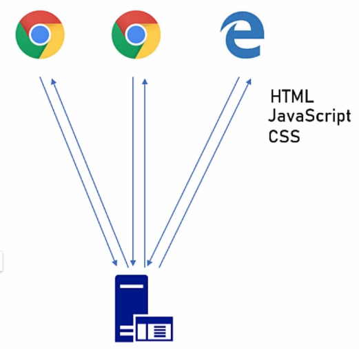

# 6. Types of Applications

## 6.1. Table of contents

- [6. Types of Applications](#6-types-of-applications)
  - [6.1. Table of contents](#61-table-of-contents)
  - [6.2. Introduction to Application Types](#62-introduction-to-application-types)
  - [6.3. Web Apps](#63-web-apps)
  - [6.4. Web API](#64-web-api)
  - [6.5. Mobile](#65-mobile)
  - [6.6. Console](#66-console)
  - [6.7. Service](#67-service)
  - [6.8. Desktop](#68-desktop)
  - [6.9. Summary](#69-summary)

## 6.2. Introduction to Application Types

- One of the first things an architect should do when walk in a system is to determine what kind of application it is going to be. This step is usually done after the requirements set (Functional or Non-Functional).
- The application type definition is a very important decision, since each type has its own pros and cons. Moreover once a decision is made, it's usually not easy to switch to other type.

## 6.3. Web Apps

- Web Apps are also known as Web Sites.
- Probably the most common application type nowadays (together with the Web API).
- Based on a Provider-Client Architecture that uses a web protocol to send messages between the provider and client.
  - In the majority of the cases we have:
    - **Provider**: the one which provides the application content. In this case, it usually is a **Web Server** - but can be a Serverless Provider too.
    - **Client**: the one which requests the content from the Provider and renders this to the User. In this case, it usually is a **Web Browser** - but can be any other render (like HTML renders) which supports stylization (like CSS stylization) and user-side actions (like JavaScript actions).

- Web Applications best suited for systems that require:
  - User interface.
  - User initiated actions (content requested by the user, usually called Request-Response application).
  - Large scale (with a large number of users and a lot of data).
  - Short, focused actions (as opposed to long running processes)

## 6.4. Web API

- Similar to Web Apps, but with two important differences:
  - It doesn't serve its (HTML) pages, but data (usually in the form of some structure).
  - Its clients are **not** Web Browsers, but other application (like the JavaScript code that runs inside the Web Browsers).
- Become extremely popular in the last years.
- API = Application Programming Interface.
- Allows the clients' programs to execute actions defined by the Web API.
- There are multiple API patterns, but the most common is the REST API.
  - Giving a simple definition, the REST API allows the client's program to access entities with a combination of:
    - URL: `https://www.mysite.com/api/orders`
    - Parameters: `date=10/10/2027`
    - HTTP Verb: `GET`, `POST`, `PUT`, `PATCH`, `DELETE`
  - Its best advantage is the request pattern definition that standardize communication between applications without the necessity protocol variations.
- Should return data, not HTML (or anything to be rendered).

- Web API best suited for systems that require:
  - Data Retrieval and Store.
  - User initiated actions.
  - Large scale.
  - Short, focused actions.
- Similar to Web Apps, Web API systems are Request-Response based, so they share multiple requirements.

## 6.5. Mobile

- Apps that run in mobile phones (probably smartphones based on Android or IOS).
- Make a big use of web APIs for multiple purposes (LogIn, Store/Load data, etc...).
- Mainly use for applications that require a high level of user interactions.
  - Games.
  - Social apps.
  - Front-end for web APIs.
  - Data expose like News.
  - Location sensitive apps that will benefit from the phone's GPS. 

## 6.6. Console

- Command Line Application (CLi App).
- Run inside the operation system command line.
- Common characteristics:
  - **No Fancy UI**: the end interface is represented by lines of text displayed in a common command window or streamed into a log channel.
  - **Require technical knowledge**: as normal users are accustomed to point-click applications, we consider that CLi apps require some previous technical knowledge to invoke the application and pass its parameters.
  - **Limited interaction**: the user interactions are commonly based on text questions exposed in the command window and used to configure the application.
  - **Long-orShort-running processes**: once configured, the app continues without user interaction and run long processes or short tasks executed by trained users. 
- Architectural patterns and practices apply also to CLi apps.

## 6.7. Service

- In general, similar to CLi Apps, but **without UI at all** and **managed by a Service Manager**.
- **Service Manager**: OS feature used to act on (like Start, Pause, Stop, Continue, etc) and monitor the activity of the registered services.
- Services are usually configured by a **configuration file** or a CLi interface (used to manual commands and interactions with a running service).
- Used for long running and no-supervised processes.

## 6.8. Desktop

- Applications that run mainly on end user PC.
  - All resources (including logic and data storage) stay on local PC.
  - Use internet just for some arbitrary tasks (such as validating the license or sending activity log).
- Fully functional when offline.
- Great and well-planned UI.
- Now-a-days, desktop apps are mainly used for user centric actions such as simulations and games.

## 6.9. Summary

- Application type should be set early.
- Can be more than one type.
  - Example: Web App + Web API + Service.
