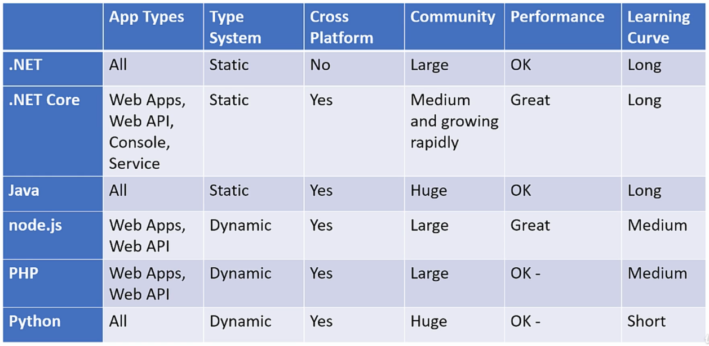
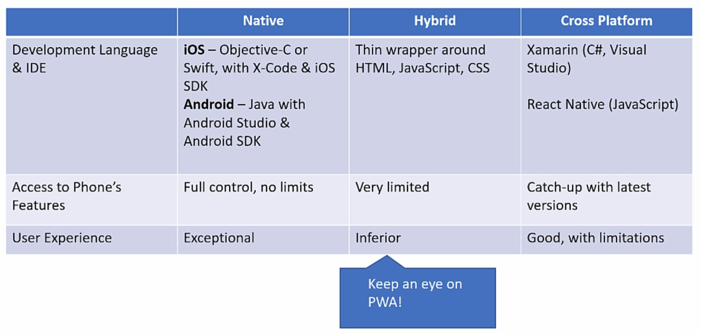

# 7. Selecting Technology Stack

## 7.1. Table of contents

- [7. Selecting Technology Stack](#7-selecting-technology-stack)
  - [7.1. Table of contents](#71-table-of-contents)
  - [7.2 Introduction to Technology Stack](#72-introduction-to-technology-stack)
  - [7.3 Considerations for Technology Stack](#73-considerations-for-technology-stack)
    - [7.3.1 Can perform the tasks?](#731-can-perform-the-tasks)
    - [7.3.2 Community](#732-community)
    - [7.3.3 Popularity](#733-popularity)
  - [7.4 Back-end Technology](#74-back-end-technology)
    - [7.4.1 .NET Classic](#741-net-classic)
    - [7.4.2 .NET Core](#742-net-core)
    - [7.4.3 Java](#743-java)
    - [7.4.4 Node.js](#744-nodejs)
    - [7.4.5 PHP](#745-php)
    - [7.4.6 Python](#746-python)
  - [7.5 Front-end Technology](#75-front-end-technology)
    - [7.5.1 Web Apps](#751-web-apps)
      - [7.5.1.1 Angular](#7511-angular)
      - [7.5.1.2 React](#7512-react)
    - [7.5.2 Mobile](#752-mobile)
      - [7.5.2.1 Native](#7521-native)
      - [7.5.2.1 Hybrid](#7521-hybrid)
      - [7.5.2.1 Cross-Platform](#7521-cross-platform)
    - [7.5.3 Desktop](#753-desktop)
  - [7.6 Data Store Technology](#76-data-store-technology)
    - [7.6.1 SQL Databases](#761-sql-databases)
    - [7.6.2 NoSQL Databases](#762-nosql-databases)
  - [7.7 Summary](#77-summary)

## 7.2 Introduction to Technology Stack

- Super important.
- Determine:
  - what languages, platforms and tools will be used during system development.
  - which skills are required to be acquired by the development team.
- It's **irreversible**.
  - It isn't literally irreversible, but just inviable because the reversion requires too much enforces (something like the system rewrite), substantial delay in the schedule and a high cost.
  - Some architectural patterns give to us some level of flexibility (like micro-services), but change the stack isn't a good idea in any case.
- It usually (wrongly) has emotional and nonrational.
  - The problem is the stack selection based on "rumors and assumptions" (like: "this technology is new and more efficient, everybody is using this").
  - The solution is always to evaluate if the system requirements match with the multiple technologies stacks, documenting reasons and pros/cons arguments.

## 7.3 Considerations for Technology Stack

### 7.3.1 Can perform the tasks?

- We must ensure that the selected platforms/technologies are actually able to perform the tasks required by the system.
- Examples:
  - If the system building requires a cross-platform development, we must check if the selected platform support cross-platform.
  - If part of the system building is done by no-technology-acquainted workers, we must look for a platform with a well based UI to facilitate the user learning.

### 7.3.2 Community

- Always make sure that there is a large and active community which discusses about the selected platform and can provide support when needed.
- This way you know you won't be left alone in the dark when encountering problems.
- The best place to look for this community is in the [Stack Overflow / Tags](https://stackoverflow.com/tags), where you can find an overview about each technology community (quantity, frequency and recent activity).

### 7.3.3 Popularity

- It's related to current frequency and recent activity.
- Sometimes new technologies have a little community (in number of users) but high frequency of new activity (which can help you to quickly solve a problem).
- The best place to test the popularity of everything is by using the [Google Trends](https://trends.google.com.br/trends/) to evaluate the search numbers for past two years.

## 7.4 Back-end Technology

- Consider **Back-end** as the combination of **Web Apps**, **Web APIs**, **Console Apps**, and **Services**.
- The idea isn't indicate which technology you should use, but list some pros and cons (of the most popular platforms) to be evaluated together with the requirements.

### 7.4.1 .NET Classic

- **Foundation**: Microsoft, 2001.
- **Language**:
  - General Purpose.
  - Object Oriented.
  - Statically typed.
  - Long learning curve.
- **Facilitates**:
  - Can be used for everything.
  - **Desktop Apps/Web Apps/Web APIs**** with dedicated frameworks.
  - Long-running processes.
- **Tools**:
  - **IDE**: Visual Studio (one of the most complete IDEs).
- **Cross Platform**: No (only for Windows).
- **Performance**: Medium/Low.
- **Maturity**: High (long on the market, with stable development and multiple third-party components).
- **Community**: Large, but **decreasing** and **not recent**.
  - Perhaps transitioning to .NET Core - **Blurred roadmap**.
- **Popularity**: Medium and decreasing (based in some legacy projects).
- **Limitations**:
  - Windows only application.

### 7.4.2 .NET Core

- **Foundation**: Microsoft, 2016.
  - Today it is called just **.NET**.
  - Open-source.
- **Language**:
  - General Purpose.
  - Object Oriented.
  - Statically typed.
  - Long learning curve.
- **Facilitates**:
  - Server-side applications (Web Apps and Web APIs).
  - Long-running processes (CLi and Services).
- **Tools**:
  - **IDE**: Visual Studio (one of the most complete IDEs).
- **Cross Platform**: Yes (fixed some gaps of **.NET Classic**).
- **Performance**: High (fixed some gaps of **.NET Classic**).
- **Maturity**: High.
- **Community**: Medium/Large, growing, and recent.
- **Popularity**: Medium and growing.
- **Limitations**:
  - It's necessary to know how to improve the language performance, otherwise this can be very painful. 

### 7.4.3 Java

- **Foundation**: Sum Microsystems, 1995.
- **Language**:
  - General Purpose.
  - Object Oriented.
  - Statically typed.
  - Long learning curve.
- **Facilitates**:
  - Can be used for everything.
  - Server-side applications (Java EE -> Java Enterprise).
    - Provide multiple ands stable frameworks for Web Apps, Web APIs, Database access, etc.
  - "Boost" natively ecosystem (like Android).
- **Tools**:
  - **IDE**: Multiple consolidated options.
- **Cross Platform**: Yes (run into a Java "machine").
- **Performance**: Medium (suffers because of multiple overheads).
- **Maturity**: High.
- **Community**: Large, but not alway recent (too much criticized, but with a great support for everything).
- **Popularity**: Very High (decreased a lot, but sometimes comeback to be used in some specific areas).
- **Limitations**:
  - It has bad learning curve, being susceptible to design errors that decrease its performance.

### 7.4.4 Node.js

- **Foundation**: Ryan Dahl, 2009.
- **Language**:
  - JavaScript-based.
  - Dynamically typed.
  - Object Oriented.
  - Medium learning curve.
- **Facilitates**:
  - Server-side applications (Web Apps and Web APIs).
  - Short and concurrent operations.
- **Tools**:
  - **IDE**: Multiple options (the generic ones).
- **Cross Platform**: Yes.
- **Performance**: High.
- **Maturity**: Medium.
- **Community**: Large (mostly because of the familiar syntax).
- **Popularity**: High and recent.
- **Limitations**:
  - Not target for long-running processes (in other words, not indicated for services).

### 7.4.5 PHP

- **Foundation**: Rasmus Lerdorf, 1994.
- **Language**:
  - Messy (?).
  - Not polish.
  - Dynamically typed.
  - Medium learning curve.
- **Facilitates**:
  - Server-side applications (Web Apps and Web APIs).
- **Tools**:
  -  **IDE**: Multiple options, but nothing special.
- **Cross Platform**:
- **Performance**: Medium.
- **Maturity**: Medium/Low (with multiple gaps).
- **Community**: Large, but decreasing.
- **Popularity**: High, but decreasing.
- **Limitations**:
  - Not target for long-running processes (in other words, not indicated for services).
  - It has bad learning curve, being susceptible to design errors that decrease its performance.

### 7.4.6 Python

- **Foundation**: Guido van Rossum, 1989.
- **Language**:
  - Scripting language.
  - General Purpose.
  - Object Oriented.
  - Natively Dynamically typed but optionally Statically typed.
  - Intuitive syntax.
  - Great learning curve.
- **Facilitates**:
  - Can be used for everything (multiple frameworks for all kind of tasks).
  - Consolidated frameworks for Web Apps and Web APIs (Django, Flask, Fast API, etc).
  - Offers a powerful support for threads (with great code optimizations), being a great option for long-running processes.
- **Tools**:
  - Multiple option, making use of the generic ones (like VSCode, that doesn't need to much to configure and start to programming) and the specific ones (like PyCharm, that offers a great support for debug, object and type mapping, etc).
- **Cross Platform**:
- **Performance**: Medium/High.
- **Maturity**: High (with a sable base and multiple extensions, with different levels of maturity).
- **Community**: Large and with multiple niche.
- **Popularity**: High.
- **Limitations**:
  - For long-running processes, it's necessary to know how to improve the code performance (parallelism, c-compilations, etc).

## 7.5 Front-end Technology

- Visual and interactive part of the software.
- When selecting the Front-end Technologies, we look for the equilibrium between robust visual capabilities, requirements satisfaction, and "easy walk" (a good learning curve).

### 7.5.1 Web Apps

- Web based Front-end: combination of HTML, CSS and JavaScript running into the browser.
- In general, the question here is: "Which JavaScript Framework are we going to use?".
- At the moment, the most popular and largest communities are the Angular and the React.

#### 7.5.1.1 Angular

- Full-blown Framework (high level of maturity).
- Long learning curve
  - Supports multiple features, with different complexities.
  - If the system requires multiple Front-end dependencies, Angular is a better option.

#### 7.5.1.2 React

- UI-Centric Library.
- Short learning curve.
  - It is library based, working an extensible tool that get more complex as you need more extensions.
  - If the the Front-scope is simple and reduced, React is a better option (because it makes the process faster).

### 7.5.2 Mobile

- There are multiple development approaches.
- You need to find the equilibrium between **requirement satisfaction**, **development time** and **team capabilities**.

#### 7.5.2.1 Native

- Use native development platform for each mobile platform.
- Completely different development skills and processes.
- Full access to phone capabilities.
- Allow a more complete user experience (more responsive and with more features).

#### 7.5.2.1 Hybrid

- In the contrary of Native Apps, Hybrid Apps offers a more restrict development, with less control over mobile.
- Works as a wrapper for the Web Apps stack (HTML, CSS, and JavaScript), running into a "browser" and requiring internet connection.
- Has a very limited access to the mobile capabilities, with inferior UX and performance when compared to Native Apps.
- Keep an eye on [PWA](https://en.wikipedia.org/wiki/Progressive_web_application).
- Has a great learning curve and development time when done by Web App teams (is the same knowledge stack).

#### 7.5.2.1 Cross-Platform

- Between Native and Hybrid.
- The development is done in a special environment, which is not linked to any of the mobile platforms.
- At the moment, the most popular options are:
  - Xamarin (C#, Visual Studio).
  - React Native (JavaScript).
- The final result is a Native App with some limitations, that is generated by a compilation process.
- The motivation for this approach is simple: simplify the development process, developing only one code for both platforms.
- It's necessary to keep the development platform updated to get the mobile access improvements.
- Has a good cost-benefit, but doesn't work well with "heavy graphics".

### 7.5.3 Desktop

- Mainly target on Windows applications.

## 7.6 Data Store Technology

- Not about products, but data storage concepts.

### 7.6.1 SQL Databases

- Relational Databases.
- Deals with structured data ("well formatted" data).
- High level of maturity.
- Usually the standard option.
- Stores the data into tables that abstracts entities or processes.
- Tables has a concrete set of columns (with defined types) which represents entities' properties.
- Allows relation between tables, making possible to access a data using other table data.
- Transactional.
  - "All or nothing". Or the operation is completed, or this is reverted.
  - Blocks the database while the operation is executed.
  - Implement ACID operations.
    - **Atomicity**: guarantees that each transaction is treated as a single "unit".
    - **Consistency**: ensures that a transaction can only bring the database from one valid state to another.
    - **Isolation**: ensures that concurrent execution of transactions leaves the database in the same state that would have been obtained if the transactions were executed sequentially.
    - **Durability**: guarantees that once a transaction has been committed, it will remain committed even in the case of a system failure (e.g., power outage or crash). 
- Uses SQL language.
  - High level of maturity.
  - Easy to understand.
  - Great capabilities.
- Has several limitations when deal with big volume of data, scaling its metadata storage and decreasing its performance.
- Now-a-days, there are some movements in favor to resolve these limitations with alternative algorithms that take more advantage from new hardware improvements. These new databases are called **New-SQL**, being, in its majority, **in-memory** and **serverless**.

### 7.6.2 NoSQL Databases

- Try to resolve the "big data problem" for SQL.
- Deals with unstructured data (data with "format undefined").
  - Considering the multiple requirements the unstructured data can bring to the system, there are multiple different approaches into the NoSQL world.
- Emphasis on scale and performance.
- Implement the **BASE** model:
  - **Basically Available**: Guarantees the availability of the data . There will be a response to any request (can be failure too).
  - **Soft state**: The state of the system could change over time.
  - **Eventual consistency**: The system will eventually become consistent once it stops receiving input.
- Usually **distributed** (data split/replicated into multiple databases).
- **Schema-less**.
  - Undefined entities' formats and attributes' types, dispensing the some meta-data.
  - We can store different entities into the same collection/document/table/node/everything else.
- Try to be simple in the concept, simplifying processes when possible (for example, using JSON to store entities).
- **Eventual consistency**: guarantees the operation will be performed, but it doesn't guarantee when this will happen.
  - We are talking about some seconds/milliseconds.
  - The main reason is the data propagation along the multiple distributed databases, which become consistent at different moment (not at the same time, like in the SQL Databases).
- Has no standard query language.
  - Depending of the database type, it can has its own language and, maybe, implement SQL interfaces.

## 7.7 Summary

- Stay rational and consider all important points before decide technology stack.
