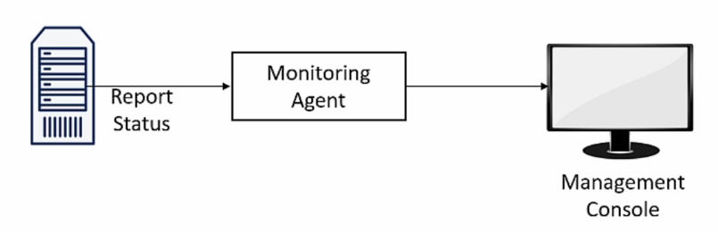

# 8. Meet the *-ilities

## 8.1. Table of contents

- [8. Meet the *-ilities](#8-meet-the--ilities)
  - [8.1. Table of contents](#81-table-of-contents)
  - [8.2. Introduction to the *-ilities](#82-introduction-to-the--ilities)
  - [8.3. Scalability](#83-scalability)
  - [8.4. Manageability](#84-manageability)
  - [8.5. Modularity](#85-modularity)
  - [8.6. Extensibility](#86-extensibility)
  - [8.7. Testability](#87-testability)
  - [8.8. Summary](#88-summary)

## 8.2. Introduction to the *-ilities

- [**Quality Attributes'**](https://en.wikipedia.org/wiki/List_of_system_quality_attributes) names.
- Describes a specific capability that is **not related** to a specific **Functional Requirement**.
- Closely tied to **Non-Functional Requirements**.
- Describes what technical capabilities should be used to in order to fulfill the **Non-Functional Requirement**.

| Non-Functional Requirement | Required Quality Attribute |
| :------------------------: | -------------------------: |
|"The system must work under heavy load, but should not waste money on unused resources." | Scalability |

## 8.3. Scalability

- The ability of the application to support adding computing resources in order to support additional load without any interruption to the application's activity.
- **Example**: Consider a e-commerce deployed into a VM mapped to work with a regular load. During the black-friday this load increases a lot. So, we have two situations:

| Non-Scalable System | Scalable System |
| ------------------- | --------------- |
| Look for non-scalable code | Add VMs |
| Rewrite non-scalable code | Notify the Load Balancer |
| Reinforce the VM | Have a coffee |

- As you can see, Scalable system can respond the situation in a **faster** and **cheaper** way, avoiding code changes.
- There are two types of scalability:
  - **Scale up**: increase application machine "power".
  - **Scale out**: increase the number of machines.
    - Preferable because is usually cheaper and efficient, allowing a limitless improvements.
    - Also provides redundancy which improve the system availability. 

## 8.4. Manageability

- The ability to manage the application.
  - "Know what's going on and take actions accordingly."

- The application constantly reports its state to a **Monitoring Agent** which pass forward to a **Management Console** and then a decision can be made - automatically (like the Load Balance that distributes the load to multiple machines) or by a human operator (like the increase of the machine number).
- How to know if a system has Manageability?
  - Check who reports the problems.
  - If not, the problems' reports will come from clients' complaints.
  - If yes, the problems' reports will be automatically reported (maybe previewed) by the system.
- Manageability improves the user experience once this one has no contact with the system's problems.

## 8.5. Modularity

- "A system that is built from building blocks, that can be changed or replaced without affecting the whole system."
- One of the most important qualities.
- Minimizes the effort needed to maintain the application and make it much more flexible for changes, allowing shorter deployment cycles and saving a lot of time when adding or updating components.
- The idea is to split the system into multiple isolated components (based on its functionalities) which can be managed into different development processes. 

## 8.6. Extensibility

- "A system that its functionality can be extended without modifying its existing code."
- Minimizes the effort needed to new features.
- Its implementation is based on code design patterns.
  - For example, we can use the **[Factory Pattern](https://refactoring.guru/pt-br/design-patterns/factory-method)** to separate the code into **Feature** and **System** (which uses the features).
  - In this case, we need to add a new class to the related **Feature Factory** to add a new functionality, keeping the **System** code intact.

## 8.7. Testability

- "How easy it to test the application?"
- Types of tests:
  - **Manual**: a human tester run the application to validate if this is according the expected.
  - **Unit**: a "tester code" run isolated system units (like methods and functions) to validate its individual behavior for multiple parameters (independent to the application scope).
  - **Integration**: a "tester code" run related system units/entities (like functions, methods and classes) to validate the final "result".
    - Validate the behavior of a chain of components that should generates a specific output when executed in a specific flow.
- Testability requires:
  - Independent modules and code units (classes, methods and functions).
  - **[Single responsibility principle](https://en.wikipedia.org/wiki/Single-responsibility_principle)** into multiple abstract levels.

## 8.8. Summary

- We can say that there are **General** and **Specific** Quality Attributes.
  - **General Quality Attributes** are valid for any application (maybe not in the beginning, but at some point in development).
    - The exposed attributes can be considered general.
  - **Specific Quality Attributes** are associated to specific Non-Functional Requirements, which aren't applicable to any system.
    - Check the [**wiki page**](https://en.wikipedia.org/wiki/List_of_system_quality_attributes) for some of these.
