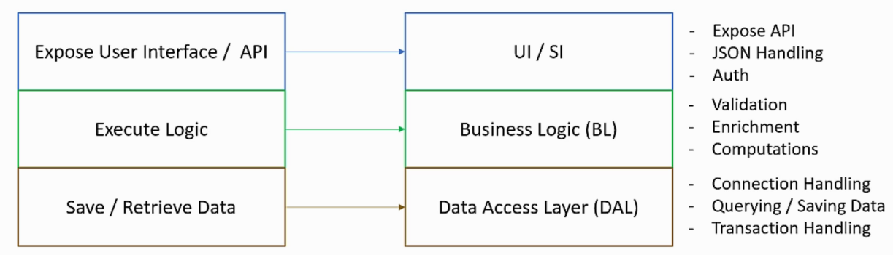

# 9. Components' Architecture

## 9.1. Table of contents

- [9. Components' Architecture](#9-components-architecture)
  - [9.1. Table of contents](#91-table-of-contents)
  - [9.1. Introduction to Components](#91-introduction-to-components)
  - [9.2. Layers](#92-layers)
    - [9.2.1 Purpose of Layers](#921-purpose-of-layers)
    - [9.2.2 Concepts of Layers](#922-concepts-of-layers)
    - [9.2.3 Layers vs Tiers](#923-layers-vs-tiers)
  - [9.3. Interfaces](#93-interfaces)
  - [9.4. Dependency Injection](#94-dependency-injection)
    - [9.4.1 Constructor injection](#941-constructor-injection)
    - [9.4.2 Setter injection](#942-setter-injection)
    - [9.4.3 Interface injection](#943-interface-injection)
  - [9.5. SOLID](#95-solid)
    - [9.5.1 Single Responsibility Principle](#951-single-responsibility-principle)
    - [9.5.2 Open/Close Principle](#952-openclose-principle)
    - [9.5.3 Liskov Substitution Principle](#953-liskov-substitution-principle)
    - [9.5.4 Interface Segregation Principle](#954-interface-segregation-principle)
    - [9.5.5 Dependency Inversion Principle](#955-dependency-inversion-principle)
  - [9.6. Naming Conventions](#96-naming-conventions)
    - [9.6.1 Structure Definitions](#961-structure-definitions)
      - [9.6.1.1 CamelCase](#9611-camelcase)
      - [9.6.1.2 snake_case](#9612-snake_case)
      - [9.6.1.3 CAPITALIZED_SNAKE_CASE](#9613-capitalized_snake_case)
    - [9.6.2 Content Representation](#962-content-representation)
      - [9.6.2.1 Hungarian Notation](#9621-hungarian-notation)
      - [9.6.2.1 Content Notation](#9621-content-notation)
  - [9.7. Exception Handling](#97-exception-handling)
  - [9.8. Logging](#98-logging)

## 9.1. Introduction to Components

- **Software Components**: piece of code that runs in a single process (in other words, it isn't distributed).
- Modern System are usually distributed:
  - Composed of independent **Software Components**.
  - Deployed on separate processes into separated containers or servers.
  - Communicate via some kind of network protocol (usually HTTP).
- Levels of Software Architecture:
    - **Component Architecture**: architecture of individual components (the content of this section). Deals with:
      - The inner components of the code.
      - How they interact with each other.
      - How to make it faster and easier to maintain.
    - **System Architecture**: (will be studied later) deals with:
      - The big picture of the system.
      - How to make sure the system is scalable, reliable, fast, easy to maintain, etc (Non-Functional Requirements).
- **Software Components**' concepts are quite low level (deal with code quality and patterns).
  - Anyway, it is a Software Architect role that need to be done together with the software developers (discussing and defining the better alternatives).
  - Do not distance yourself from the code.

## 9.2. Layers

> Represent horizontal functionality.

- Traditionally, Software Components perform three basic actions:
  1. Expose the some kind of **Interface** (e.g. user interface, API, etc).
  2. Execute the **Logic** (what happens when the data is received from the user, like validation, processing, calculations, etc).
  3. **Save** / **Retrieve** data.

- These actions are usually represented in layers:
  1. User Interface (UI) / Service Interface (SI).
  2. Business Logic (BL).
  3. Data Access Layer (DAL).

- Each layer is composed by multiple classes that handle layers' designated task.
- Each Layer is encapsulated and doesn't expose info about its inner workings.



### 9.2.1 Purpose of Layers

- Forces well formed and focused code.
- Layers are a modular architecture.

### 9.2.2 Concepts of Layers

- **Code Flow**: a Layer can call only a Layer that is directly benefit in the code.
  - Always follow the Layers' sequence: UI/SI -> BL -> DAL.
  - Do not skip Layers or access a previous Layer (it breaks the modularity, creating unnecessary dependencies that difficult future changes).

- **Loose Coupling**: Layers need to communicate with each other in a way that will have the minimum impact when there is a change.
  - Direct references to Layers' classes create a strong couple between Layers, making difficult to apply changes.
  - The correct way to reference a Layer is by **Dependency Injection** of functionalities' **Interfaces** (just an **Interface class**, not the Concrete class). In this way, we can change the Interface implementation inside its own Layer without effect the others Layers.

- **Exception Handling**: each Layer must hide its inner exception and not let the Layers above it to know about it, but rather let them a generic and non-specific error message.
  - The correct pattern is:
    1. Analyze the Exception.
    2. Write to Log.
    3. Throw generic Exceptions.

### 9.2.3 Layers vs Tiers

- **Layers**: pieces of code that is part of a component.
  - There aren't network in classes' communication.
  - Part of the same process, sharing the same computing resource.

- **Tiers**: distributed pieces of code.
  - Independently deployed.
  - Communicate with other tools via network protocols.

## 9.3. Interfaces

- Similar to a "contract" or "template".
- Declares the signature of an implementation.
  - Given a peace of code that should do a specific task, its methods will look  in a specif way.
- Make the code loosely coupled, avoiding to tie one class to other.
- Instantiate Layers' objects into other Layers is a bad idea because create a strong couple (we can say that the `new` operator and similar are a kind of glue).
- Interfaces' implementations can ben changed and updated inside their own Layers without effect their users (other Layers).
- Interfaces can be used to provide multiple access levels to the same feature, providing different behaviors to different users
  - Multiple Interfaces with different methods to a the same implementation.
  - One Interface to multiple implementations with different logics.

- Example of Interface using .NET (a language with a well implementation of the interface concept):

```c#
interface ICalculator
{
    double Add(double num1, double num2);
    double Subtract(double num1, double num2);
    double Multiply(double num1, double num2);
    double Divide(double num1, double num2);
}
```

- Example of Interface use:

```c#
public Main()
{
    ICalculator calc = GetInstance();
    double result = calc.Add(5, 2);
}
```

## 9.4. Dependency Injection

- Definition: [Wiki](https://en.wikipedia.org/wiki/Dependency_injection)

> A technique whereby one object... supplies the dependencies of another object.

- With **DI**, we can inject a **concrete implementation** or a **implemented interface** to represent the dependency, without the dependent class knowing which concrete implementation is used.

- Example of a simple dependency injection use:
  - The `Calculator` is a dependency of the `Main` function.
  - The `Main` function depends on the `Calculator` class to be able to act correctly.
  - The `GetInstance` function represents the **Dependency Injection**, injecting a `ICalculator` implementation to the `Main` function.
    - It applies some logic (the dependent doesn't know it), instantiate an dependency implementation and return this as an interface.
  - In this way we create a middleman between dependent and dependency, eliminating the strong coupling between the two and making the code more modular and flexible.

```c#
public Main()
{
    ICalculator calc = GetInstance();
    double result = calc.Add(5, 2);
}
```

- Example of a simple dependency injection implementation:
  - This implementation has no logic at all, but complies its goal decoupling the two classes.

```c#
private ICalculator GetInstance()
{
    return new Calculator();
}
```

- Example of a function dependency injection implementation:
  - In this example, the calling coded specifies the required implementation type (the **construction logic** is completely inside of the `GetInstance` function, while the **decision logic** is part of the `Main` function, maintaining some level of coupling).
  - A variation of this implementation is to read the `type` from a "configuration file" (or something similar), decoupling the **decision logic** from the `Main` class.

```c#
private ICalculator GetInstance(string type)
{
    switch (type)
    {
        case "regular":
            return new Calculator();
        case "advanced":
            return new AdvancedCalculator();
        default:
            return new Calculator();
    }
}
```

### 9.4.1 Constructor injection

- The dependencies are provided through a client's class constructor.
- This method requires the `client` to provide a parameter in a constructor for the dependency.
- Improves the testability, allowing to substitute the dependency by mocks.

```c#
public class Client
{
    // Constructor
    Client(Service service)
    {
        // Save the reference to the passed-in service inside this client
        this.service = service;
    }
}
```

### 9.4.2 Setter injection

- The client exposes a setter method that the injector uses to inject the dependency.
- This method requires the `client` to provide a setter method for the dependency.

```c#
public class Client
{
    // Setter method
    public void setService(Service service)
    {
        // Save the reference to the passed-in service inside this client.
        this.service = service;
    }
}
```

### 9.4.3 Interface injection

- The dependency's interface provides an injector method that will inject the dependency into any client passed to it. Clients must implement an interface that exposes a setter method that accepts the dependency.
- This is simply the client publishing a role interface to the setter methods of the client's dependencies. It can be used to establish how the injector should talk to the client when injecting dependencies.

```c#
// Service setter interface.
public interface ServiceSetter
{
    public void setService(Service service);
}

// Client class
public class Client implements ServiceSetter
{
    // Internal reference to the service used by this client.
    private Service service;

    // Set the service that this client is to use.
    @Override
    public void setService(Service service)
    {
        this.service = service;
    }
}
```

## 9.5. SOLID

- Coined by Bob Martin in 2000.
- Principle that, when implemented, make the code easy to understand, flexible and maintainable.

### 9.5.1 Single Responsibility Principle

> Each class, module or method should have one, and only one, responsibility.

- A code entity/actor (class, module or method) must encapsulate a single, and well defined, functionality.
- When a change is required, it will affect only a well defined code module.
- [Wiki](https://en.wikipedia.org/wiki/Single-responsibility_principle).
- **Example**: Logging Engine.
  - Functionality questions:
    - What should be written?
    - Where should it be written?
  - The SRP says that these two questions should be answered by two separate classes:
    - **Composer**: responsible for composing the message.
    - **Writer**: responsible for handling the writing process.

```c#
public void Log(string message)
{
    // compose the log message.
    var composed = Composer.ComposeMsg(message);
    // write the log message to a file.
    Writer.WriteMsg(composed);
}
```

### 9.5.2 Open/Close Principle

> A software entity should be open for extension but closed for modification.

- In order to change the behavior of an entity, we would need to modify its code and then recompile and redeploy it. But, considering the OCP, we should extend the current functionality without touch the code.
- Closely related to **extensibility** quality.
- It improves the code flexibility and enable us to make changes quickly without modifying and compiling the existing code.
- Can be implemented using:
  - **Class Inheritance** (in OOL): extend the functionality inheriting from a new concrete or abstract class that implement the new behavior.
  - **Plug-In Mechanism**: extend the functionality receiving a generic dependency, implemented by an external component.
- [Wiki](https://en.wikipedia.org/wiki/Open–closed_principle).

### 9.5.3 Liskov Substitution Principle

> If S is a subtype of `T`, then object of type `T` may be replaced with objects of type `S`, without altering any of the desired properties of the program.

- Closely related to **Polymorphism** ("A type can be replaced by its subtype without breaking the code.").
- LSP doesn't talk about coding or compiling, but on something **behavioral sub-typing**.
- Considering a module that uses an entity, when replacing the entity with a new variation, the behavior of the entity must be kept the same (without adding or removing behaviors). If a new behavior is required, it should be explicitly executed by the module (and no implicitly executed by the entity). 
- The reason behind this principle is to avoid hidden behaviors that were not intended by the calling.
- [Wiki](https://en.wikipedia.org/wiki/Liskov_substitution_principle).
- **Example**: Main Sender.

```c#
// First version
private void SendMail(Message msg)
{
    var sender = new MailSender();
    sender.Send(msg);  // Just send the message.
}
```

```c#
// New version
private void SendMail(Message msg)
{
    var sender = new AdvancedMailSender();
    sender.Send(msg);  // Just send the message.
    sender.SendCopy(msg);  // New behavior: send a copy of the message to other address. 
}
```

### 9.5.4 Interface Segregation Principle

> Many client-specific interfaces are better that one general-purpose interface.

- Interface should contemplate a specific functional scope, following the **Single Responsibility Principle**.
- Improves the modularity and flexibility, helping to keep the SRP.
- [Wiki](https://en.wikipedia.org/wiki/Interface_segregation_principle).
- **Example**:
  - The following interface...

```c#
interface IDataProcessor
{
    string ReadData();
    bool ValidateData(string data);
    string EncodeData(string data);
    string DecodeData(string data);
    void SendDataToExternalSystem(string data);
}
```

  - Can be broken into multiple interfaces, with better defined functional scopes.

```c#
interface IDataHandler
{
    string ReadData();
    bool ValidateData(string data);
}

interface IDataEncoder
{
    string EncodeData(string data);
    string DecodeData(string data);
}

interface IDataSender
{
    void SendDataToExternalSystem(string data);
}
```

### 9.5.5 Dependency Inversion Principle

> High-level modules should not depend on low-level modules. Both should depend on abstractions (e.g., interfaces).

> Abstractions should not depend on details. Details (concrete implementations) should depend on abstractions.

- Closely related to **Dependency Injection** of abstractions (**Interfaces**).
- In many cases, thinking about the interaction in itself as an abstract concept allows the coupling of the components to be reduced without introducing additional coding patterns, allowing only a lighter and less implementation-dependent interaction schema. 
- [Wiki](https://en.wikipedia.org/wiki/Dependency_inversion_principle).

## 9.6. Naming Conventions

- Define naming rules of code elements.
  - For classes, methods, variables, constants, etc.
- Make the code more readable and easy to maintain.
- Not enforced by compilers.
- Always decide on convention as soon as possible, sticking to a standard an following it.

### 9.6.1 Structure Definitions

#### 9.6.1.1 CamelCase

- First letter of second word onward will be **capitalized**.
  - **Upper Camel Case**: `class CarEngine`.
  - **Lower Camel Case**: `var carEngine`.
- Popular in **Java**, **JavaScript**, and **Swift**.
- Recommended for class names in **Python** and **Ruby**.

#### 9.6.1.2 snake_case

- Names contains only lowercase letters and words are separated by underscore.
- **Example**: `int num_of_parts;`.
- Popular in **Python** and **Ruby** for names of variable.

#### 9.6.1.3 CAPITALIZED_SNAKE_CASE

- Names contains only uppercase letters and words are separated by underscore.
- Popular in **Java**,**Python**, and **Ruby** for names of constants.
- **Example**:

```python
class Calendar():
    DAYS_IN_WEEK = 7
```

### 9.6.2 Content Representation

#### 9.6.2.1 Hungarian Notation

- **DEPRECATED**, avoid it.
- Type information is part of the name of the variable.
- **Example**: `string strFirstName`.

#### 9.6.2.1 Content Notation

- Classes' names should always be **Nouns**.
  - **Example**: `DataRetriever`, `Car`, `NetworkManager`.
- Methods' names should always be **Imperative Verbs**.
  - **Example**: `RetrieveData`, `Drive`, `SendPacket`.

## 9.7. Exception Handling

- Catch exception only if you have something to do with it.
  - Logging doesn't count.
  - Some actions:
    - Rolling back transactions.
    - Retry.
    - Wrap the exception.

- Catch only specific exceptions.
  - This allow us to avoid wrong exceptions and handle the correct errors.

- Use `try/catch` on the smallest code fragments possible.
  - Locate the code fragments that may raise exceptions and apply the `try/catch`.

- Handle exceptions is an action (considering the **Single Responsibility Principle**).
  - So, must exist a method to just handle the exceptions of another method execution.

## 9.8. Logging

- Purposes:
  - Track errors.
    - The system should register exceptions/errors occurrences' details (description and context information - like current user, time, etc) to the log.
    - It gives an investigation's start point and facilitates the understanding of the situation.
  - Gather useful data (as minor priority logs).
    - Allows to analyze the system,
    - Some data examples:
      - Which module is the most visited.
      - Performance.
      - User's flow.

- Log storage:
  - Doesn't really import, but is related to the use you will give for the log data.
    - If the log will be used just for error treatment (occasional reads), you can use the easiest save method.
    - If you intend to take conclusion from the log data (frequent reads), you should balance the save and the read processes difficult (maybe opting for a database, for example).
  - Example: files, database, event log, etc.
