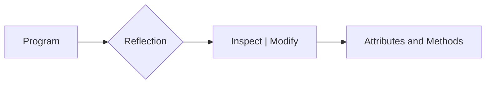

# Reflection in Python

Reflection refers to the ability of a program to inspect its own structure and modify it at runtime. In Python, reflection capabilities are built into the language, allowing for a variety of powerful and flexible programming techniques.



## Historical Context

- **1980s**: Reflection was first introduced in Lisp and Smalltalk, two influential programming languages of the 1980s.
- **1991**: Python was created by Guido van Rossum, incorporating many features from Lisp and Smalltalk, including reflection.
- **2000s**: Reflection became more widely used in Python with the introduction of decorators and metaclasses.

## How Reflection Works in Python

Python provides several built-in functions and libraries for reflection, including:

- `type()`: Returns the type of an object.
- `id()`: Returns the unique identifier for an object.
- `getattr()`, `setattr()`, `delattr()`: Get, set, or delete an attribute of an object.
- `isinstance()`: Checks if an object is an instance of a certain class.
- `issubclass()`: Checks if a class is a subclass of another class.
- `dir()`: Returns a list of all attributes and methods of an object.
- `callable()`: Checks if an object is callable.

## Reflection in Action

- Using `getattr()`, `setattr()`, and `delattr()` to manipulate object attributes at runtime:

    ```python
    class MyClass:
        """An empty class for demonstration purposes."""

    my_instance = MyClass()
    setattr(my_instance, 'my_attribute', 123)
    print(getattr(my_instance, 'my_attribute'))  # Prints: 123
    delattr(my_instance, 'my_attribute')
    print(getattr(my_instance, 'my_attribute', 'Attribute not found'))  # Prints: Attribute not found
    ```

- Using reflection to get information about a function into a logging decorator:

    ```python
    import functools

    def log_calls(func):
        """A decorator that logs function calls."""
        @functools.wraps(func)
        def wrapper(*args, **kwargs):
            print(f'Calling {func.__name__} with args: {args}, kwargs: {kwargs}')
            return func(*args, **kwargs)
        return wrapper

    @log_calls
    def my_function(x, y):
        """A simple function for demonstration purposes."""
        return x + y

    my_function(1, 2)  # Prints: Calling my_function with args: (1, 2), kwargs: {}
    ```

- Using metaclasses to create a custom class with reflection:

    ```python
    class MyMeta(type):
        """A custom metaclass for demonstration purposes."""
        def __new__(cls, name, bases, dct):
            print(f'Creating class {name} with bases: {bases}, attributes: {dct}')
            return super().__new__(cls, name, bases, dct)

    class MyClass(metaclass=MyMeta):
        """An empty class for demonstration purposes."""
    ```

## References

- [Python Docs: Built-in Functions](https://docs.python.org/3/library/functions.html)
- [Python Docs: The Python Standard Library](https://docs.python.org/3/library/index.html)
- [Python Docs: Data Model](https://docs.python.org/3/reference/datamodel.html)

